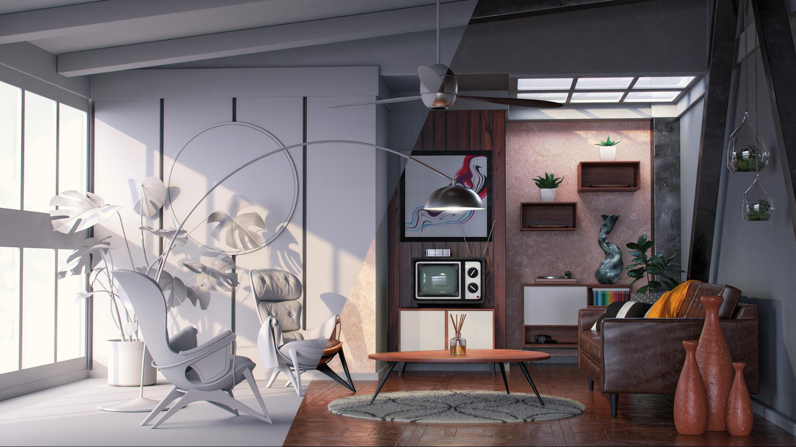

# Sugerencias y técnicas para crear originales de iluminación 3D en CGI

Obtenga más información sobre la iluminación 3D y cómo crear diferentes condiciones de luz que puedan alterar completamente una escena generada por ordenador y el aspecto que tienen los objetos en ella.

Percibimos el mundo que nos rodea usando nuestros sentidos: oímos, sentimos, olemos, vemos. Podemos ver porque nuestros ojos están recogiendo información traída hacia nosotros por partículas elementales llamadas fotones. Esta información es procesada por nuestro cerebro para producir una imagen. Lo que interpretamos como color de objeto, brillo, translucidez o cualidades metálicas son todos productos de la interacción entre los fotones y la superficie del objeto.

La mecánica de la luz en una escena 3D generada por ordenador sigue el mismo principio natural de dispersión de fotones, a través de un proceso denominado [trazado de rayos](https://en.wikipedia.org/wiki/Ray_tracing_(graphics)). Los rayos rebotan sobre formas e interactúan con sus materiales, definiendo de forma efectiva cómo aparecen los objetos en la imagen final. Las luces exponen la dimensionalidad de cualquier cosa que exista en una escena 3D.

Algunos materiales son más sensibles a las condiciones de iluminación que otros. Tomar metales, por ejemplo: un objeto cromado refleja básicamente todo lo que lo rodea. Si se mueve una luz, se vuelve más brillante o más grande, toda esa información es visible directamente en la superficie cromada con detalles parecidos a los de un espejo, por lo que puede parecer completamente diferente de una condición de luz a la otra.

## Cómo trabajar con luces 3D para crear renderizados 3D eficaces

El proceso de creación de un renderizado 3D nunca es exactamente el mismo, pero estos son los pasos más comunes:

1. Creación o adquisición de objetos
1. Conjunto de escena
1. Encuadrar la escena
1. **Iluminación**
1. Creación o asignación de material
1. Renderizado

Cuando llegas a la fase de iluminación, es ideal configurar las luces antes de trabajar en los materiales. Para ello, puede asignar un material gris neutro y mate a toda la escena. De este modo, podrá ver y entender mejor cómo afectan las luces a las siluetas de objetos de la escena. Una vez terminados los materiales, es posible que sea necesario perfeccionar la iluminación.

Es mejor trabajar con las luces de una en una. La luz activa debe ser la única visible en la escena, mientras que las demás luces deben apagarse temporalmente. De este modo, podrá ver cómo una luz específica influye en la escena y cambiarla trabajando en sus propiedades, como la posición, la dirección, la intensidad, etc.

Otro truco útil es crear una esfera con un material de metal brillante (un cromo o un espejo). Esta &quot;bola de espejo&quot; reflejará de forma efectiva toda la escena que la rodea, de modo que podrá determinar fácilmente la posición, dirección o tamaño de la luz. En el caso de las luces de ambiente, podrás ver su reflejo en la bola del espejo, lo que te ayudará a configurar su orientación en el espacio.

## Tipos de luces en el Adobe [!DNL Dimension]

### Luces de ambiente

Las luces de ambiente son imágenes equirrectangulares (esféricas) que se envuelven alrededor de toda la escena. Como sugiere el nombre, estas luces sirven para emular todo el entorno, incluidas las fuentes de luz, que se almacenan en ellas.

Cuando cree una nueva escena en [[!DNL Dimension]](https://www.adobe.com/products/dimension.html), se creará una luz de entorno predeterminada. Es por eso que inmediatamente pueden ver cualquier cosa en la escena. Los recursos de inicio de Adobe [!DNL Dimension] incluyen un cierto número de luces de entorno, que puede probar de inmediato. Además, [Adobe [!DNL Stock]](https://stock.adobe.com/search?filters[content_type:3d]=1&amp;filters[3d_type_id][0]=2&amp;load_type=3d+lp) ofrece una enorme selección de luces de ambiente seleccionadas.

Las luces de ambiente producen resultados muy realistas y pueden ahorrarle mucho tiempo. Para conseguir algo similar manualmente, tendríamos que crear todo el entorno en 3D (incluyendo varias fuentes de luz), lo que supone un trabajo considerable.

Existen muchas formas de crear luces de ambiente, como capturar desde una escena 3D, desde una fotografía y utilizar sistemas paramétricos. Si la luz del entorno se obtiene a partir de una escena 3D, el proceso es sencillo. La imagen de salida debe ser de 32 bits, lo que capturará la información de luz de todas las luces de la escena. La cámara 3D necesita utilizar la proyección equirrectangular (para generar una imagen esférica).

También puede crear luces de ambiente capturando fotografías del mundo real. Para este flujo de trabajo, se necesita una cámara 360 (por ejemplo, [Ricoh Theta Z1](https://theta360.com/en/about/theta/z1.html)). A continuación, la cámara se utiliza para el horquillado de exposición, o para tomar varias tomas del mismo entorno, tomadas con una gama de diferentes valores de exposición (desde subexpuesta a sobreexpuesta). Estas tomas se utilizan para crear imágenes de 32 bits, a menudo denominadas HDR (abreviatura de Alto rango dinámico). Una forma de montar una imagen de este tipo es con la función Combinar para HDR en Photoshop. El rango de exposición incrustado se convertirá en la propiedad de intensidad.

En ambos casos, las fuentes de luz (y sus intensidades) se &quot;hornean&quot; en estas imágenes y emitirán la luz una vez que se utilicen en [!DNL Dimension].

En estos métodos ha capturado toda la iluminación, los reflejos y los detalles que necesita, pero las aplicaciones 3D le permiten seguir editándolos en el espacio 3D, para que pueda ajustar la rotación de la iluminación y cambiar la intensidad y el color generales.

### Luces direccionales

Además de las luces de ambiente, que emiten luz desde 360 grados, también hay luces direccionales, que emiten luz sólo desde una dirección. Se utilizan para emular linternas y otros tipos de luces procedentes de un emisor bien definido, y se pueden formar como un círculo o un cuadrado.

El uso de luces direccionales ofrece un control total sobre la configuración de la iluminación. La iluminación de la escena con estas luces se realiza de la misma manera que en la fotografía tradicional, donde cada luz se puede controlar de forma independiente, lo que le permite crear su propia iluminación fotográfica virtual. Una de las configuraciones de iluminación más utilizadas es el sistema de iluminación de 3 puntos.

[!DNL Dimension] tiene una acción práctica, Apuntar luz en punto, que le permite controlar la rotación y la altura haciendo clic y arrastrando sobre un objeto 3D. De esta forma, puede dirigir dinámicamente los rayos de luz. Estos parámetros también se pueden ajustar manualmente.

Puede cambiar el color y la intensidad de las luces direccionales, así como ajustar la forma de la fuente de luz: hacer que sea circular o rectangular, ampliarla o hacerlo más grande. Por último, puede suavizar los bordes de la fuente de luz.

![Modificación de la forma de una luz direccional en el Adobe  [!DNL Dimension]](assets/Mastering3dlighting_12.gif)

Si reduce el tamaño de la fuente de luz que el objeto, las sombras serán más nítidas, con un contorno más nítido, ya que los rayos no pueden superar el objeto iluminado. Las fuentes de luz más grandes producen sombras más suaves, ya que en este caso los rayos provienen de todos los lados del objeto (marcado en rojo en la ilustración siguiente), lo que crea una serie de sombras. Estas sombras se suavizan con los rayos que salen de la dirección opuesta.

### Sol y cielo

La luz solar es un tipo especial de luz direccional. El proceso de configuración es muy similar a una luz direccional regular, aunque esta luz cambiará automáticamente el color con la altura; cuando se encuentra cerca del horizonte (valores de ángulo de baja altura), se va calentando gradualmente para simular la puesta de sol. El color también se puede cambiar mediante ajustes preestablecidos. Mientras tanto, la opacidad afectará a la suavidad de la sombra.

![Manipulación de las propiedades de iluminación para la iluminación solar en un modelo de coche 3D en un Adobe  [!DNL Dimension]](assets/Mastering3dlighting_15.gif)

Podemos emular el cielo usando luces ambientales, y cualquier luz ambiental que presente el cielo puede ser usada. Ahora, tenemos que alinear la luz solar (hecha en [!DNL Dimension]) con el sol, capturado en la luz ambiental. Una forma rápida de hacerlo es crear una esfera y asignarle un material metálico; esto nos proporcionará reflejos en tiempo real del medio ambiente, para que podamos utilizar la luz de destino en un punto para alinear la luz solar con el sol.

Si la luz del entorno tiene un cielo con relieve, la propiedad de la opacidad se puede utilizar para que coincida más estrechamente con estas condiciones.

![Manipulación de las propiedades de opacidad para la iluminación del entorno de cielo en un modelo de coche 3D en Adobe  [!DNL Dimension]](assets/Mastering3dlighting_17.gif)

Una vez emparejadas la luz solar y la luz del entorno del cielo, puede rotarlas juntas mediante la propiedad Rotación global.

### Luces basadas en objetos

Los objetos se pueden convertir en fuentes de luz activando la propiedad Resplandor para sus materiales. De este modo, es posible crear objetos como bombillas, luces de neón, softboxes y todo tipo de pantallas y pantallas.

El beneficio clave de utilizar este tipo de iluminación es la difuminación de intensidad, que produce resultados muy naturales. Esto resulta muy útil para la visualización de productos u otras escenas basadas en estudios.

Puede controlar el suavizado de las sombras aumentando o reduciendo la escala del objeto resplandeciente con la herramienta de transformación. Aumentar la intensidad de la luz también aumentará.

A diferencia de los tipos de luces anteriores que hemos cubierto, estas luces también pueden utilizar texturas, además de colores simples. Las texturas se pueden asociar al color base de sus materiales y la intensidad de la luz se controla mediante un regulador de resplandor.

## Ejemplos de iluminación 3D efectiva

### Iluminación del producto

Hay muchas técnicas fotográficas para configurar la luz de una toma de producto. Utilizaremos una de las configuraciones más utilizadas, que es el sistema de luz de 3 puntos.

Esta configuración consta de tres luces:

1. **Iluminación principal:** se utiliza como origen principal y se resalta aproximadamente desde la dirección de la cámara

   

1. **Luz de borde:** orientada en el lado opuesto de la llave, se utiliza para exponer la silueta del sujeto.

   

1. **Luz de relleno:** menos intensivo y sirve para rellenar áreas más oscuras, se utiliza para las áreas a las que no llegan las dos luces anteriores.

   

Existen dos formas de crear la iluminación de 3 puntos en [!DNL Dimension]: mediante luces direccionales (añadiéndolas individualmente a la escena o utilizando un ajuste preestablecido de luz de 3 puntos) o mediante objetos brillantes.

### Iluminación creativa

La iluminación creativa se utiliza cuando la precisión física no es el objetivo principal. Esto incluye escenas abstractas y surrealistas de todo tipo, así que no hay límites reales donde nuestra imaginación pueda llevarnos.

En el ejemplo anterior, la idea era retratar un ambiente de ensueño: caramelos, colores pastel y superficies suaves. El sistema de iluminación se compone de tres placas brillantes (dos en el lateral y la principal resplandece desde la parte inferior). Todas las placas brillantes son irrealistas grandes, lo que crea sombras y resaltes muy suaves. Las fuentes de luz se colorean y ese color se transfiere al material asignado a los objetos de la escena.

El sujeto de la escena (tuberías) está completamente rodeado por la geometría de las paredes. Esto hará que los rayos de luz reboten hacia atrás y hacia adelante y se mezclen de maneras interesantes. Reproducir con tonos cálidos frente a fríos a menudo produce un contraste agradable (esta técnica a veces se utiliza en la fotografía retrato).

### Visualización interior

La creación de una visualización de un interior 3D sigue un determinado conjunto de reglas, lo que casi siempre garantiza buenos resultados. En este caso, sólo se considerará la luz natural (sin fuentes artificiales, como las lámparas).

En primer lugar, una escena como esta debe estar en un entorno cerrado. Al igual que en la vida real, el interior necesitará paredes, suelo, techo y ventanas. De este modo, la luz se ilumina a través de las ventanas y rebota alrededor (mediante un proceso denominado trazado por rayos). Este comportamiento produce iluminación muy natural (por ejemplo, las áreas ocluidas, como las esquinas, serán más oscuras).

Como la escena está casi completamente rodeada de geometría arquitectónica, veremos muy poca iluminación y casi ninguna reflexión proveniente de la luz del Medio Ambiente. Sin embargo, en este caso, estamos construyendo nuestro propio entorno, que es el interior mismo. La luz reaccionará con los objetos de la escena rebotando de ellos y de las paredes circundantes. Los objetos se reflejarán unos a otros y las paredes que los rodean. Sin embargo, es una buena idea añadir una luz de ambiente, con el cielo. Esto añadirá algún relleno azul difuso.

La forma más sencilla de establecer esta luz es utilizar planos con materiales brillantes. En este caso tenemos tres planos que cubren todas las aberturas del interior.

La intensidad de la luz se controla mediante la propiedad del resplandor en los materiales de los aviones. Puede añadir un color o incluso una textura, que se puede utilizar para proyectar sombras interesantes. El uso de materiales de resplandor también proporciona la difuminación de intensidad de la luz, lo que es muy importante para la iluminación interior.

### Iluminación exterior

Crear iluminación exterior es bastante sencillo y se reduce a usar un sistema de luz solar y solar (ver arriba). Es importante hacer coincidir la luz solar correctamente con la luz del ambiente basada en el cielo, prestando atención tanto a la orientación como al valor de la opacidad.

La escena misma juega un papel importante en esto. Para obtener resultados convincentes, utilice los objetos de la escena como catalizadores que interactúan con la luz. En el renderizado del bosque que se muestra arriba, los objetos (varias plantas, troncos y árboles) se colocan uno cerca del otro.

Esto significa que habrá mucha interacción compleja de trazado de rayos, a medida que la luz rebote entre los objetos. Los puntos sombreados aparecerán oscuros (como se espera), mientras que las áreas expuestas permanecerán brillantes.

![Uso de la rotación global en Adobe  [!DNL Dimension] para reorientar el sistema de luz solar y solar en una escena 3D](assets/Mastering3dlighting_34.gif)

Espero que este resumen muestre la importancia de dominar las luces 3D en varias situaciones. Deberías estar listo para empezar a producir resultados más convincentes.

¡Feliz iluminación! Descargue hoy mismo la [última versión](https://creativecloud.adobe.com/apps/download/[!DNL Dimension]) de Dimension.
