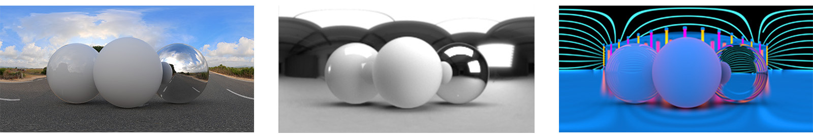
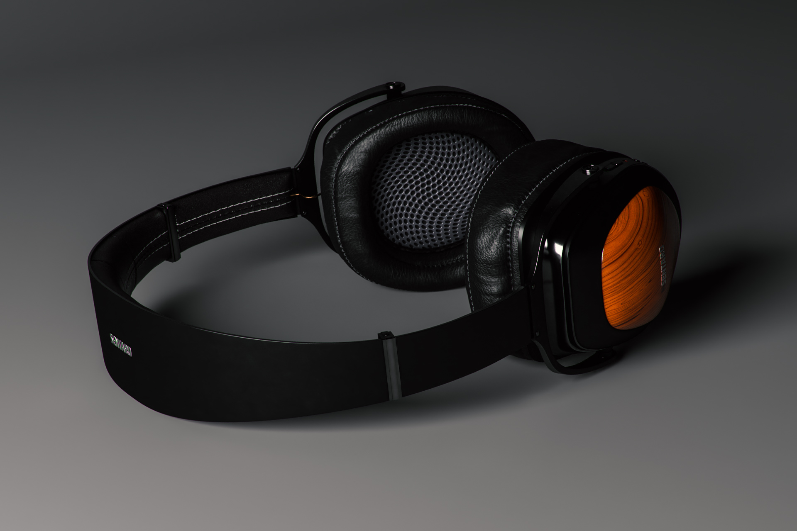

# Sugerencias y técnicas para dominar la iluminación 3D en CGI

Aprende sobre la iluminación 3D y cómo crear diferentes condiciones de luz que pueden alterar por completo una escena generada por ordenador y la forma en que los objetos se ven en ella.

Percibimos el mundo que nos rodea usando nuestros sentidos: escuchamos, sentimos, olemos, vemos. Podemos ver porque nuestros ojos están recogiendo información traída a nosotros por partículas elementales llamadas fotones. El cerebro procesa esta información para producir una imagen. Lo que interpretamos como color de objeto, brillo, translucidez o cualidades metálicas son todos productos de la interacción entre los fotones y la superficie del objeto.

La mecánica de la luz en una escena 3D generada por ordenador sigue el mismo principio natural de la dispersión de fotones, a través de un proceso llamado trazado de rayos. Los rayos rebotan en las formas e interactúan con sus materiales, lo que define de manera efectiva cómo aparecen los objetos en la imagen final. Las luces exponen la dimensionalidad de cualquier cosa que exista en una escena 3D.

Algunos materiales son más sensibles a las condiciones de iluminación que otros. Tomemos los metales por ejemplo: un objeto cromado es básicamente un reflejo de todo lo que lo rodea. Si se mueve una luz, se vuelve más brillante o más grande, toda esa información es visible directamente en la superficie cromada con detalles casi similares a los de un espejo, por lo que puede parecer completamente diferente de una condición de luz a la otra.

## Cómo trabajar con luces 3D para crear representaciones 3D eficaces

El proceso de creación de una representación 3D nunca es exactamente el mismo, pero estos son los pasos más comunes:

1. Creación o adquisición de objetos
1. Montaje de escenas
1. Encuadra la escena
1. **Iluminación**
1. Creación o asignación de materiales
1. Renderizado

Al llegar a la fase de iluminación, es ideal configurar las luces antes de trabajar en los materiales. Para ello, puede asignar un material gris neutro y mate a toda la escena. De este modo, podrás ver y comprender mejor cómo las luces afectan a las siluetas de los objetos en la escena. Una vez terminados los materiales, es posible que la iluminación necesite un mayor refinamiento.

Es mejor trabajar en las luces de una en una. La luz activa debe ser la única visible en la escena, mientras que las demás luces deben apagarse temporalmente. De esta manera, podrás ver cómo una luz específica influye en la escena y cambiarla trabajando en sus propiedades, como la posición, la dirección, la intensidad, etc.

Otro truco útil es crear una esfera con un material metálico brillante (un cromo o un espejo). Esta &quot;bola de espejo&quot; reflejará de manera efectiva toda la escena a su alrededor, para que puedas determinar fácilmente la posición, dirección o tamaño de la luz. En el caso de las luces ambientales, podrás ver su reflejo en la bola de espejo, lo que ayudará a configurar su orientación en el espacio.

## Tipos de luces en el Adobe [!DNL Dimension]

### Luces ambientales

Las luces de ambiente son imágenes equirrectangulares (esféricas) que se envuelven alrededor de toda la escena. Como su nombre indica, estas luces sirven para emular todo el entorno, incluidas las fuentes de luz que se almacenan en ellas.

Cuando se crea una escena nueva en [[!DNL Dimension]](https://www.adobe.com/products/dimension.html), se creará una luz de ambiente predeterminada para usted. Es por esto que usted es inmediatamente capaz de ver cualquier cosa en la escena. Adobe [!DNL Dimension] Los Activos de inicio incluyen un determinado número de luces de entorno, que puede probar de inmediato. Además, [Adobe [!DNL Stock]](https://stock.adobe.com/search?filters[content_type:3d]=1&amp;filters[3d_type_id][0]=2&amp;load_type=3d+lp) ofrece una selección enorme y seleccionada de luces de ambiente.

Las luces ambientales producen resultados muy realistas y pueden ahorrarle mucho tiempo. Para conseguir algo similar manualmente, tendrías que crear todo el entorno en 3D (incluidas varias fuentes de luz), lo que supone una cantidad considerable de trabajo.

Hay muchas formas de crear luces de ambiente, incluidas la captura de una escena 3D, de una fotografía y el uso de sistemas paramétricos. Si la luz del entorno se crea a partir de una escena 3D, el proceso es sencillo. La imagen de salida debe ser de 32 bits, lo que capturará la información de luz de todas las luces de la escena. La cámara 3D necesita utilizar la proyección equirrectangular (para generar una imagen esférica).

También puedes crear luces de ambiente capturando fotografías del mundo real. Para este flujo de trabajo, se necesita una cámara 360 (p. ej., [Ricoh Theta Z1](https://theta360.com/en/about/theta/z1.html)). A continuación, la cámara se utiliza para encuadernar la exposición, o para realizar varias tomas del mismo entorno, tomadas con un rango de valores de exposición diferentes (desde subexposición hasta sobreexposición). Estas tomas se utilizan para construir imágenes de 32 bits, a menudo denominadas HDR (abreviatura de High Dynamic Range). Una forma de montar una imagen de este tipo es con la función Combinar para HDR en Photoshop. El rango de exposición incrustado se convertirá en la propiedad de intensidad.

En ambos casos, las fuentes de luz (y sus intensidades) se &quot;cubren&quot; en estas imágenes y emitirán la luz una vez que se utilicen en [!DNL Dimension].

Con estos métodos, has capturado toda la iluminación, los reflejos y los detalles que necesitas, pero las aplicaciones 3D te permiten seguir editándolos en el espacio 3D, para que puedas ajustar la rotación de la iluminación, así como cambiar la intensidad y el color generales.

### Luces direccionales

Además de las luces de ambiente, que emiten luz desde 360 grados, también hay luces direccionales, que emiten luz desde una sola dirección. Se utilizan para emular linternas y otros tipos de luces procedentes de un emisor bien definido, y pueden tener la forma de un círculo o un cuadrado.

El uso de luces direccionales ofrece un control total sobre la configuración de la iluminación. Iluminar la escena con estas luces se hace de la misma manera que en la fotografía tradicional, donde cada luz se puede controlar de forma independiente, lo que le permite crear su propia iluminación fotográfica virtual. Uno de los ajustes de iluminación más utilizados es el sistema de iluminación de 3 puntos.

[!DNL Dimension] Tiene una acción cómoda, Apuntar luz en el punto, que permite controlar la rotación y la altura haciendo clic y arrastrando sobre un objeto 3D. De esta manera, puedes dirigir dinámicamente los rayos de luz. Estos parámetros también se pueden ajustar manualmente.

Puedes cambiar el color y la intensidad de las luces direccionales, así como ajustar la forma de la fuente de luz: hacerla circular o rectangular, estirarla o agrandarla. Por último, puede suavizar los bordes de la fuente de luz.

![Modificación de la forma de una luz direccional en Adobe [!DNL Dimension]](assets/Mastering3dlighting_12.gif)

Si se reduce el tamaño de la fuente de luz respecto al objeto, las sombras serán más nítidas, con un contorno más nítido, ya que los rayos no pueden pasar sobre el objeto iluminado. Las fuentes de luz más grandes producen sombras más suaves, porque en este caso los rayos proceden de todos los lados del objeto (marcados como rojos en la ilustración siguiente), lo que crea un conjunto de sombras. Estas sombras se suavizan por los rayos que vienen de la dirección opuesta.

### Sol y cielo

La luz solar es un tipo especial de luz direccional. El proceso de ajuste es muy similar a una luz direccional regular, sin embargo, esta luz cambiará automáticamente el color con la altura; cuando está cerca del horizonte (valores de ángulo de baja altura), gradualmente se volverá más cálido para simular la puesta de sol. El color también se puede cambiar mediante ajustes preestablecidos. Mientras tanto, la nubosidad afectará a la suavidad de la sombra.

![Manipulación de las propiedades de iluminación para la iluminación solar en un modelo de coche en 3D en Adobe [!DNL Dimension]](assets/Mastering3dlighting_15.gif)

Podemos emular el cielo usando luces de ambiente, y cualquier luz de ambiente que presente el cielo puede ser utilizada. Ahora, tenemos que alinear la luz solar (hecha en [!DNL Dimension]) con el Sol, capturado en la luz ambiental. Una forma rápida de hacerlo es crear una esfera y asignarle un material metálico; esto nos proporcionará reflejos del entorno en tiempo real, para que podamos usar la luz Aim en el punto para alinear la luz solar con el Sol.

Si la luz ambiental presenta un cielo nublado, la propiedad nubosidad se puede utilizar para que coincida más con estas condiciones.

![Manipulación de las propiedades de nubosidad para la iluminación del entorno del cielo en un modelo de coche en 3D en Adobe [!DNL Dimension]](assets/Mastering3dlighting_17.gif)

Una vez que la luz del sol y la del entorno del cielo estén emparejadas, puede girarlas juntas mediante la propiedad Rotación global.

### Luces basadas en objetos

Los objetos se pueden convertir en fuentes de luz activando la propiedad Resplandor para sus materiales. De esta manera, es posible crear objetos como bombillas, luces de neón, softbox y todo tipo de pantallas y pantallas.

El beneficio clave de utilizar este tipo de iluminación es la caída de intensidad, que produce resultados muy naturales. Esto resulta muy útil para la visualización de productos u otras escenas basadas en estudios.

Puede controlar la suavidad de las sombras escalando el objeto que brilla hacia arriba o hacia abajo con la herramienta de transformación. Al hacerlo más grande, también aumentará la intensidad de la luz.

A diferencia de los tipos de luces anteriores que hemos cubierto, estas luces también pueden utilizar texturas, además de colores lisos. Las texturas se pueden fijar al color base de sus materiales, y la intensidad de la luz se controla mediante un regulador de resplandor.

## Ejemplos de iluminación 3D eficaz

### Iluminación de productos

Existen muchas técnicas fotográficas para configurar la luz de una foto de producto. Utilizaremos una de las configuraciones más utilizadas, que es el sistema de luz de 3 puntos.

Esta configuración consta de tres luces:

1. **Luz clave:** se utiliza como fuente principal y brilla aproximadamente desde la dirección de la cámara

   

1. **Luz de llanta:** orientada en el lado opuesto a la tecla, se utiliza para exponer la silueta del sujeto.

   

1. **Luz de relleno:** menos intensivo y que sirve para rellenar las áreas más oscuras, esto se utiliza para las áreas que las dos luces anteriores no alcanzan.

   

Hay dos formas de crear la iluminación de 3 puntos en [!DNL Dimension] - mediante luces direccionales (añadiéndolas individualmente a la escena o utilizando un ajuste preestablecido de luz de 3 puntos) o mediante objetos brillantes.

### Luz creativa

La iluminación creativa se utiliza cuando la precisión física no es el objetivo principal. Esto incluye escenas abstractas y surrealistas de todo tipo, por lo que no hay límites reales donde nuestras imaginaciones nos puedan llevar.

En el ejemplo anterior, la idea era retratar un ambiente onírico: dulces, colores pastel y superficies lisas. El sistema de iluminación se compone de tres placas brillantes (dos a un lado y la principal que brilla desde la parte inferior). Todas las planchas brillantes son poco realistas y grandes, lo que crea sombras e iluminaciones muy suaves. Las fuentes de luz son coloreadas y ese color se transfiere al material asignado a los objetos en la escena.

El sujeto de la escena (tuberías) está completamente rodeado por la geometría de las paredes. Esto hará que los rayos de luz reboten de un lado a otro y se mezclen de maneras interesantes. Jugar con tonos fríos FRENTE a cálidos a menudo produce un contraste agradable (esta técnica se utiliza a veces en la fotografía de retratos).

### Visualización de interiores

La creación de una visualización de un interior 3D sigue un cierto conjunto de reglas, que casi siempre garantizan buenos resultados. Para este caso de uso, solo tendremos en cuenta la luz natural (no fuentes artificiales, como las lámparas).

En primer lugar, una escena como esta debe encontrarse en un entorno cerrado. Al igual que en la vida real, el interior necesitará paredes, suelo, techo y ventanas. Esto asegurará que la luz pase a través de las ventanas y luego rebote (a través de un proceso llamado trazado de rayos). Este comportamiento produce una iluminación muy natural (por ejemplo, las áreas ocluidas, como las esquinas, serán más oscuras).

Como la escena está casi completamente rodeada de geometría arquitectónica, veremos muy poca iluminación y casi ningún reflejo proveniente de la luz del Entorno. Sin embargo, en este caso, estamos construyendo nuestro propio entorno, que es el interior mismo. Por lo tanto, la luz reaccionará con los objetos de la escena rebotando en ellos y en las paredes circundantes. Los objetos se reflejarán unos a otros y las paredes que los rodean. Sin embargo, es una buena idea añadir una luz de ambiente, que presente el cielo. Esto añadirá un relleno azul difuso.

La forma más fácil de ajustar esta luz es usando planos con materiales brillantes. En este caso de uso tenemos tres planos, que cubren todas las aberturas en el interior.

La intensidad de la luz se controla mediante la propiedad de resplandor de los materiales de los planos. Puedes añadir un color o incluso una textura, que se pueden utilizar para proyectar sombras interesantes. El uso de materiales de resplandor también proporcionará la difuminación de intensidad de luz, que es bastante importante para la iluminación interior.

### Iluminación exterior

La creación de iluminación exterior es bastante sencilla y se reduce al uso de un sistema de luz solar y de cielo (ver arriba). Es importante hacer coincidir la luz solar correctamente con la luz ambiental del cielo, prestando atención tanto a la orientación como al valor de nubosidad.

La escena en sí juega un papel importante en esto. Para obtener resultados atractivos, utiliza los objetos de tu escena como catalizadores que interactúan con la luz. En el renderizado de bosque mostrado arriba, los objetos (varias plantas, troncos y árboles) se colocan uno cerca del otro.

Esto significa que habrá muchas interacciones complejas de trazado de rayos, a medida que la luz rebota entre los objetos. Los puntos sombreados aparecerán oscuros (como se esperaba), mientras que las áreas expuestas permanecerán brillantes.

![Uso de la rotación global en Adobe [!DNL Dimension] para reorientar el sistema de luz solar y de cielo en una escena 3D](assets/Mastering3dlighting_34.gif)

Espero que este resumen ilustre la importancia de dominar las luces 3D en diversas situaciones. Usted debe estar listo para comenzar a producir resultados más convincentes.

¡Feliz iluminación! Descargue el [última versión](https://creativecloud.adobe.com/apps/download/Dimension) del Dimension hoy.
