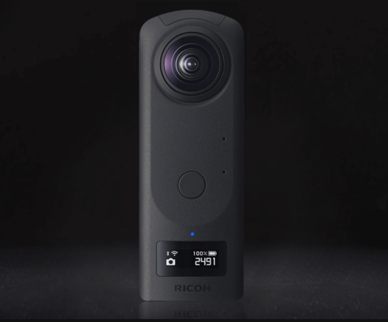

# Creación de fotografías virtuales fotorrealistas con representación y composición 3D

![Collage de ejemplos con fotografías virtuales fotorrealistas diseñadas con Adobe [!DNL Dimension]](assets/Photorealistic_1.png)

Mirando las imágenes de arriba, te perdonarían por asumir que todo lo que ves es real. Sin embargo, con los avances tecnológicos en la representación de imágenes 3D fotorrealistas, es más difícil que nunca determinar qué es real y qué es virtual. En este caso, las imágenes son una mezcla de contenido real, fotografía y 3D renderizado; y este es exactamente el tipo de diseño 3D en el que las empresas están invirtiendo.

Esta técnica de superposición de capas o ‘composición’ de modelos 3D en una imagen o vídeo no es nueva y, de hecho, sus orígenes se remontan a los inicios de VFX (ya en los años 80). Lo que es nuevo y emocionante es que esta técnica se ha convertido en una poderosa herramienta para [Adobe [!DNL Dimension]](https://www.adobe.com/products/dimension.html) y un nuevo e intrigante flujo de trabajo para fotógrafos.

## La tecnología que hay detrás de la creación de imágenes compuestas en Adobe [!DNL Dimension]

![Edición del plano de un modelo de esfera metálica en un Adobe [!DNL Dimension] compuesto](assets/Photorealistic_3.png)

Adobe [!DNL Dimension] ha permitido a los usuarios combinar elementos 2D y 3D directamente en la aplicación mediante la función de coincidencia de imagen de Adobe Sensei. La principal ventaja de componer elementos de esta forma es que el turbo impulsa el proceso de creación de una imagen de aspecto realista al sustituir una escena 3D totalmente realizada por una imagen de fondo que se puede capturar desde la realidad.

![Función Hacer coincidir con la imagen en Adobe [!DNL Dimension] analiza la imagen de fondo y estima la distancia focal y la posición de la cámara que se utilizó para capturarla](assets/Photorealistic_4.gif)

La función Hacer coincidir con la imagen analiza la imagen de fondo y calcula la distancia focal y la posición de la cámara que se utilizó para capturarla. A continuación, se crea una cámara 3D en el [!DNL Dimension] escena que se puede utilizar para procesar elementos 3D dentro de la misma perspectiva que la imagen de fondo para que se compongan juntos.

Pero, ¿qué pasa con todo lo que no se captura dentro del encuadre de la cámara?  El entorno en el que se captura una imagen es importante, ya que define el aspecto que tendrá todo dentro. Un objeto dentro de una imagen refleja la luz del mundo que lo rodea, que también incluye todo lo que hay detrás de la cámara. Por lo tanto, para que los elementos 3D con capas se integren de verdad con el fondo de la imagen, deben reflejar completamente la iluminación en el entorno en el que se tomó la imagen.

Match Image intentará &quot;alucinar&quot; el entorno de iluminación en el que se tomó una imagen de fondo. Realiza un trabajo impresionante que producirá excelentes resultados en poco tiempo, pero capturar el entorno junto con la imagen de fondo producirá resultados aún más realistas. Este es incluso el método utilizado para entrenar a la función Adobe Sensei a hacerlo por sí misma.

Adéntrate en el mundo de las imágenes panorámicas HDR de 360°. Estas imágenes se han utilizado durante mucho tiempo en gráficos 3D para agilizar los efectos de iluminación de un entorno de iluminación de todo el mundo. El proceso para capturarlos en el pasado ha sido bastante complejo debido al alto nivel de conocimientos y equipo especializado necesario para hacerlos. Con la llegada de las cámaras de 360°, la creación de estas imágenes es ahora más posible que nunca.

Cámaras como la Ricoh Theta, Gopro MAX e Insta 360 pueden capturar panoramas de 360°. El Ricoh Theta tiene un soporte de exposición automático incorporado, que es una parte clave del proceso de captura. Esto reduce el tiempo y el esfuerzo necesarios para capturar HDR y hace que sea más accesible para los fotógrafos.

## El proceso para crear imágenes compuestas fotorrealistas

### [!DNL Capture]

Para comenzar a capturar entornos para la composición, necesita dos elementos principales; una imagen o imágenes de fondo de alta calidad y un panorama HDR de 360° del entorno en el que se tomó.

Uno de los aspectos más importantes de capturar este tipo de contenido de manera eficaz es aprovechar las habilidades y herramientas existentes de un fotógrafo. La creación de una imagen de fondo hermosa requiere prestar atención a la composición y al detalle. Las imágenes de fondo también requieren una mentalidad especial para crear algo que sea útil para componer elementos 3D.

### Elegir una ubicación

Busca ubicaciones que sean interesantes tanto para su contexto como para su iluminación. Al considerar el contexto, puede resultar útil imaginar el uso potencial de una escena. Por ejemplo, una vista de una carretera vacía se podría utilizar para añadir elementos en un coche 3D, mientras que una vista de una mesa en una cafetería se podría utilizar para [visualización de empaquetado](https://www.adobe.com/products/dimension/packaging-design-mockup.html) de productos alimenticios.

Cuando se trata de capturar la imagen de fondo, es importante tener en cuenta que los elementos 3D se compondrán en ella. Debe haber un área de enfoque vacía para dejar espacio para estos objetos. El contenido 3D será a menudo el foco principal de la composición final, por lo que es importante que el fondo no destaque por sí solo.

Igualmente importante es la situación de iluminación dentro de la imagen, ya que esto afectará en gran medida al contenido 3D compuesto. La luz debería entrar en la toma por encima del hombro o desde el lateral: esto producirá los mejores resultados porque actuará como una luz clave cuando los objetos 3D se coloquen en la escena. Puede resultar tentador fotografiar hacia la luz cuando no hay ningún elemento de enfoque a la vista, pero recuerda que esto dará como resultado un contenido siempre a contraluz. La adición de un objeto temporal fijo a la escena puede resultar útil para componer y evaluar la iluminación.

## Captura del panorama HDR

### Ubicación de cámara

Coloque la cámara de 360° en el centro general del área en la que se centrará para capturar los fondos. Puede ser ideal en casos en los que los fondos muestren una escena más amplia para levantar la cámara del suelo con un monopié, de lo contrario la cámara se puede ajustar directamente en el suelo.

### Color

Mantener el color entre la cámara utilizada para fotografiar el entorno y la cámara utilizada para fotografiar el fondo es muy importante, ya que las imágenes se utilizarán juntas. Aquí tenemos la temperatura de color de ambas cámaras establecida en 5000k y tomamos una foto de una tabla de colores con ambas cámaras para una mayor alineación en posproducción.

### Valores de exposición entre paréntesis

Para crear un entorno HDR con la cámara de 360°, es necesario capturar varios VE para combinarlos en una imagen HDR en posproducción. La cantidad de VE no está estandarizada, pero generalmente se desea que el extremo superior del rango de exposición vaya a un punto donde no haya más información en las sombras y el extremo inferior del rango de exposición a un punto donde no haya más información en las iluminaciones.

Lo ideal es que la cámara de 360° tenga una función de horquillado automático que permita que la cámara realice las distintas exposiciones por lotes. Los ajustes ideales consisten en utilizar el valor ISO más bajo disponible para evitar el ruido y un valor de apertura alto para el enfoque. Los valores de exposición se pueden modificar usando la velocidad de obturación y se pueden dividir por paradas; reducir o duplicar la exposición.

A continuación se muestra un ejemplo de los VE utilizados para fotografiar un IBL en exteriores:

01 - F 5.6, ISO 80, velocidad del obturador 1/25000, WB 5000 K

02 - F 5.6, ISO 80, velocidad del obturador 1/12500, WB 5000 K

03 - F 5.6, ISO 80, velocidad del obturador 1/6400, WB 5000 K

...

16 - F 5.6, ISO 80, velocidad del obturador 1, WB 5000 K

Si los 360° utilizados son capaces de emitir imágenes RAW, los EV se pueden dividir en incrementos de 2-4 paradas, ya que retienen más información que las imágenes de 8 bits como JPEG.

Después de realizar cualquier ajuste de color en los valores de exposición, se pueden exportar temporalmente a archivos individuales para luego combinarlos en Photoshop. El tipo de archivo debe depender del origen, pero no utilice un formato comprimido como JPEG en ninguno de los dos casos. En Photoshop, utilice Archivo > Automatizar > Combinar para HDR Pro... y seleccione todos los archivos EV exportados.

Asegúrese de que &quot;Modo&quot; está establecido en 32 bits. El uso de &quot;eliminar fantasmas&quot; puede ayudar a eliminar los detalles que han cambiado entre los VE, pero no lo uses si no lo necesitas. El regulador bajo el histograma solo afecta a la exposición de previsualización, por lo que debe ignorarlo. Desmarque &quot;Completar tonos en Adobe Camera Raw&quot; y pulse Aceptar.

El resultado es una imagen HDR que se puede utilizar para iluminar escenas en 3D.

Los pasos finales consistirán en eliminar cualquier sección de sombreado y trípode visible en el nadir de la imagen y ajustar la exposición predeterminada de la imagen para iluminar la escena correctamente. La eliminación de detalles se puede realizar mediante la herramienta Clonar de Photoshop. El ajuste de la exposición debe realizarse junto con los fondos en [!DNL Dimension], ya que el valor de exposición del IBL HDR son los valores de iluminación de los objetos 3D.

### Captura del fondo

Después de capturar el entorno, ahora puede capturar fondos con una cámara de su elección. Cuanto mayor sea la calidad y mayor resolución, mejor. Esto, junto con el ojo por la composición que tienen los fotógrafos es el principal beneficio de este proceso. Las imágenes anteriores se capturaron con una Canon 5D MK IV.

Hay mucho margen para enmarcar y componer con los fondos. La cámara puede tener aperturas altas o bajas para una profundidad de campo variable, utilizar distancias focales largas o cortas y ser inclinada hacia arriba o hacia abajo. El requisito principal es que la cámara esté orientada hacia el punto central en el que se capturó el entorno con la cámara 360.

Una vez finalizada la captura, las imágenes deben postprocesarse para que coincidan con el color del entorno lo más cerca posible. El color y la exposición deben ser lo más neutros y naturales posible. Cualquier aspecto estilizado debe aplicarse después de que los elementos 3D se hayan compuesto en la imagen con Adobe [!DNL Dimension].

## Montaje de la imagen compuesta en [!DNL Dimension]

Con estos elementos reunidos y completos, ahora se pueden ensamblar en una escena en Adobe [!DNL Dimension]. Esto es tan sencillo como arrastrar el fondo a la escena, donde luego se aplicará al fondo; a continuación, añada el panel HDR a la ranura de la imagen de luz ambiental.

Arrastre y suelte la imagen de fondo en un área vacía del lienzo o seleccione Entorno en el panel Escena y añada la imagen a la entrada de fondo.

![La imagen de fondo de una fotografía virtual se puede seleccionar en el menú Propiedades de Adobe [!DNL Dimension]](assets/Photorealistic_20.png)

Para añadir el panel HDR, seleccione la luz ambiental y añádala a la entrada de imagen.

![La fuente de luz ambiental se puede añadir a la imagen de fondo de una fotografía virtual desde el menú Escena en Adobe [!DNL Dimension]](assets/Photorealistic_21.png)

A continuación, puedes usar &quot;Hacer coincidir con la imagen&quot; en el fondo para que coincida con la resolución y el aspecto, así como con la perspectiva de la cámara. En lugar de generar el entorno a partir de la imagen de fondo, la imagen del panel HDR capturada se utiliza para iluminar la escena, por lo que la opción &quot;crear luces&quot; puede dejarse sin marcar.

![Uso de la función Hacer coincidir imagen en Adobe [!DNL Dimension] para procesar una imagen de esfera metálica en 3D con las luces de entorno desde una panorámica HDR](assets/Photorealistic_22.png)

Ahora, los objetos que se añadan a la escena se compondrán de forma realista en el fondo, ya que están siendo iluminados por el entorno en el que se tomó la imagen.

Para evaluar rápidamente la orientación y exposición del panel HDR en relación con el fondo, se ha creado una esfera primitiva con un material metálico, tomada del panel de activos libres en [!DNL Dimension], se puede colocar en la escena. A continuación, la rotación de la luz ambiental puede colocarse de forma que los reflejos parezcan correctos. Si la iluminación del panel HDR sobreexpone o subexpone la esfera, la exposición del panel HDR debe aumentarse o disminuirse para compensar.

Para evaluar rápidamente la orientación y exposición del panel HDR en relación con el fondo, se ha creado una esfera primitiva con un material metálico, tomada del panel de activos libres en [!DNL Dimension], se puede colocar en la escena. A continuación, la rotación de la luz ambiental puede colocarse de forma que los reflejos parezcan correctos. Si la iluminación del panel HDR sobreexpone o subexpone la esfera, la exposición del panel HDR debe aumentarse o disminuirse para compensar.

## El resultado final: Una imagen compuesta con realismo fotográfico

![Lapso de tiempo de la composición y el procesamiento en 3D para una fotografía de producto virtual en Adobe [!DNL Dimension]](assets/Photorealistic_24.gif)

Una vez completada la escena, el flujo de trabajo para el usuario final es sencillo. Solo tienes que arrastrar y soltar tu propio modelo o cualquier [Adobe [!DNL Stock] 3D](https://stock.adobe.com/3d-assets) contenido directamente en la imagen para representarla como si estuviera allí cuando se tomó la foto. Esto abre nuevas vías para crear contenido publicitario altamente realista o la capacidad de iterar diseños en muchos contextos diferentes.

El resultado final es una combinación convincente de realidad y 3D que ayuda a los usuarios finales a lograr el objetivo de crear imágenes fotorrealistas con un mínimo esfuerzo. Pruébalo tú mismo con un poco [gratuito [!DNL Dimension] escenas](https://assets.adobe.com/public/3926726a-2a17-43d4-4937-6d84a4d29338) hemos creado para mostrar el flujo de trabajo.

[Descargar la última versión](https://creativecloud.adobe.com/apps/download/dimension) de [!DNL Dimension] y empieza a crear tus imágenes fotorrealistas.
