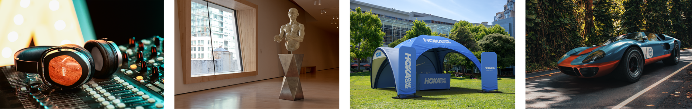
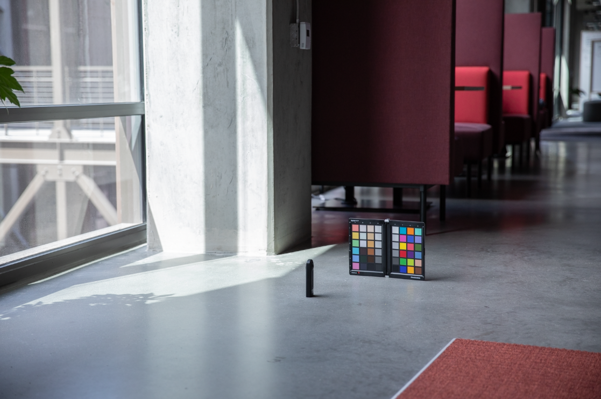

# Creación de fotografías virtuales fotorrealistas con procesamiento y composición 3D

![Un collage de ejemplos con fotografías virtuales fotorrealistas diseñadas con Adobe  [!DNL Dimension]](assets/Photorealistic_1.png)

Mirando las imágenes de arriba, te perdonarían por asumir que todo lo que ves es real. Sin embargo, con los avances tecnológicos en el renderizado de imágenes 3D fotorrealistas, es más difícil que nunca determinar qué es real y qué es virtual. En este caso, las imágenes son una mezcla de contenido real, fotográfico y 3D renderizado — y este es exactamente el tipo de diseño 3D en el que las empresas están invirtiendo.

Esta técnica, de capas o de &quot;composición&quot; de modelos 3D en una imagen o vídeo, no es nueva y, de hecho, sus orígenes se remontan a los primeros tiempos de VFX (ya en los años 80). Lo nuevo y emocionante es que esta técnica se ha convertido en una herramienta poderosa para los usuarios de [Adobe [!DNL Dimension]](https://www.adobe.com/products/dimension.html) y en un nuevo flujo de trabajo intrigante para los fotógrafos.

## La tecnología subyacente a la creación de imágenes compuestas en Adobe [!DNL Dimension]

![Edición del plano de un modelo de esfera metálica en una  [!DNL Dimension] composición de Adobe](assets/Photorealistic_3.png)

Adobe [!DNL Dimension] ha permitido a los usuarios combinar elementos 2D y 3D directamente en la aplicación mediante la función de imagen de coincidencia con tecnología Adobe Sensei. La principal ventaja de componer elementos de esta forma es que turbo impulsa el proceso de crear una imagen de aspecto realista al sustituir una escena 3D totalmente realizada por una imagen de fondo, que se puede capturar de la realidad.

![La función Hacer coincidir con la imagen en Adobe  [!DNL Dimension] analiza la imagen de fondo y calcula la distancia focal y la posición de la cámara que se utilizó para capturarla](assets/Photorealistic_4.gif)

La función Hacer coincidir con la imagen analiza la imagen de fondo y calcula la distancia focal y la posición de la cámara que se utilizó para capturarla. A continuación, se crea una cámara 3D en la escena [!DNL Dimension] que se puede utilizar para procesar elementos 3D en la misma perspectiva que la imagen de fondo para que se compongan juntos.

¿Pero qué pasa con todo lo que no se captura dentro del fotograma de la cámara?  El entorno completo en el que se captura una imagen es importante porque define el aspecto que tiene todo. Un objeto dentro de una imagen refleja la luz del mundo que lo rodea, que también incluye todo lo que hay detrás de la cámara. Para que los elementos 3D con capas se fusionen con el fondo de la imagen, deben reflejar completamente la iluminación en el entorno en el que se tomó la imagen.

Hacer coincidir con la imagen intentará &quot;alucinar&quot; el entorno de iluminación en el que se tomó una imagen de fondo. Realiza un trabajo impresionante que producirá excelentes resultados en el corto plazo, pero capturar el entorno junto con la imagen de fondo producirá resultados aún más realistas. Este es incluso el método utilizado para entrenar la función de Adobe Sensei para hacerlo por su cuenta.

Introduzca el mundo de las imágenes panorámicas HDR de 360°. Estas imágenes se han utilizado durante mucho tiempo en gráficos 3D para agilizar los efectos de iluminación de un entorno de iluminación de todo el mundo. El proceso para capturarlos en el pasado ha sido bastante complejo debido al alto nivel de conocimientos y equipo especializado que se necesita para hacerlos. Con la aparición de cámaras de 360°, la creación de estas imágenes es ahora más posible que nunca.

Cámaras como la Ricoh Theta, Gopro MAX e Insta 360 pueden capturar 360 panoramas. La Ricoh Theta tiene un horquillado de exposición automático integrado en el cual es una parte clave del proceso de captura. Esto reduce el tiempo y el esfuerzo para capturar HDR y lo hace más accesible para los fotógrafos.

## Proceso para crear imágenes compuestas fotorrealistas

### [!DNL Capture]

Para comenzar a capturar entornos para la composición, necesita dos elementos principales; imagen o imágenes de fondo de alta calidad y un panorama HDR de 360° del entorno en el que se tomó.

Uno de los aspectos más importantes de la captura efectiva de este tipo de contenido es aprovechar las habilidades y herramientas existentes de un fotógrafo. La creación de una imagen de fondo preciosa requiere un ojo para la composición y atención a los detalles. Las imágenes de fondo también requieren una mentalidad especial para crear algo útil para componer elementos 3D en.

### Selección de una ubicación

Busque las ubicaciones que sean interesantes tanto para su contexto como para su iluminación. Al considerar el contexto, puede resultar útil imaginar el uso potencial de una escena. Por ejemplo, una vista de una carretera vacía podría utilizarse para agregar en un coche 3D, mientras que una vista de una tabla en una cafetería podría utilizarse para [mostrar el empaquetado](https://www.adobe.com/products/dimension/packaging-design-mockup.html) de productos alimenticios.

Cuando se trata de capturar la imagen de fondo, es importante tener en cuenta que los elementos 3D se compondrán en ella. Debería haber un área vacía de enfoque para dejar espacio para estos objetos. El contenido 3D será a menudo el centro principal de la composición final, por lo que es importante que el fondo no destaque demasiado por sí solo.

Igualmente importante es la situación de iluminación de la imagen, ya que esto afectará enormemente al contenido 3D compuesto. La luz debe entrar en la toma desde el hombro o desde el lateral — esto producirá los mejores resultados, ya que actuará como luz clave cuando los objetos 3D se coloquen en la escena. Puede ser tentador disparar hacia la luz cuando no hay ningún elemento de enfoque en la vista, pero recuerde que esto resultará en contenido que siempre está retroiluminado. La adición de un objeto permanente temporal a la escena puede resultar útil para componer y evaluar la iluminación.

## Captura del panorama HDR

### Colocación de la cámara

Coloque la cámara de 360° en el centro general del área en la que se centrará para capturar los fondos. Puede ser ideal en los casos en que los fondos muestran una escena más ancha para levantar la cámara del suelo con un monópodo, de lo contrario la cámara se puede colocar directamente en el suelo.

### Color

Mantener el color entre la cámara utilizada para disparar al entorno y la cámara utilizada para disparar al fondo es muy importante, ya que las imágenes se usarán juntas. Aquí tenemos la temperatura de color de ambas cámaras fijada en 5000 k y tomamos una foto de un gráfico de color con ambas cámaras para mayor alineación en el post.

### Valores de exposición entre corchetes

Para crear un entorno HDR con la cámara de 360°, es necesario capturar varias EV para combinarlas en una imagen HDR en una publicación. La cantidad de EV no está estandarizada, pero generalmente se desea que el extremo superior del rango de exposición vaya a un punto en el que no haya más información en las sombras y el extremo inferior del rango de exposición a un punto en el que no haya más información en las iluminaciones.

Lo ideal es que la cámara de 360° tenga una función de horquillado automático que permita agrupar las distintas exposiciones por lotes. Los ajustes ideales son utilizar el valor ISO más bajo disponible para evitar ruido y un valor de apertura alto para la nitidez. Los valores de exposición se pueden modificar utilizando la velocidad del obturador y dividirse por paradas; reducir a la mitad o duplicar la exposición.

A continuación se muestra un ejemplo de los vehículos eléctricos utilizados para disparar una IBL al aire libre:

01 - F 5.6, ISO 80, velocidad del obturador 1/25000, WB 5000 K

02 - F 5.6, ISO 80, velocidad del obturador 1/12500, WB 5000 K

03 - F 5.6, ISO 80, velocidad del obturador 1/6400, WB 5000 K

...

16 - F 5.6, ISO 80, velocidad del obturador 1, WB 5000 K

Si el valor de 360° utilizado es capaz de generar imágenes RAW, los EV se pueden dividir en incrementos de 2 a 4 paradas, ya que conservan más información que imágenes de 8 bits como JPEG.

Después de realizar ajustes de color en los archivos EV, se pueden exportar temporalmente a archivos individuales para luego combinarlos en Photoshop. El tipo de archivo debe depender del origen, pero no utilice un formato comprimido como JPEG en ningún caso. En Photoshop, utilice Archivo > Automatizar > Combinar para HDR Pro... y seleccione todos los EV exportados.

Asegúrese de que &quot;Modo&quot; esté definido en 32 bits. El uso de &quot;eliminar fantasmas&quot; puede ayudar a eliminar los detalles que han cambiado entre los vehículos eléctricos, pero no los use si no los necesita. El regulador situado debajo del histograma solo afecta a la exposición de previsualización, por lo que debe ignorarla. Anule la selección de &quot;Tonos completos en Adobe Camera Raw&quot; y pulse Aceptar.

El resultado es una imagen HDR que se puede utilizar para iluminar escenas en 3D.

Los pasos finales consistirán en eliminar cualquier sombra y trípode visible en el nadir de la imagen y ajustar la exposición predeterminada de la imagen para iluminar la escena correctamente. La eliminación de detalles se puede realizar con la herramienta de clonación en Photoshop. El ajuste de la exposición se debe realizar junto con los fondos en [!DNL Dimension], ya que el valor de exposición del HDR IBL es el valor de iluminación de los objetos 3D.

### Captura de fondos

Después de capturar el entorno, ahora puede capturar fondos con una cámara de su elección. Cuanto mayor sea la calidad y mayor sea la resolución, mejor. Esto, junto con el ojo para la composición que tienen los fotógrafos, es el principal beneficio de este proceso. Las imágenes anteriores se capturaron con una Canon 5D MK IV.

Hay mucho margen de maniobra para enmarcar y componer con los fondos. La cámara puede tener aperturas altas o bajas para una profundidad de campo variada, utilizar longitudes focales largas o cortas y estar enredada hacia arriba o hacia abajo. El principal requisito es que la cámara se dirija hacia el punto central en el que se capturó el entorno con la cámara 360.

Una vez finalizada la captura, las imágenes se deben publicar para que coincidan con el color del entorno lo más cerca posible. El color y la exposición deben ser lo más neutros y naturales posible. Cualquier aspecto estilizado debe aplicarse después de que los elementos 3D se hayan compuesto en la imagen con el Adobe [!DNL Dimension].

## Montaje de la imagen compuesta en [!DNL Dimension]

Con estos elementos reunidos y completados, ahora se pueden montar en una escena en el Adobe [!DNL Dimension]. Esto es tan sencillo como arrastrar el fondo a la escena, donde se aplicará al fondo; a continuación, añada el panel HDR a la ranura de imagen de luz de ambiente.

Arrastre y suelte la imagen de fondo en un área vacía del lienzo, o bien seleccione el Entorno en el panel Escena y añada la imagen a la entrada de fondo.

![La imagen de fondo de una fotografía virtual se puede seleccionar en el menú Propiedades del Adobe  [!DNL Dimension]](assets/Photorealistic_20.png)

Añada el panel HDR seleccionando la luz de ambiente y añadiéndola a la entrada de imagen.

![El origen Luz de ambiente se puede añadir a la imagen de fondo de una fotografía virtual desde el menú Escena en Adobe  [!DNL Dimension]](assets/Photorealistic_21.png)

A continuación, puede utilizar &quot;Hacer coincidir con la imagen&quot; en el fondo para que coincida con la resolución y el aspecto, así como con la perspectiva de la cámara. En lugar de generar el entorno a partir de la imagen de fondo, la imagen de panel HDR capturada se utiliza para iluminar la escena, por lo que la opción &quot;crear luces&quot; se puede dejar sin marcar.

![Uso de la función Hacer coincidir con la imagen en Adobe  [!DNL Dimension] para procesar una imagen de esfera metálica 3D con las luces de ambiente de una panorámica HDR](assets/Photorealistic_22.png)

Ahora, los objetos añadidos a la escena se compondrán de forma realista en el fondo, ya que están iluminados por el entorno en el que se tomó la imagen.

Para evaluar rápidamente la orientación y la exposición del panel HDR en relación con el fondo, se puede colocar en la escena una esfera primitiva con un material metálico, tomada del panel de activos libres en [!DNL Dimension]. La rotación de la luz de ambiente se puede colocar para que los reflejos tengan el aspecto correcto. Si la iluminación del panel HDR sobreexpone o subexpone la esfera, la exposición del panel HDR debe aumentarse o reducirse para compensar.

Para evaluar rápidamente la orientación y la exposición del panel HDR en relación con el fondo, se puede colocar en la escena una esfera primitiva con un material metálico, tomada del panel de activos libres en [!DNL Dimension]. La rotación de la luz de ambiente se puede colocar para que los reflejos tengan el aspecto correcto. Si la iluminación del panel HDR sobreexpone o subexpone la esfera, la exposición del panel HDR debe aumentarse o reducirse para compensar.

## El resultado final: Una imagen compuesta fotorrealista

![Un lapso de tiempo de composición y representación 3D para una fotografía de producto virtual en Adobe  [!DNL Dimension]](assets/Photorealistic_24.gif)

Una vez finalizada la escena, el flujo de trabajo para el usuario final es sencillo. Basta con arrastrar y soltar su propio modelo o cualquier contenido [Adobe [!DNL Stock] 3D](https://stock.adobe.com/3d-assets) directamente en la imagen para representarla como si estuviera ahí cuando se tomó la fotografía. Esto abre nuevas vías para crear contenido publicitario altamente realista, o la capacidad de repetir diseños en muchos contextos diferentes.

El resultado final es una mezcla convincente de realidad y 3D que ayuda a los usuarios finales a alcanzar el objetivo de crear imágenes fotorrealistas con un esfuerzo mínimo. Pruébelo usted mismo con algunas [escenas [!DNL Dimension] gratuitas](https://assets.adobe.com/public/3926726a-2a17-43d4-4937-6d84a4d29338) que hemos creado para demostrar el flujo de trabajo.

[Descargue la última ](https://creativecloud.adobe.com/apps/download/dimension) versión de  [!DNL Dimension] hoy y empiece a crear sus imágenes fotorrealistas.
