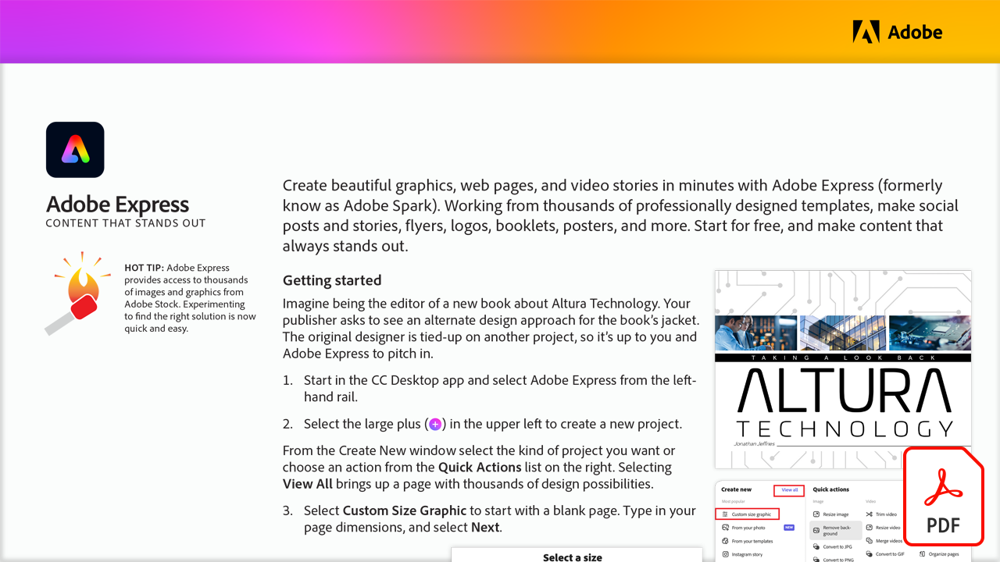

# Adobe Express: Contenido que destaca

Crea gráficos, páginas web e historias en vídeo atractivos en cuestión de minutos con Adobe Express (anteriormente conocido como Adobe Spark). Trabaja a partir de miles de plantillas diseñadas de forma profesional y crea publicaciones e historias para redes sociales, folletos, logotipos, folletos, carteles y mucho más. Empieza gratis y crea contenido que destaque siempre.

Seleccione la imagen siguiente para ver o descargar este tutorial de PDF.

[{width="680"}](assets/Adobe-Express-content-that-stands-out.pdf){target="blank"}
