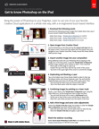

# Crear composiciones únicas con Adobe [!DNL Stock] y Photoshop para iPad

Lleva el poder de Photoshop al alcance de tu mano. Aprende a usar una de tus aplicaciones de Creative Cloud favoritas de una forma completamente nueva, con una interfaz táctil rediseñada.

>[!VIDEO](https://video.tv.adobe.com/v/331004?hidetitle=true)

  

[**Descargue la guía del PDF de referencia rápida**](../quick-reference/GettoknowPhotoshopontheiPad.pdf)

