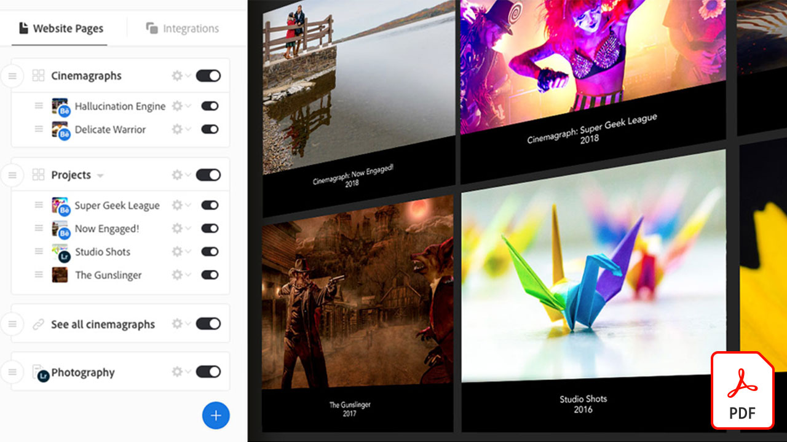
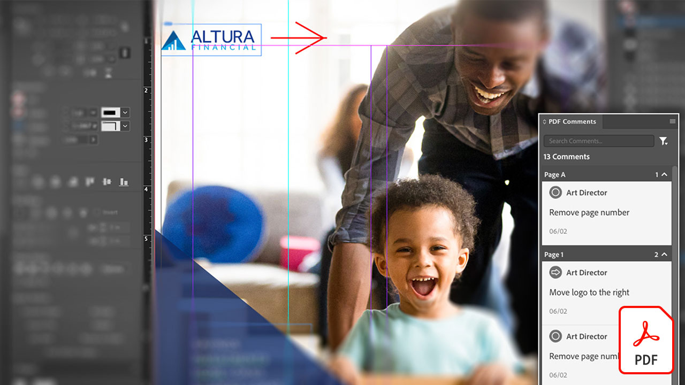

# Tutoriales de Creative Cloud para empresas

Como creativo empresarial, debe colaborar con equipos distribuidos, establecer procesos escalables y cumplir con los sistemas y directrices corporativos. Estos tutoriales le ayudan a aprender las nuevas funciones del Creative Cloud desde una perspectiva empresarial.

## Haga clic para ver un tutorial de producto

### Creative Cloud para empresas

<table style="table-layout:fixed">
<tr>
 <td>
   
    

   <a href="assets/FromHandLetteringtoIllustratorviaCreativeCloud.pdf"><strong>De la carta mano a Illustrator mediante Creative Cloud (PDF)</strong></a>
    

    <em>Gracias a la potencia del Creative Cloud para empresas, las aplicaciones móviles y de escritorio de Adobe le permiten capturar, convertir y crear desde cualquier lugar: en cualquier dispositivo</em>
     
  </td>
  <td>
   
    

   <a href="assets/FromLightroomWebtoInDesignviaCreativeCloud.pdf"><strong>De Lightroom Web a InDesign mediante Creative Cloud (PDF)</strong></a>
    

    <em>Lleve su creatividad desde la cámara al diseño final con archivos y bibliotecas Creative Cloud</em>
     
  </td>
  <td>
    
    

     
  </td>
</tr>
</table>

### Spark

<table style="table-layout:fixed">
<tr>
 <td>
   
    

   <a href="assets/AddingaGlideshowtoyourSparkPageAdobeBlog.pdf"><strong>Adición de una proyección de diapositivas a la página de Spark (PDF)</strong></a>
    

    <em>Adobe Spark Page ofrece algunos componentes de diseño increíbles y fáciles de usar que dan vida a sus artículos web</em>
     
  </td>
  <td>
   
    

   <a href="assets/CreatingYourBrandinAdobeSpark.pdf"><strong>Creación de su marca en Adobe Spark (PDF)</strong></a>
    

    <em>Adobe Spark facilita la definición de su marca</em>
     
  </td>
  <td>
   
    

   <a href="assets/MeetYourNewProductionArtistAdobeSparkPost.pdf"><strong>Conozca A Su Nuevo Artista De Producción: Adobe Spark Post (PDF)</strong></a>
    

    <em>Adobe Spark aprende de usted a medida que crea diseños, define colores, importa ilustraciones y organiza elementos en sus composiciones</em>
     
  </td>
</tr>
</table>

### Photoshop

<table style="table-layout:fixed">
<tr>
   <td>
    
    

    <a href="alphabetsoup.md"><strong>Descodificación de la sopa de letras de formatos gráficos</strong></a>
    

    <em>Los archivos JPG, PNG, SVG, GIF y EPS se suelen utilizar en el diseño, algunos para páginas web y otros para presentaciones, publicaciones y proyectos creativos. Pero, ¿qué significan y cuál deberían escoger?</em>
     
  </td>
  <td>
    
    

    <a href="compositepsipad.md"><strong>Crear composiciones únicas con Adobe [!DNL Stock] y Photoshop para iPad</strong></a>
    

    <em>Lleve la potencia de Photoshop al alcance de la mano. Aprenda a utilizar una de sus aplicaciones Creative Cloud favoritas de una forma completamente nueva, con una interfaz táctil rediseñada</em>
     
  </td>
  <td>
    
    

    <a href="cinemagraphps.md"><strong>Creación de párrafos con Photoshop</strong></a>
    

    <em>En este tutorial de vídeo de taller paso a paso, puede crear una fotografía interactiva combinando vídeo del Adobe [!DNL Stock] con técnicas inteligentes de enmascaramiento en Photoshop</em>
     
  </td>
</tr>
<tr>
   <td>
    
    

    <a href="assets/AddRemarkableLightingtoaPhotowithPhotoshopandAfterEffects.pdf"><strong>Adición de iluminación notable a una fotografía con Photoshop y After Effects (PDF)</strong></a>
    

    <em>Aprenda a utilizar el efecto Desenfoque de luz en Adobe After Effects para mejorar drásticamente una fotografía</em>
     
   </td>
   <td>
    
    

    <a href="assets/CreateCinemagraphsinaSnapwithPhotoshopandAdobeStock.pdf"><strong>Crear párrafos en un abrir y cerrar de ojos con Photoshop y Adobe [!DNL Stock] (PDF)</strong></a>
    

    <em>Buscando vídeos en bucle sin problemas en Adobe [!DNL Stock] para ensamblar rápidamente llamativos párrafos en Photoshop</em>
     
  </td>
   <td>
    
    

    <a href="assets/CreatingaLivingPhotographwithPhotoshopPart1.pdf"><strong>Creación de una fotografía interactiva con Photoshop — Parte 1 (PDF)</strong></a>
    

    <em>Adobe Photoshop le permite convertir rápidamente sus vídeos cortos en fotografías vivas que fascinan a su público en cualquier plataforma social</em>
     
  </td>
</tr>
<tr>
   <td>
    
    

    <a href="assets/CreatingaLivingPhotographwithPhotoshopPart2.pdf"><strong>Creación de una fotografía interactiva con Photoshop — Parte 2 (PDF)</strong></a>
    

    <em>La combinación de fotografías con vídeo es una forma eficaz de añadir una calidad atractiva a las fotografías sin sacrificar el mensaje ni el tono de la imagen original</em>
     
  </td>
  <td>
    
    

    <a href="assets/PhotoshopAfterEffectsAwesomenessAdobeMAX2018LabRecap.pdf"><strong>Photoshop + After Effects = Tolerancia: Adobe MAX 2018 Lab Recap (PDF)</strong></a>
    

    <em>En este laboratorio práctico y paso a paso, combine Photoshop con After Effects para crear imágenes y efectos impresionantes adecuados para su uso en cualquier medio</em>
     
  </td>
  <td>
    
    

    <a href="assets/QuicklyBrandYourInstagramPhotoswithAdobePhotoshopActions.pdf"><strong>Marcar rápidamente sus fotografías de Instagram con acciones de Adobe Photoshop (PDF)</strong></a>
    

    <em>Elimine el tedio y ahorre toneladas de tiempo mediante acciones en Photoshop</em>
     
  </td>
</tr>
<tr>
    <td>
    
    

    <a href="assets/WorkSmarterNotHarderwithPhotoshop.pdf"><strong>Trabajar de forma más inteligente, no más difícil, con Photoshop (PDF)</strong></a>
    

    <em>Los cambios en Photoshop pueden llevar mucho tiempo, pero no tienen por qué</em>
     
  </td>
   <td>
    
    

    <a href="assets/AnyoneCanBeCreativewithAdobeCreativeCloud.pdf"><strong>Añada un poco de Adobe Photoshop a su conjunto de habilidades creativas (PDF)</strong></a>
    

    <em>Añada un poco de Adobe Photoshop a su conjunto de habilidades creativas</em>
     
  </td>
  <td>
    
    

    <a href="assets/GreenScreenisNotJustforVideo.pdf"><strong>La pantalla verde no es solo para vídeo (PDF)</strong></a>
    

    <em>Puede utilizar la pantalla verde en un estudio de fotografías y After Effects para preparar el uso de la fotografía en Photoshop</em>
     
  </td>
</tr>  
</table>

### Fresco

<table>
<tr>
 <td>
   
    

   <a href="frescoworkshop.md"><strong>Pruebe su mano en el Fresco en el iPad (y iPhone)</strong></a>
    

    <em>Explore un nuevo mundo de dibujo digital y pintura con Adobe Fresca en este taller práctico de 15 minutos</em>
     
  </td>
  <td>
    
    

     
  </td>
  <td>
    
    

     
  </td>
</tr>
</table>

### Adobe Portfolio

<table  style="table-layout:fixed">
<tr>
   <td>
   
    

   <a href="assets/GettingStartedWithAdobePortfolio.pdf"><strong>Introducción a Adobe Portfolio (PDF)</strong></a>
    

    <em>Compartir su mejor trabajo con Adobe Portfolio es una forma eficaz de compartir su éxito y atraer nuevos talentos creativos</em>
     
  </td>
   <td>
   
    

   <a href="assets/ConnectingLightroomandBehancetoYourAdobePortfolio.pdf"><strong>Conexión de Lightroom y Bēhance a su Adobe Portfolio (PDF)</strong></a>
    

    <em>Usar proyectos de Bēhance como páginas en su portafolio</em>
     
  </td>
  <td>
   
    

   <a href="assets/ShowYourBestWorkwithAdobePortfolio.pdf"><strong>Mostrar el mejor trabajo con Adobe Portfolio (PDF)</strong></a>
    

    <em>Adobe Portfolio le permite cargar, organizar y compartir su trabajo con personal y clientes potenciales de todo el mundo</em>
     
  </td>
 </tr>
 </table>

### Bibliotecas CC

<table  style="table-layout:fixed">
<tr>
  <td>
   
   

   <a href="ccteamlibraries.md"><strong>Creación de bibliotecas de Creative Cloud para equipos</strong></a>
    

    <em>Aprenda a compartir recursos dentro de un grupo o equipo mediante las bibliotecas de Creative Cloud para equipos</em>
     
  </td>
  <td>
   
   

   <a href="sharecclibraries.md"><strong>Uso compartido de recursos de marca con bibliotecas de Creative Cloud para equipos</strong></a>
    

    <em>Aprenda a crear, utilizar y compartir activos de marca para su grupo o equipo mediante las bibliotecas de Creative Cloud para equipos</em>
     
  </td>
  <td>
   
    

   <a href="assets/CreateAddandShareYourBrandAssetswithCreativeCloudLibraries.pdf"><strong>Creación, adición y uso compartido de los recursos de marca con las bibliotecas de Creative Cloud (PDF)</strong></a>
    

    <em>Las Bibliotecas Creative Cloud proporcionan un sistema de marca integrado que permite a los diseñadores compartir los activos de marca entre equipos creativos</em>
     
  </td>
</tr>
<tr>
  <td>
   
    

   <a href="assets/ShareTextStylesFromIllustratorwithCreativeCloudLibraries.pdf"><strong>Compartir estilos de texto de Illustrator con bibliotecas de Creative Cloud (PDF)</strong></a>
    

    <em>Trabajar de forma más inteligente, no más difícil, en Illustrator</em>
     
  </td>
  <td>
    
    

     
  </td>
  <td>
    
    

     
  </td>
</tr>
</table>

### Fuentes

<table  style="table-layout:fixed">
<tr>
  <td>
   
    

   <a href="assets/CreatingBeautifulTypographywithCreativeCloud.pdf"><strong>Creación de una tipografía atractiva con Creative Cloud (PDF)</strong></a>
    

    <em>Aprenda a aprovechar los controles tipográficos de última generación que se encuentran en sus herramientas de diseño favoritas</em>
     
  </td>
   <td>
   
    

   <a href="assets/DiscoveringFontswithCreativeCloud.pdf"><strong>Detección de fuentes con Creative Cloud (PDF)</strong></a>
    

    <em>Encontrar la fuente correcta para un proyecto puede parecer abrumador a veces. Con varias aplicaciones y servicios de Creative Cloud, ahora encontrar la fuente correcta es divertido e inspirador</em>
     
  </td>
  <td>
   
    

   <a href="assets/UnleashHiddenGemsinOpenTypefonts.pdf"><strong>Liberar gemas ocultos en las fuentes de OpenType (PDF)</strong></a>
    

    <em>El formato de OpenType permite que una fuente contenga hasta 65.536 pictogramas</em>
     
  </td>
</tr>
</table>

### InDesign

<table  style="table-layout:fixed">
<tr>
  <td>
   
    

   <a href="assets/CreatingInteractivePDFsfromInDesign.pdf"><strong>Creación de archivos PDF interactivos desde InDesign (PDF)</strong></a>
    

    <em>InDesign contiene muchas funciones que le ayudan a dar formato, diseñar, administrar y realizar el seguimiento del contenido de los documentos</em>
     
  </td>
   <td>
   
    

   <a href="assets/EasilyGatherandIncorporateDesignFeedbackwithAdobeAcrobatandInDesign.pdf"><strong>Recopilar e incorporar comentarios de diseño fácilmente con Adobe Acrobat y InDesign (PDF)</strong></a>
    

    <em>Las partes interesadas pueden utilizar Acrobat para añadir comentarios y anotaciones detallados y, a continuación, puede volver a incluir rápidamente esas marcas en Adobe InDesign para verlas en el contexto de su diseño</em>
     
  </td>
  <td>
   
    

   <a href="assets/StyleWebContentwithInDesign.pdf"><strong>Estilo del contenido web con Adobe InDesign CC (PDF)</strong></a>
    

    <em>¿Sabía que puede aprovechar la potencia del InDesign para generar gráficos HTML y web?</em>
     
  </td>
</tr>
<tr>
   <td>
   
    

   <a href="assets/InteractivePDFBookmarksandLinkedTOCsfromInDesign.pdf"><strong>PDF interactivo: Marcadores y TDC vinculados desde InDesign (PDF)</strong></a>
    

    <em>Aprenda a utilizar la función Tabla de contenido en InDesign para generar marcadores e hipervínculos que ayuden a los lectores a encontrar rápidamente información en los archivos PDF</em>
     
  </td>
   <td>
   
    

   <a href="assets/InteractivePDFGraphicalHyperlinksandNestedMasterPagesinInDesign.pdf"><strong>PDF interactivo: Hipervínculos gráficos y páginas maestras anidadas en InDesign (PDF)</strong></a>
    

    <em>La aplicación de hipervínculos con páginas maestras permite administrar rápidamente un sistema de navegación en todas las páginas</em>
     
  </td>
  <td>
    
    

     
  </td>
</tr>
</table>

### Illustrator

<table  style="table-layout:fixed">
<tr>
   <td>
   
    

   <a href="assets/GettoKnowGraphicStylesinIllustrator.pdf"><strong>Introducción a los estilos gráficos en Illustrator (PDF)</strong></a>
    

    <em>Illustrator le ofrece la posibilidad de diseñar ilustraciones de la misma forma que el texto</em>
     
  </td>
   <td>
   
    

   <a href="assets/WorkSmarterNotHarderwithIllustrator.pdf"><strong>Trabajar de forma más inteligente, no más difícil, con Adobe Illustrator CC (PDF)</strong></a>
    

    <em>Acelere los dibujos vectoriales en Illustrator</em>
     
  </td>
  <td>
   
    

   <a href="assets/IllustratorSymbolsandLayersequalsPerfectStructureforResponsiveSVG.pdf"><strong>Símbolos Illustrator + capas = estructura perfecta para SVG interactivo (PDF)</strong></a>
    

    <em>Illustrator ofrece una compatibilidad sin precedentes con el formato SVG, incluida la posibilidad de crear símbolos, grupos, ID y definiciones vectoriales precisas de la ilustración</em>
     
  </td>
</tr>
</table>

### [!DNL Dimension]

<table  style="table-layout:fixed">
<tr>
   <td>
   
    

   <a href="assets/VisualizeyourProductinaRealisticEnvironment.pdf"><strong>Visualizar el producto en un entorno realista (PDF)</strong></a>
    

    <em>Cuando quiera ver cómo se ven sus productos en el mundo real, Adobe [!DNL Dimension] es su aplicación de destino</em>
     
  </td>
  <td>
    
    

     
  </td>
  <td>
    
    

     
  </td>
</tr>
</table>
