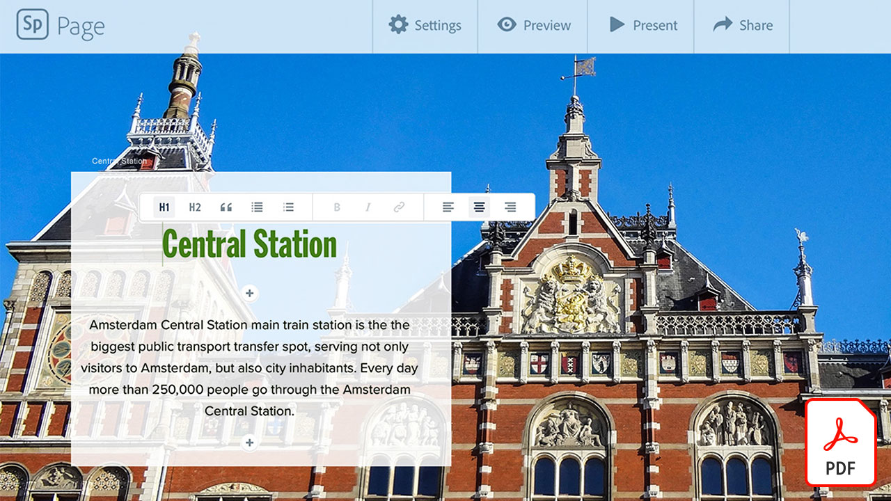

# Tutoriales de Creative Cloud para empresas

Como creativo empresarial, debe colaborar con equipos distribuidos, establecer procesos ampliables y cumplir con los sistemas y directrices corporativos. Estos tutoriales le ayudarán a conocer las nuevas funciones de Creative Cloud, desde una perspectiva empresarial.

## Haga clic para ver un tutorial de producto (en orden alfabético)

### Adobe Acrobat

<table style="table-layout:fixed">
<tr>
 <td>
   
    

   <a href="acrobat-content-creators.md"><strong>Acrobat para creadores de contenido (PDF)</strong></a>
    

    <em>Descubre las herramientas de Acrobat que ayudan a agilizar los flujos de trabajo creativos</em>
     
  </td>
  <td>
    
    

     
  </td>
  <td>
    
    

     
  </td>
  <td>
    
    

     
  </td>
</tr>
</table>

### Adobe Express (anteriormente Adobe Spark)

<table style="table-layout:fixed">
<tr>
 <td>
   
    

   <a href="assets/AddingaGlideshowtoyourSparkPageAdobeBlog.pdf"><strong>Añadir una proyección de diapositivas a su Spark Page (PDF)</strong></a>
    

    <em>Adobe Spark ofrece algunos componentes de diseño sorprendentes y fáciles de usar que dan vida a tus historias web</em>
     
  </td>
  <td>
   
    

   <a href="assets/CreatingYourBrandinAdobeSpark.pdf"><strong>Creación de su marca en Adobe Spark (PDF)</strong></a>
    

    <em>Adobe Spark facilita la definición de tu marca</em>
     
  </td>
  <td>
   
    

   <a href="assets/MeetYourNewProductionArtistAdobeSparkPost.pdf"><strong>Conozca a su nuevo artista de producción: Adobe Spark Post (PDF)</strong></a>
    

    <em>Adobe Spark aprende de usted mientras crea diseños, define colores, importa ilustraciones y organiza elementos en sus composiciones</em>
     
  </td>
  <td>
    
    

     
  </td>
</tr>
</table>

### Adobe Portfolio

<table  style="table-layout:fixed">
<tr>
   <td>
   
    

   <a href="assets/GettingStartedWithAdobePortfolio.pdf"><strong>Introducción A Adobe Portfolio (PDF)</strong></a>
    

    <em>Compartir tu mejor trabajo con Adobe Portfolio es una forma eficaz de compartir tu éxito y atraer a nuevos talentos creativos</em>
     
  </td>
  <td>
   
    

   <a href="assets/ConnectingLightroomandBehancetoYourAdobePortfolio.pdf"><strong>Conexión de Lightroom y Bēhance a su Adobe Portfolio (PDF)</strong></a>
    

    <em>Utiliza proyectos de Bēhance como páginas de tu portafolio</em>
     
  </td>
  <td>
   
    

   <a href="assets/ShowYourBestWorkwithAdobePortfolio.pdf"><strong>Mostrar sus mejores trabajos con Adobe Portfolio (PDF)</strong></a>
    

    <em>Adobe Portfolio te permite cargar, organizar y compartir tu trabajo con posibles empleados y clientes de todo el mundo</em>
     
  </td>
  <td>
    
    

     
  </td>
 </tr>
 </table>

### Bibliotecas CC

<table  style="table-layout:fixed">
<tr>
  <td>
   
   

   <a href="cc-workflows-cc-libraries.md"><strong>Mejorar los flujos de trabajo de CC con Bibliotecas CC</strong></a>
    

    <em>Descubre cómo las Bibliotecas Creative Cloud mantienen juntos los elementos de diseño, lo que garantiza la coherencia del proyecto para los diseñadores y los equipos</em>
     
  </td>
  <td>
   
   

   <a href="ccteamlibraries.md"><strong>Creación de bibliotecas de Creative Cloud para equipos</strong></a>
    

    <em>Aprenda a compartir recursos dentro de un grupo o equipo mediante Bibliotecas Creative Cloud para equipos</em>
     
  </td>
  <td>
   
   

   <a href="sharecclibraries.md"><strong>Compartir recursos de marca con Bibliotecas Creative Cloud para equipos</strong></a>
    

    <em>Aprenda a crear, usar y compartir recursos de marca para su grupo o equipo mediante Bibliotecas Creative Cloud para equipos</em>
     
  </td>
  <td>
   
    

   <a href="assets/CreateAddandShareYourBrandAssetswithCreativeCloudLibraries.pdf"><strong>Cree, agregue y comparta los activos de su marca con las bibliotecas de Creative Cloud (PDF)</strong></a>
    

    <em>Bibliotecas Creative Cloud proporciona un sistema de marca integrado que permite a los diseñadores compartir activos de marca entre los equipos creativos</em>
     
  </td>
  </tr>
  <tr>
  <td>
   
    

   <a href="assets/ShareTextStylesFromIllustratorwithCreativeCloudLibraries.pdf"><strong>Compartir estilos de texto de Illustrator con Bibliotecas Creative Cloud (PDF)</strong></a>
    

    <em>Trabaja más inteligente, no más duro, en Illustrator</em>
     
  </td>
  <td>
    
    

     
  </td>
  <td>
    
    

     
  </td>
  <td>
    
    

     
  </td>
</tr>
</table>

### Creative Cloud para empresas

<table style="table-layout:fixed">
<tr>
 <td>
   
    

   <a href="assets/FromHandLetteringtoIllustratorviaCreativeCloud.pdf"><strong>De letras a mano a Illustrator mediante Creative Cloud (PDF)</strong></a>
    

    <em>Gracias a la potencia de Creative Cloud para empresas, las aplicaciones de escritorio y móviles de Adobe te permiten capturar, convertir y crear desde cualquier lugar, en cualquier dispositivo</em>
     
  </td>
  <td>
   
    

   <a href="assets/FromLightroomWebtoInDesignviaCreativeCloud.pdf"><strong>De la web de Lightroom al InDesign a través del Creative Cloud (PDF)</strong></a>
    

    <em>Lleva tu creatividad de la cámara al diseño final con archivos y bibliotecas de Creative Cloud</em>
     
  </td>
  <td>
    
    

     
  </td>
  <td>
    
    

     
  </td>
</tr>
</table>

### [!DNL Dimension]

<table  style="table-layout:fixed">
<tr>
   <td>
   
    

   <a href="assets/VisualizeyourProductinaRealisticEnvironment.pdf"><strong>Visualiza tu producto en un entorno realista (PDF)</strong></a>
    

    <em>Cuando quieras ver cómo quedan tus productos en el mundo real, utiliza Adobe [!DNL Dimension] es tu aplicación de referencia</em>
     
  </td>
  <td>
    
    

     
  </td>
  <td>
    
    

     
  </td>
  <td>
    
    

     
  </td>
</tr>
</table>

### Fresco

<table>
<tr>
 <td>
   
    

   <a href="frescoworkshop.md"><strong>Descubre Fresco en el iPad (y iPhone)</strong></a>
    

    <em>Explora un mundo completamente nuevo del dibujo y la pintura digitales con Adobe Fresca en este taller práctico de 15 minutos</em>
     
  </td>
  <td>
    
    

     
  </td>
  <td>
    
    

     
  </td>
  <td>
    
    

     
  </td>
</tr>
</table>

### Fuentes

<table  style="table-layout:fixed">
<tr>
<td>
   
    

   <a href="taming-type-anxiety.md"><strong>Ansiedad de tipo de domo (PDF)</strong></a>
    

    <em>Obtenga información sobre cómo acceder a más de 20 000 fuentes diseñadas profesionalmente en Creative Cloud y utilizarlas</em>
     
  </td>
  <td>
   
    

   <a href="assets/CreatingBeautifulTypographywithCreativeCloud.pdf"><strong>Creación de tipografías atractivas con Creative Cloud (PDF)</strong></a>
    

    <em>Aprenda a aprovechar los controles tipográficos de última generación que se encuentran en sus herramientas de diseño favoritas</em>
     
  </td>
   <td>
   
    

   <a href="assets/DiscoveringFontswithCreativeCloud.pdf"><strong>Detección de fuentes con Creative Cloud (PDF)</strong></a>
    

    <em>Encontrar la fuente adecuada para un proyecto puede parecer abrumador a veces. Gracias a las distintas aplicaciones y servicios de Creative Cloud, encontrar la fuente adecuada resulta divertido e inspirador</em>
     
  </td>
  <td>
   
    

   <a href="assets/UnleashHiddenGemsinOpenTypefonts.pdf"><strong>Desencadenar gemas ocultas en fuentes de OpenType (PDF)</strong></a>
    

    <em>El formato de OpenType permite que una fuente contenga hasta 65.536 glifos</em>
     
  </td>
</table>

### Illustrator

<table  style="table-layout:fixed">
<tr>
   <td>
   
    

   <a href="assets/GettoKnowGraphicStylesinIllustrator.pdf"><strong>Conocer los estilos gráficos en Illustrator (PDF)</strong></a>
    

    <em>Illustrator le permite dar estilo a sus ilustraciones de la misma forma que a su texto</em>
     
  </td>
   <td>
   
    

   <a href="assets/WorkSmarterNotHarderwithIllustrator.pdf"><strong>Trabaja de forma más inteligente, no más duro, con Adobe Illustrator CC (PDF)</strong></a>
    

    <em>Agiliza tus dibujos vectoriales en Illustrator</em>
     
  </td>
  <td>
   
    

   <a href="assets/IllustratorSymbolsandLayersequalsPerfectStructureforResponsiveSVG.pdf"><strong>Illustrator Symbols + Layers = Estructura perfecta para SVG sensible! (PDF)</strong></a>
    

    <em>Illustrator proporciona una compatibilidad inigualable para el formato de SVG, incluida la capacidad de crear símbolos, grupos, ID y definiciones vectoriales precisas de su ilustración</em>
     
  </td>
  <td>
    
    

     
  </td>
</tr>
</table>

### InDesign

<table  style="table-layout:fixed">
<tr>
  <td>
   
    

   <a href="assets/CreatingInteractivePDFsfromInDesign.pdf"><strong>Creación de PDF interactivos desde el InDesign (PDF)</strong></a>
    

    <em>InDesign contiene muchas funciones que le ayudan a dar formato, estilo, administrar y realizar un seguimiento del contenido de los documentos</em>
     
  </td>
   <td>
   
    

   <a href="assets/EasilyGatherandIncorporateDesignFeedbackwithAdobeAcrobatandInDesign.pdf"><strong>Recopile e incorpore fácilmente comentarios de diseño con Adobe Acrobat y InDesign (PDF)</strong></a>
    

    <em>Los responsables de departamento pueden usar Acrobat para agregar comentarios y anotaciones detallados, y luego puedes volver a llevar rápidamente esas marcas a Adobe InDesign para verlas en el contexto de tu diseño</em>
     
  </td>
  <td>
   
    

   <a href="assets/StyleWebContentwithInDesign.pdf"><strong>Aplicación de estilos al contenido web con Adobe InDesign CC (PDF)</strong></a>
    

    <em>¿Sabía que puede aprovechar la potencia del InDesign para generar gráficos web y de HTML?</em>
     
  </td>
  <td>
   
    

   <a href="assets/InteractivePDFBookmarksandLinkedTOCsfromInDesign.pdf"><strong>PDF interactivo: Marcadores y índice vinculados de InDesign (PDF)</strong></a>
    

    <em>Aprenda a utilizar la función Tabla de contenido en InDesign para generar marcadores e hipervínculos que ayuden a los usuarios a encontrar información rápidamente en los archivos de PDF</em>
     
  </td>
</tr>
<tr>
  <td>
   
    

   <a href="assets/InteractivePDFGraphicalHyperlinksandNestedMasterPagesinInDesign.pdf"><strong>PDF interactivo: Hipervínculos gráficos y páginas maestras anidadas en InDesign (PDF)</strong></a>
    

    <em>La aplicación de hipervínculos con páginas principales permite administrar rápidamente un sistema de navegación en todas las páginas</em>
     
  </td>
  <td>
    
    

     
  </td>
  <td>
    
    

     
  </td>
  <td>
    
    

     
  </td>
</tr>
</table>

### Photoshop

<table style="table-layout:fixed">
<tr>
  <td>
    
    

    <a href="alphabetsoup.md"><strong>Descodificación de la sopa de alfabetos de formatos gráficos</strong></a>
    

    <em>Los archivos de JPG, PNG, SVG, GIF y EPS se suelen utilizar en el diseño, algunos para páginas web y otros para presentaciones, publicaciones y proyectos creativos. Pero, ¿qué significan y qué debes elegir?</em>
     
  </td>
  <td>
    
    

    <a href="compositepsipad.md"><strong>Crear composiciones únicas con Adobe [!DNL Stock] y Photoshop para iPad</strong></a>
    

    <em>Lleva el poder de Photoshop al alcance de tu mano. Aprende a usar una de tus aplicaciones de Creative Cloud favoritas de una forma completamente nueva, con una interfaz táctil rediseñada</em>
     
  </td>
  <td>
    
    

    <a href="cinemagraphps.md"><strong>Creación de cinematografías con Photoshop</strong></a>
    

    <em>En este tutorial en vídeo paso a paso en el taller, puedes crear una fotografía viva combinando el vídeo del Adobe [!DNL Stock] con técnicas de enmascaramiento inteligentes en Photoshop</em>
     
  </td>
  <td>
    
    

    <a href="assets/AddRemarkableLightingtoaPhotowithPhotoshopandAfterEffects.pdf"><strong>Añade una luz excepcional a una foto con Photoshop y After Effects (PDF)</strong></a>
    

    <em>Aprenda a utilizar el efecto Explosión de luz en Adobe After Effects para mejorar de forma significativa una fotografía</em>
     
  </td>
</tr>
<tr>
  <td>
    
    

    <a href="assets/CreateCinemagraphsinaSnapwithPhotoshopandAdobeStock.pdf"><strong>Crea películas en un instante con Photoshop y Adobe [!DNL Stock] (PDF)</strong></a>
    

    <em>Búsqueda de vídeos en bucle sin problemas en el Adobe [!DNL Stock] para montar rápidamente cinemógrafos llamativos en Photoshop</em>
     
  </td>
  <td>
    
    

    <a href="assets/CreatingaLivingPhotographwithPhotoshopPart1.pdf"><strong>Creación de una fotografía viva con Photoshop — Parte 1 (PDF)</strong></a>
    

    <em>Adobe Photoshop te permite convertir rápidamente tus vídeos cortos en fotografías vivas que cautivan a tu audiencia en cualquier plataforma social</em>
     
  </td>
  <td>
    
    

    <a href="assets/CreatingaLivingPhotographwithPhotoshopPart2.pdf"><strong>Creación de una fotografía viva con Photoshop — Parte 2 (PDF)</strong></a>
    

    <em>La combinación de fotos y vídeos es una forma eficaz de añadir una calidad atractiva a las fotos sin sacrificar el mensaje o el tono de la imagen original</em>
     
  </td>
  <td>
    
    

    <a href="assets/PhotoshopAfterEffectsAwesomenessAdobeMAX2018LabRecap.pdf"><strong>Photoshop + After Effects = Conciencia: Adobe MAX 2018 Lab Recap (PDF)</strong></a>
    

    <em>En este laboratorio práctico paso a paso, combina Photoshop con After Effects para crear imágenes y efectos que dejen boquiabiertos y adecuados para su uso en cualquier medio</em>
     
  </td>
</tr>
<tr>
  <td>
    
    

    <a href="assets/QuicklyBrandYourInstagramPhotoswithAdobePhotoshopActions.pdf"><strong>Marcar rápidamente sus fotos de Instagram con las acciones de Adobe Photoshop (PDF)</strong></a>
    

    <em>Elimina lo tedioso y ahorra mucho tiempo con las acciones de Photoshop</em>
     
  </td>
  <td>
    
    

    <a href="assets/WorkSmarterNotHarderwithPhotoshop.pdf"><strong>Trabaja más inteligente, no más duro, con Photoshop (PDF)</strong></a>
    

    <em>Los cambios en Photoshop pueden llevar mucho tiempo, pero no tienen por qué serlo</em>
     
  </td>
  <td>
    
    

    <a href="assets/AnyoneCanBeCreativewithAdobeCreativeCloud.pdf"><strong>Añade un poco de Adobe Photoshop a tu conjunto de habilidades creativas (PDF)</strong></a>
    

    <em>Añade un poco de Adobe Photoshop a tu conjunto de habilidades creativas</em>
     
  </td>
  <td>
    
    

    <a href="assets/GreenScreenisNotJustforVideo.pdf"><strong>La pantalla verde no es solo para vídeo (PDF)</strong></a>
    

    <em>Puede usar un fondo verde en un estudio fotográfico y usar After Effects para preparar la foto y usarla en Photoshop</em>
     
  </td>
</tr>  
</table>
