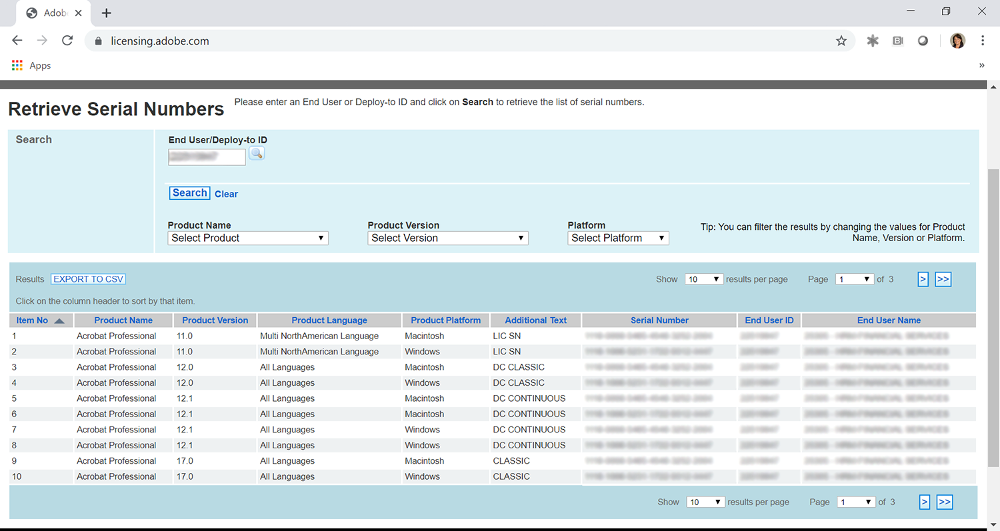
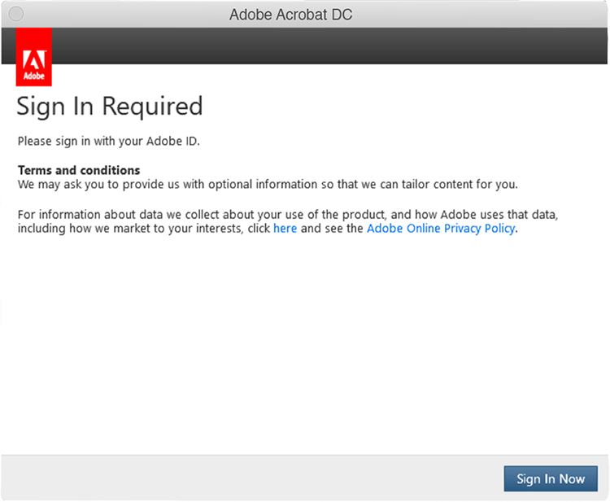

# Información sobre la caducidad de los números de serie de Creative Cloud para empresas y Acrobat

Históricamente, el Adobe proporcionaba números de serie con nuestras aplicaciones (es decir, Creative Suite, Creative Cloud para empresas, Acrobat XI, Acrobat DC) a los clientes mediante contratos de licencias de duración determinada para empresas (ETLA). Estos números de serie tienen una fecha de caducidad. Una vez transcurrida la fecha de caducidad, el producto dejará de funcionar, por lo que es importante planificar la migración antes de que caduquen los números de serie. Esta página describe los pasos necesarios para garantizar que los usuarios finales tengan acceso continuo a sus aplicaciones y servicios de Adobe.

## Comprobación de los números de serie para su fecha de caducidad

### Buscar los números de serie

Las licencias de número de serie asociadas a su acuerdo de ETLA están disponibles a través de la [Sitio web de licencias de Adobe](https://licensing.adobe.com/) (LWS). Siga estas instrucciones para mostrar y descargar:

1. Iniciar sesión en [Sitio web de licencias de Adobe](https://licensing.adobe.com/) (LWS) con su Adobe ID y contraseña.
1. Elegir **Licencias > Recuperar números de serie**.
1. Introduzca su **ID de usuario final** o **ID de implementación**.
1. (Opcional) Seleccione una **Nombre del producto**, **Versión del producto**, o **Platform** para filtrar resultados.
1. Haga clic en Buscar.
1. Se muestran los números de serie y el nombre del producto.
1. (Opcional) Seleccione &quot;EXPORTAR A CSV&quot; para descargar la lista de números de serie.

### Comprobar la fecha de caducidad

La [AdobeExpiryCheck](https://helpx.adobe.com/enterprise/kb/volume-license-expiration-check.html) es una utilidad de línea de comandos para administradores de TI que permite comprobar si los productos de Adobe de un equipo utilizan números de serie que han caducado o van a caducar. La herramienta mostrará información como el identificador de licencia del producto (LEID), el número de serie cifrado y la fecha de caducidad. Esto [página](https://helpx.adobe.com/enterprise/kb/volume-license-expiration-check.html) contiene instrucciones sobre cómo descargar y utilizar la herramienta en equipos Mac o Windows.

## Conocer la experiencia del usuario final antes y después de que caduque el número de serie

Tanto Acrobat como Creative Cloud para aplicaciones empresariales empezarán a mostrar mensajes (en las aplicaciones) 60 días antes del vencimiento. Una vez que caduca el número de serie, los productos dejan de funcionar y se solicita al usuario que realice una acción.

### Creative Cloud para la experiencia empresarial

La siguiente información describe la experiencia del usuario final. A continuación se muestra un breve vídeo seguido de una revisión de la experiencia del usuario final.

>[!VIDEO](https://video.tv.adobe.com/v/331746?hidetitle=true)

**Antes del vencimiento**

A partir de 60 días antes de que caduque el número de serie, todas las aplicaciones de Creative Cloud para empresas muestran un cuadro de diálogo en el producto al usuario final. Este mensaje aparecerá semanalmente, hasta 30 días antes del vencimiento, y luego aparecerá diariamente hasta la fecha de vencimiento que comience *Su licencia está a punto de caducar. Este producto de Adobe utiliza una licencia que caducará el 29 de noviembre de 2020. Póngase en contacto con el administrador para asegurarse de que sigue teniendo acceso*.

**Después del vencimiento**

Una vez que caduque el número de serie, los usuarios ya no tendrán acceso al Creative Cloud de las aplicaciones empresariales. La primera vez que se inicie tras el vencimiento, se mostrará al usuario un cuadro de diálogo que indicará *El número de serie que has introducido ha caducado. No se puede adquirir la licencia de este producto. Póngase en contacto con Asistencia al cliente*.

En todos los intentos posteriores de iniciar las aplicaciones, se solicitará al usuario final que **Iniciar sesión ahora** seguido de la opción para crear su propio Adobe ID y entrar en el modo de prueba. Sin embargo, cualquier nuevo Adobe ID creado por el usuario final no se asociará a las licencias de su organización y causará confusión adicional a sus usuarios. Para evitar la interrupción de la actividad o confusión innecesaria, migre sus usuarios a licencias de usuario designadas antes de que caduquen sus números de serie.

### Experiencia de Acrobat

La siguiente información describe la experiencia del usuario final. A continuación se muestra un breve vídeo seguido de una revisión de la experiencia del usuario final.

>[!VIDEO](https://video.tv.adobe.com/v/331749?hidetitle=true)

**Antes del vencimiento**

A partir de los 60 días antes de que caduque el número de serie, Acrobat muestra un mensaje emergente del producto al usuario final. Esto aparecerá una vez a la semana hasta 7 días antes del vencimiento. Entonces comenzará a aparecer diariamente comenzando *Su licencia de Adobe Acrobat caduca el 11/30/2020. Póngase en contacto con el administrador para seguir utilizando Acrobat sin interrupciones.*

**Después del vencimiento**

Una vez que caduque el número de serie, los usuarios ya no tendrán acceso a Acrobat. La primera vez que se inicie tras el vencimiento, se mostrará al usuario un cuadro de diálogo que indicará *El número de serie que has introducido ha caducado. No se puede adquirir la licencia de este producto. Póngase en contacto con Asistencia al cliente.*

En todos los intentos posteriores de iniciar Acrobat, se solicitará al usuario que **Iniciar sesión ahora** seguido de la opción para crear su propio Adobe ID y entrar en el modo de prueba. Sin embargo, cualquier nuevo Adobe ID creado por el usuario final no se asociará a las licencias de su organización y causará confusión adicional a sus usuarios.

## Contacte con nosotros si necesita ayuda

Si tiene alguna pregunta sobre el uso de la [AdobeExpiryCheck](https://helpx.adobe.com/enterprise/kb/volume-license-expiration-check.html) o necesita ayuda para migrar de la implementación de números de serie a un usuario designado, tiene varias opciones:
* Enviar un correo electrónico al equipo de Adobe Enterprise Onboarding: **entonb@adobe.com**
* Abra un ticket de asistencia en [Admin Console](https://adminconsole.adobe.com/support)
* Póngase en contacto con el administrador de cuentas de Adobe o el administrador de éxito de clientes
