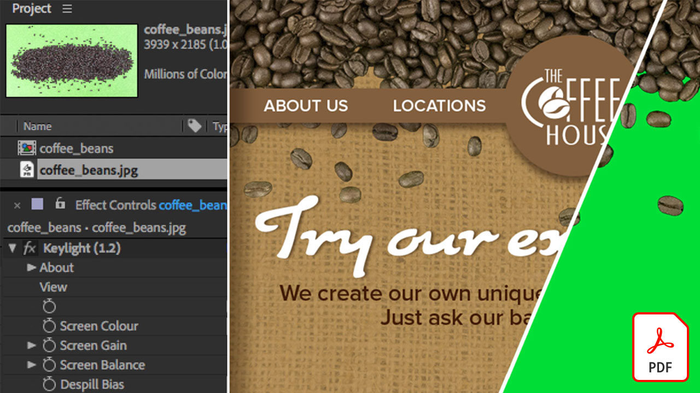

# Guías de referencia rápida de vídeo

Dale vida a tus ideas con las aplicaciones y software de Adobe para edición de vídeo, gráficos en movimiento, efectos visuales, animación y mucho más. Seleccione una imagen para descargar o ver un PDF de la guía de referencia rápida.

## Adobe Audition

<table>
<tr>
   <td>
      
      

      <a href="assets/QuicklyRemoveUnwantedAudioContentwiththeSpotHealingBrushinAdobeAudition.pdf" target="_blank"><strong>Elimina rápidamente el contenido de audio no deseado con el pincel corrector puntual en Adobe Audition (PDF)</strong></a>
      

      <em>¿Sabías que el Pincel corrector puntual de Adobe Photoshop te permite eliminar sonidos molestos de tus archivos de audio en Adobe Audition?</em>
       
  </td>
  <td>
    
    

     
  </td>
  <td>
    
    

     
  </td>
  <td>
    
    

     
  </td>
</tr>
</table>

## Adobe Express (anteriormente Adobe Spark)

<table>
<tr>
<td>
   
    

   <a href="assets/ShowcaseyourSparkVideoinyourSparkPage.pdf" target="_blank"><strong>Mostrar el Spark Video en el Spark Page (PDF)</strong></a>
    

    <em>Adobe Spark Page te permite cargar vídeos de una variedad de fuentes, incluidos los vídeos que creas con Spark Video!</em>
     
  </td>
  <td>
    
    

     
  </td>
  <td>
    
    

     
  </td>
  <td>
    
    

     
  </td>
</tr>
</table>

## After Effects

<table>
<tr>
 <td>
   
    

   <a href="assets/AfterEffectsforPhotography.pdf" target="_blank"><strong>After Effects para fotografía (PDF)</strong></a>
    

    <em>Aprende a usar los increíbles efectos de After Effects para mejorar tus fotografías</em>
     
  </td>
  <td>
   
    

   <a href="assets/CinemagraphsTheMesmerizingPlaceBetweenaPhotoandaVideo.pdf" target="_blank"><strong>Cinemagramas: el lugar hipnotizante entre una foto y un vídeo (PDF)</strong></a>
    

    <em>Obtén más información sobre los cinemógrafos: esos llamativos híbridos que existen entre una foto y un vídeo</em>
     
  </td>
  <td>
   
    

   <a href="assets/CreateanIllustrationfromanAdobeStockPhotowithAfterEffects.pdf" target="_blank"><strong>Crear una ilustración a partir de una foto de Adobe [!DNL Stock] con After Effects (PDF)</strong></a>
    

    <em>Combina los niveles de tono y saturación con los efectos de dibujos animados en After Effects para crear una ilustración estilizada única a partir de una foto de [!DNL Stock] de Adobe</em>
     
  </td>
   <td>
   
    

   <a href="assets/CreateBeautifulKaleidoscopePatternswithAfterEffects.pdf" target="_blank"><strong>Crear hermosos patrones de caleidoscopio con el PDF de After Effects)</strong></a>
    

    <em>Crea un sinfín de patrones y texturas a partir de cualquier imagen con el efecto Caleidoscopio CC en Adobe After Effects</em>
     
  </td>
</tr>
<tr>
<td>
   
    

   <a href="assets/CreateIntricateTransparencyinyourPhotographswithKeyinginAfterEffects.pdf" target="_blank"><strong>Crea una transparencia compleja en tus fotografías con incrustación en After Effects (PDF)</strong></a>
    

    <em>La incrustación se usa mucho para vídeo; también puede ser de gran ayuda cuando se necesitan tus fotografías para proyectos de diseño</em>
     
  </td>
 <td>
   
    

   <a href="assets/CreateAnimatedTitlesUsingMotionGraphicsTemplatesinAdobePremiereRush.pdf" target="_blank"><strong>Crear títulos animados usando plantillas de gráficos animados en Adobe Premiere [!DNL Rush] (PDF)</strong></a>
    

    <em>Añade plantillas de gráficos animados de diseño profesional que se ajusten a tu historia o a tu marca personal para hacer que tus vídeos tengan un aspecto aún más increíble</em>
     
  </td>
  <td>
      
      

      <a href="assets/DazzlingLightEffectsforPhotographywithAfterEffects.pdf" target="_blank"><strong>Efectos de luz deslumbrantes para fotografía con After Effects (PDF)</strong></a>
      

      <em>Los efectos de iluminación en Adobe After Effects pueden cambiar drásticamente el aspecto de tu foto</em>
       
  </td>
  <td>
      
      

      <a href="assets/EditingVRPhotography360photoswithAfterEffects.pdf" target="_blank"><strong>Edición de fotografías de realidad virtual (fotos de 360 grados) con After Effects (PDF)</strong></a>
      

      <em>Aunque los juegos y experiencias interactivos más envolventes no son tan comunes, la fotografía en 360 grados ya está aquí</em>
       
  </td>
</tr>
</table>

## Premiere Rush

<table>
<tr>
   <td>
      
      

      <a href="assets/SmoothlyCombineMusicandDialogueorNarrationwithAutoduckinginAdobePremiereRush.pdf" target="_blank"><strong>Combina música y diálogo o narración sin problemas con atenuación automática en [!DNL Adobe Premiere Rush] (PDF)</strong></a>
      

      <em>Adobe Premiere [!DNL Rush] ofrece funciones avanzadas de edición de vídeo en una aplicación fácil de usar, para que cualquiera pueda crear un vídeo de calidad profesional en minutos</em>
       
  </td>
  <td>
    
    

     
  </td>
  <td>
    
    

     
  </td>
  <td>
    
    

     
  </td>
</tr>
</table>
