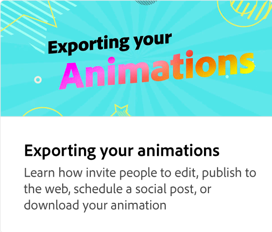

# ¿Qué es la cronología de animación?

Aprenda a navegar por la línea de tiempo de la animación y ajustarla. La cronología es una vista general de toda la animación, donde puede previsualizar y reducir/ampliar la duración de la animación.

>[!VIDEO](https://video.tv.adobe.com/v/3437604?captions=spa&quality=12&learn=on&hidetitle=true)

## Vídeos adicionales de esta serie

<table style="table-layout:fixed">
<tr>
   <td>
         
   </td>
   <td>
         
   </td>
   <td>
         
   </td>
   <td>
         
   </td>
</tr>
<tr>
   <td>
         
   </td>
   <td>
         
   </td>
   <td>
         
   </td>
   <td>
         
   </td>
</tr>
</table>
