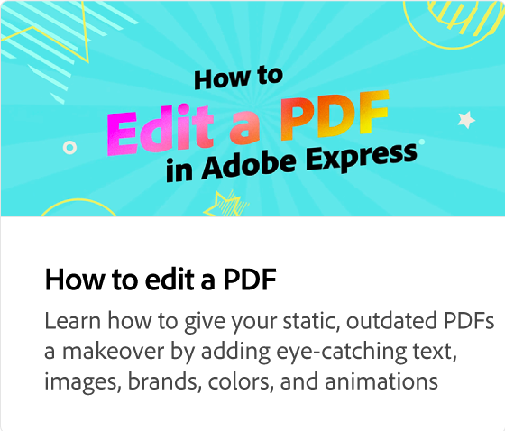

# Cómo traducir tu contenido de forma masiva

Aprenda a crear variaciones de idioma de sus proyectos traduciendo automáticamente el contenido a 46 idiomas diferentes. Puede seleccionar el idioma deseado, duplicar y traducir el contenido y conservar todas las animaciones.

>[!NOTE]
>
>Es importante revisar las traducciones para comprobar su exactitud antes de compartirlas o descargarlas.

>[!VIDEO](https://video.tv.adobe.com/v/3427023?quality=12&learn=on&hidetitle=true)

## Vídeos adicionales de esta serie

<table style="table-layout:fixed">
<tr>
   <td>
         
   </td>
   <td>
         
   </td>
   <td>
         
   </td>
   <td>
         
   </td>      
</tr>
<tr>
   <td>
      
   </td>
   <td>
      
   </td>
   <td>
      
   </td>
   <td>
      
   </td>
</tr>
</table>
