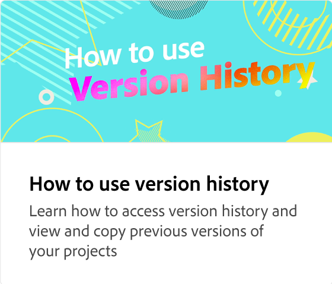

# Cómo añadir una imagen

Descubre todas las formas en que puedes añadir una imagen y efectos de imagen a tus proyectos creativos. Reemplace las imágenes de plantilla por gráficos de Adobe Stock más adecuados. Utilice el panel Capa para reorganizar las capas, buscar nuevas imágenes y cambiar el recorte. La naturaleza no destructiva del recorte le permite cambiar la forma del recorte en cualquier momento.

>[!VIDEO](https://video.tv.adobe.com/v/3420226?quality=12&learn=on&hidetitle=true)

## Vídeos adicionales de esta serie

<table style="table-layout:fixed">
<tr>
 <td>
      
  </td>
   <td>
      
  </td>
   <td>
      
  </td>
  <td>
      
  </td>
</tr>
<tr>
  <td>
      
  </td>
   <td>
      
  </td>
   <td>
         
   </td>
   <td>
         
   </td>
</tr>
<tr>
   <td>
   
   </td>
   <td>
   
   </td>
   <td>
   
   </td>
   <td>
      
      

       
   </td>
</tr>
</table>