# Tutoriales del caso de uso del Adobe [!DNL Express]

Descubre cómo los diferentes equipos de tu organización pueden beneficiarse del Adobe Express.

## Novedades

>[!BEGINTABS]

>[!TAB Crear contenido de RR. HH. multicanal para eventos]

Descubre cómo [crear rápidamente contenido de RR. HH. multicanal para eventos](create-hr-content.md).

>[!TAB Creación de un elemento visual promocional para un curso de aprendizaje en línea]

Aprende a crear una imagen atractiva para un [curso de aprendizaje en línea](promo-visual.md).

>[!TAB Creando un vídeo de fin de año]

Aprende a crear un inspirador [vídeo de fin de año](end-of-year-video.md).

>[!ENDTABS]

<table style="table-layout:fixed">
<tr>
   <td>
      <a href="create-hr-content.md">
         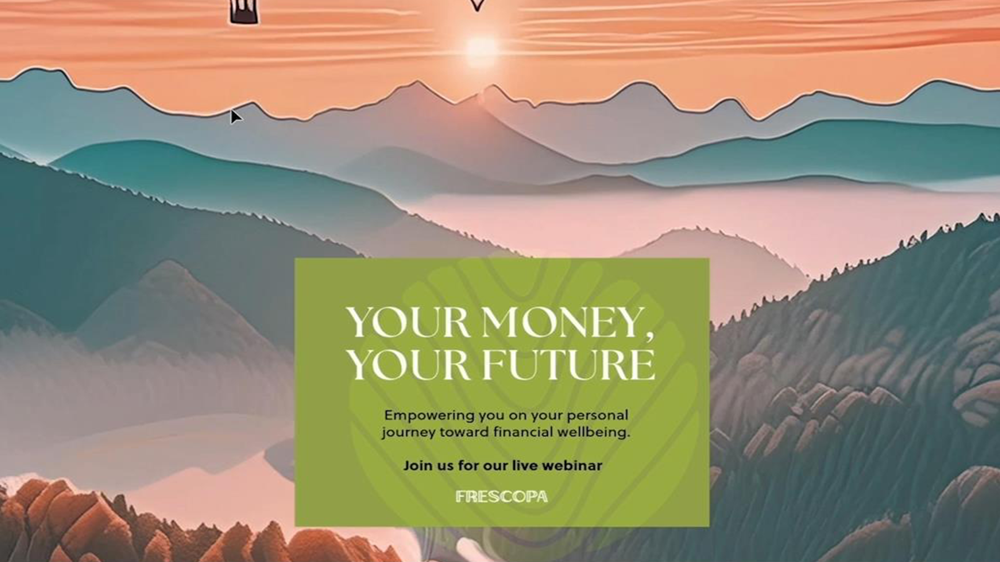
      </a>
      

      <a href="create-hr-content.md">Crear contenido de RR. HH. multicanal para eventos</a>
      

      Aprende a crear rápidamente contenido de RR. HH. multicanal para eventos
       
   </td>
   <td>
      <a href="promo-visual.md">
         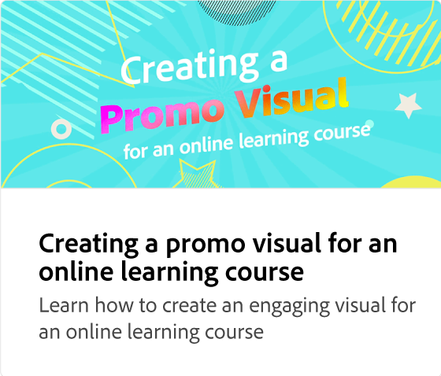
      </a>
      

      <a href="promo-visual.md">Creación de un elemento visual promocional para un curso de aprendizaje en línea</a>
      

      Aprende a crear atractivos elementos visuales para un curso de aprendizaje online
       
   </td>
   <td>
      <a href="end-of-year-video.md">
         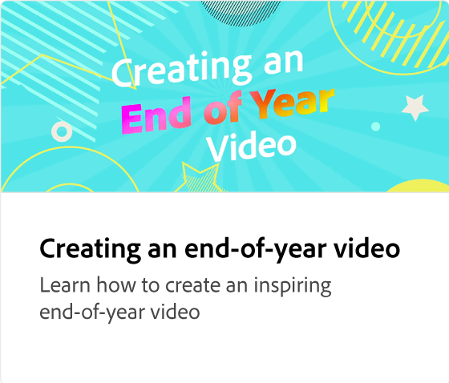
      </a>
      

      <a href="end-of-year-video.md">Creando un vídeo de fin de año</a>
      

      Aprende a crear un vídeo inspirador de fin de año
       
   </td>
   <td>
      
      

      <a href="newsletter.md">Cómo crear un boletín</a>
      

      Aprende a crear una portada dinámica para un boletín
       
   </td>
</tr>
<tr>
   <td>
      <a href="create-digital-screens.md">
         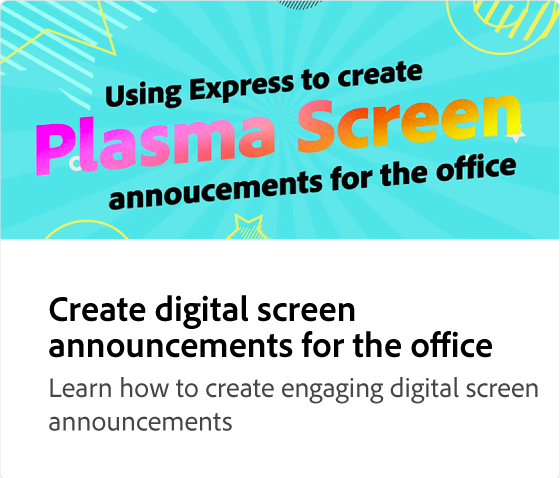
      </a>
      

      <a href="create-digital-screens.md">Crear anuncios de pantalla digital para la oficina</a>
      

      Aprenda a crear anuncios de pantalla digital atractivos para la oficina
       
   </td>
    <td>
      <a href="create-backgrounds.md">
         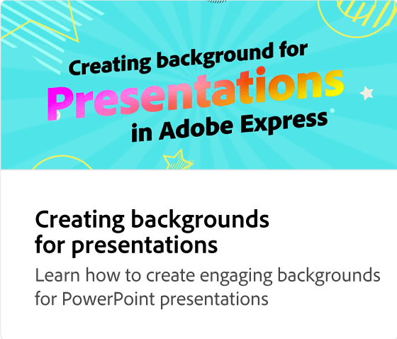
      </a>
      

      <a href="create-backgrounds.md">Creación de fondos para presentaciones</a>
      

      Aprende a crear fondos atractivos para presentaciones de PowerPoint
       
   </td>
   <td>
      
      

      <a href="update-image.md">Actualizar imagen de resumen de finanzas</a>
      

      Aprenda a actualizar rápidamente una imagen gráfica estática
       
   </td>
   <td>
      
      

      <a href="compelling-merchandise.md">Crea contenido atractivo de comercialización</a>
      

      Aprende a crear imágenes atractivas para un nuevo conjunto de inventario
       
   </td>
</tr>
<tr>
   <td>
      
      

      <a href="multi-channel-marketing-content.md">Capacita a los equipos de marketing para crear contenido multicanal</a>
      

      Aprende a crear contenido único para atraer espectadores a eventos online
       
   </td>
   <td>
      <a href="localized-marketing-content.md">
         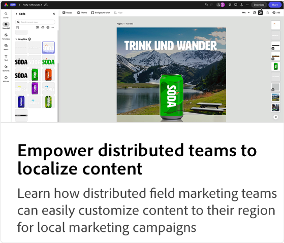
      </a>
      

      <a href="localized-marketing-content.md">Capacita a los equipos distribuidos para localizar el contenido</a>
      

      Descubre cómo localizar contenido para campañas de marketing regionales
       
   </td>
   <td>
      <a href="jumpstart-ideation.md">
         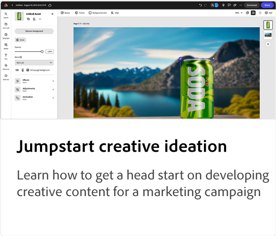
      </a>
      

      <a href="jumpstart-ideation.md">Inicia rápidamente la idea creativa</a>
      

      Descubre cómo sacar ventaja al desarrollar contenido creativo
       
   </td>
   <td>
      <a href="create-local-marketing.md">
         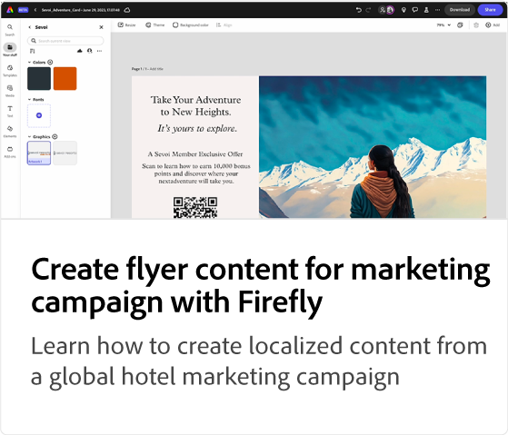
      </a>
      

      <a href="create-local-marketing.md">Crea contenido de folletos para la campaña de marketing con el Firefly</a>
      

      Descubre cómo localizar contenido para una campaña de marketing global
       
   </td>
</tr>
<tr>
   <td>
      <a href="create-on-boarding.md">
         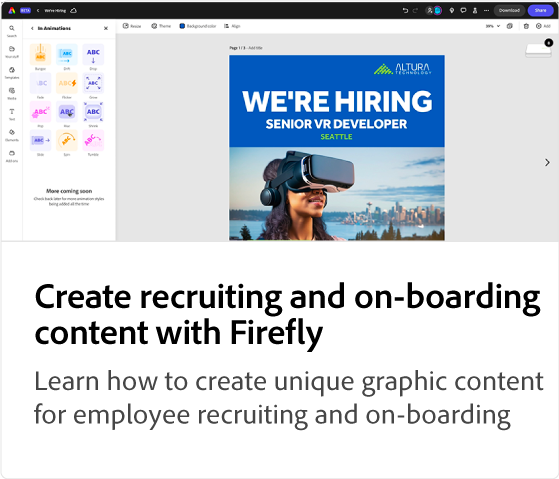
      </a>
      

      <a href="create-on-boarding.md">Crea contenido de reclutamiento e incorporación con Firefly</a>
      

      Aprende a crear gráficos únicos para el reclutamiento de empleados y el contenido de incorporación
       
   </td>
   <td>
      <a href="create-social-posters.md">
         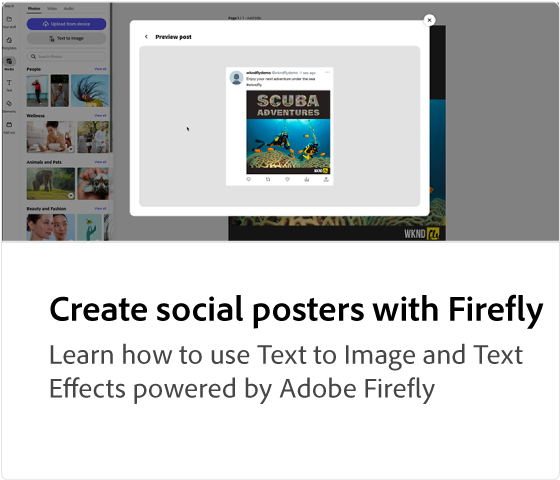
      </a>
      

      <a href="create-social-posters.md">Crear carteles para redes sociales con Firefly</a>
      

      Aprende a crear fácilmente una campaña de promoción para las redes sociales
       
   </td>
   <td>
      <a href="create-blog-graphics.md">
         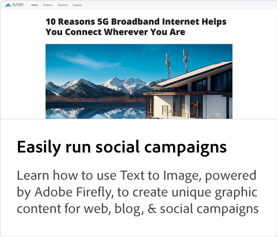
      </a>
      

      <a href="create-blog-graphics.md">Crear contenido gráfico para blogs con el Firefly</a>
      

      Aprende a crear contenido gráfico único para campañas web, de blogs y sociales
       
   </td>
   <td>
      <a href="create-webinar-poster.md">
         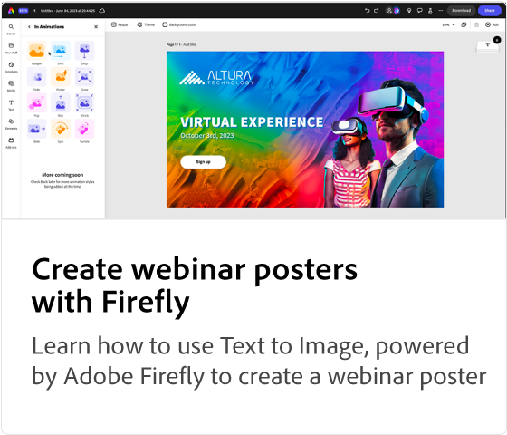
      </a>
      

      <a href="create-webinar-poster.md">Crear carteles de seminarios web con el Firefly</a>
      

      Descubre cómo crear un cartel atractivo para un evento de realidad virtual
       
   </td>
</tr>
</table>
