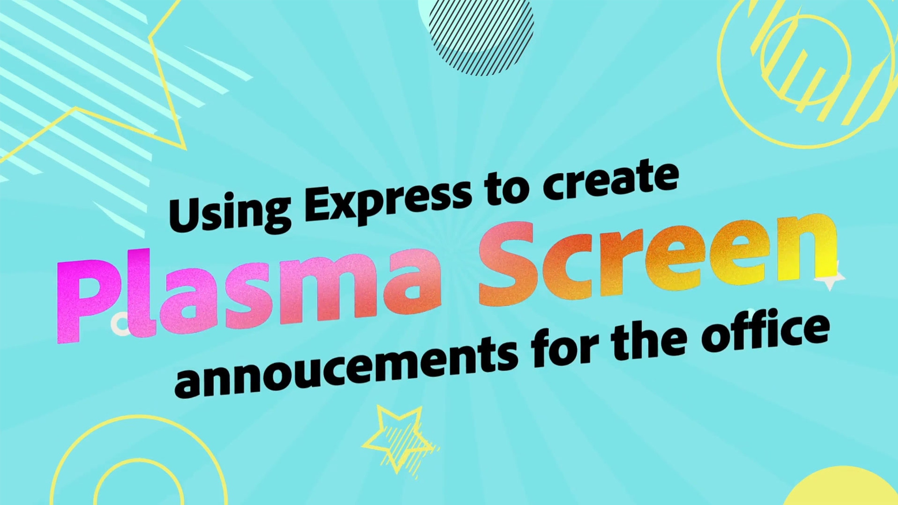

# Tutoriales del caso de uso del Adobe [!DNL Express]

Descubre cómo los diferentes equipos de tu organización pueden beneficiarse del Adobe Express.

## Novedades

* [Creación de un elemento visual promocional para un curso de aprendizaje en línea](promo-visual.md)
Aprenda a crear un efecto visual atractivo para un curso de aprendizaje en línea
* [Creando un vídeo de fin de año](end-of-year-video.md)
Aprende a crear un vídeo inspirador de fin de año
* [Cómo crear un boletín](newsletter.md)
Aprenda a crear la página principal de un boletín que se pueda utilizar para imprimirlo, enviarlo por correo electrónico o publicarlo en la web

<table style="table-layout:fixed">
<tr>
   <td>
      
   </td>
   <td>
      
   </td>
   <td>
      
   </td>
   <td>
      
   </td>
</tr>
<tr>
   <td>
      
   </td>
   <td>
      
   </td>
   <td>
      
   </td>
   <td>
      
   </td>
</tr>
<tr>
   <td>
      
   </td>
   <td>
      
   </td>
   <td>
      
   </td>
   <td>
      
   </td>
</tr>
<tr>
   <td>
      
   </td>
   <td>
      
   </td>
   <td>
      
   </td>
   <td>
      
      

       
   </td>
</tr>
</table>
