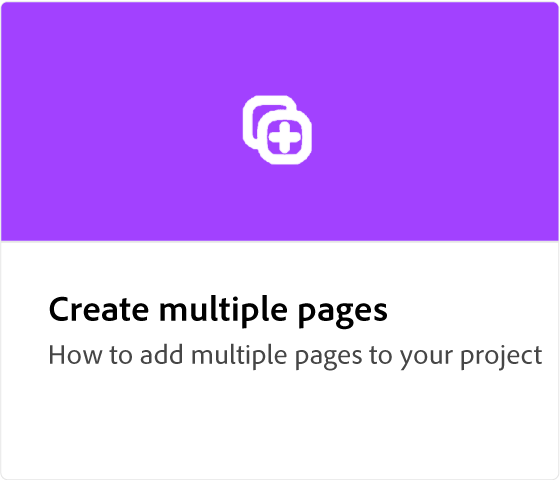

# Adobe [!DNL Express] resumen

Adobe Express es una herramienta creativa fácil de usar, sin necesidad de experiencia.

  

## Introducción a Adobe Express

  

>[!VIDEO](https://video.tv.adobe.com/v/3420204?quality=12&learn=on&hidetitle=true)

## Tutoriales de Adobe Express

<table>
<tr>
   <td>
      
      

      <a href="get-started.md"><strong>Introducción a Adobe Express</strong></a>
      

      <em>Aprende los conceptos básicos de Adobe Express</em>
       
  </td>
  <td>
      
      

      <a href="adobe-express-beginners.md"><strong>Adobe Express para principiantes</strong></a>
      

      <em>Exprésate aprendiendo a crear tu primer diseño</em>
       
  </td>
  <td>
      
      

      <a href="get-inspiration.md"><strong>Obtener inspiración rápida</strong></a>
      

      <em>¿No eres diseñador? No es un problema. Aprende a inspirarte rápidamente en Adobe Express</em>
       
  </td>
  <td>
   
    

   <a href="create-templates.md"><strong>Creación de plantillas</strong></a>
    

    <em>Aprenda a utilizar de nuevo el mismo diseño de proyecto</em>
     
  </td>
</tr>
<tr>
   <td>
      
      

      <a href="add-design-assets.md"><strong>Añadir activos de diseño</strong></a>
      

      <em>Aprenda a personalizar las pegatinas y publicaciones de Instagram</em>
       
  </td>
  <td>
      
      

      <a href="group-objects.md"><strong>Agrupación de objetos</strong></a>
      

      <em>Aprende a redimensionar texto e imágenes</em>
       
  </td>
  <td>
      
      

      <a href="layers.md"><strong>Seleccionar y mover capas</strong></a>
      

      <em>Mover, reordenar o superponer pegatinas y texto con capas</em>
       
  </td>
  <td>
      
      

      <a href="multiple-pages.md"><strong>Crear varias páginas</strong></a>
      

      <em>Aprende a añadir varias páginas a tu proyecto</em>
       
  </td>
</tr>
<tr>
   <td>
      
      

      <a href="undo-redo.md"><strong>Deshacer y rehacer</strong></a>
      

      <em>Aprenda a deshacer y rehacer acciones</em>
       
  </td>
  <td>
      
      

      <a href="cc-libraries.md"><strong>Usar Bibliotecas CC</strong></a>
      

      <em>Aprenda a compartir recursos de la Biblioteca CC con su equipo</em>
       
  </td>
  <td>
      
      

      <a href="brand.md"><strong>Aplicar su marca</strong></a>
      

      <em>Aprende a añadir tu logotipo y color de marca a cualquier plantilla</em>
       
  </td>
  <td>
      
      

      <a href="google-drive.md"><strong>Integración con Google Drive</strong></a>
      

      <em>Aprenda a incorporar imágenes de Google Drive</em>
       
  </td>
</tr>
<tr>
    <td>
      
      

      <a href="remove-background.md"><strong>Eliminar fondo</strong></a>
      

      <em>Aprenda a eliminar el fondo de las imágenes</em>
       
  </td>
  <td>
      
      

      <a href="refine-cutout.md"><strong>Perfeccionar un recorte</strong></a>
      

      <em>Aprenda a perfeccionar sus recortes</em>
       
  </td>
  <td>
      
      

      <a href="text-effects.md"><strong>Uso de efectos de texto</strong></a>
      

      <em>Aprenda a añadir sombras paralelas, formas y texto de contorno</em>
       
  </td>
  <td>
      
      

      <a href="image-effects.md"><strong>Usar efectos de imagen</strong></a>
      

      <em>Aprende a iluminar y oscurecer imágenes</em>
       
  </td>
  <td>
      
      

      <a href="create-curved-text.md"><strong>Crear texto curvo</strong></a>
      

      <em>Aprenda a crear texto curvo en el proyecto</em>
       
  </td>
</tr>
</table>
