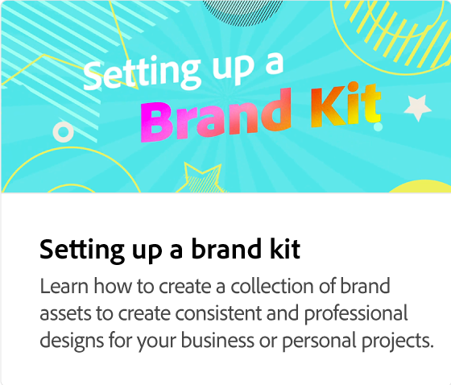

# Cómo añadir texto

Aprende todas las formas diferentes de añadir texto a proyectos creativos, incluidas la edición, el movimiento y la eliminación de capas de texto, el cambio de fuentes, el ajuste del tamaño y el diseño del texto, la alineación del texto, el cambio del color de relleno y del contorno, la adición de sombras paralelas y el uso de formas y recortes de texto. Las fuentes recomendadas se proporcionan como inspiración.

>[!VIDEO](https://video.tv.adobe.com/v/3420222?quality=12&learn=on&hidetitle=true)

## Vídeos adicionales de esta serie

<table style="table-layout:fixed">
<tr>
 <td>
      
  </td>
   <td>
      
  </td>
   <td>
      
  </td>
  <td>
      
  </td>
</tr>
<tr>
   <td>
      
  </td>
   <td>
      
  </td>
   <td>
         
   </td>
    <td>
         
   </td>
</tr>
<tr>
   <td>
   
   </td>
   <td>
   
   </td>
   <td>
   
   </td>
   <td>
      
      

       
   </td>
</tr>
</table>