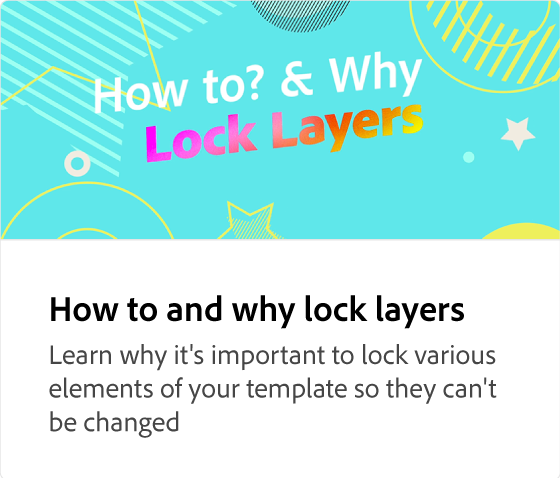

# Cómo utilizar las plantillas

Tu marca es única en su clase y el uso de plantillas te ayuda a mantenerte fiel a la marca.

>[!VIDEO](https://video.tv.adobe.com/v/3427099?quality=12&learn=on&hidetitle=true)

## Vídeos adicionales de esta serie

<table style="table-layout:fixed">
<tr>
    <td>
            
    </td>
    <td>
         
    </td>
    <td>
            
    </td>
    <td>
      
      

       
    </td>
</tr>
</table>