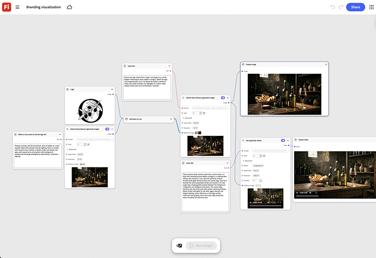

# Visualización de marca

Aprende a visualizar tu logotipo o marca en escenas de productos. Incorpora directrices de marca para un logotipo y una paleta de colores, y el gráfico genera tanto ilustraciones clave estáticas como una pasada de movimiento corto en una sola ejecución, para que ambos formatos permanezcan visualmente alineados.[Abrir plantilla de visualización de marca](https://firefly.adobe.com/graph/edit/id/urn:aaid:sc:US:c11ecbe0-0751-58ce-9f30-2eb6518bfd51).

>[!TIP]
>
>**Antes de comenzar**: para obtener los mejores resultados, personaliza esta plantilla para adaptarla a tu propia marca, producto y flujo de trabajo. Intercambie las imágenes de referencia, los mensajes y la copia antes de utilizar cualquier salida.

[!BADGE Casos prácticos]{type=Informative tooltip="Casos prácticos"}

* **Tecnología**: Visualiza una nueva submarca de producto como arte clave y teaser de lanzamiento antes de dedicar el presupuesto de diseño o medios a la producción completa.
* **Bebidas**: prueba tres indicaciones para el logotipo y la paleta de colores como arte clave de aspecto acabado antes de elegir una para pasar a la producción.
* **Finanzas**: obtén una vista previa de una nueva tarjeta o identidad de aplicación como elementos visuales de marca antes de que llegue a una revisión de diseño.

{align="center"}

Vuelva a [Introducción al gráfico de Firefly](https://experienceleague.adobe.com/en/docs/creative-cloud-enterprise-learn/cce-learning-hub/fireflyoverview/firefly-graph/overview-firefly-graph).
