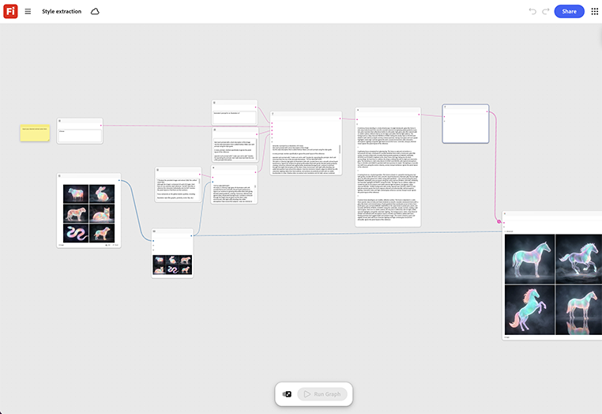

# Extracción de estilos

Aprende cómo alimentar una imagen de referencia para extraer su color, luz y tratamiento de textura. A continuación, puede aplicar ese tratamiento a cualquier imagen nueva ejecutada a través del mismo gráfico. [Abrir plantilla de extracción de estilos](https://firefly.adobe.com/graph/edit/id/urn:aaid:sc:US:6ab4c3c7-ead2-5fa5-9441-75b7a362ce11).

>[!TIP]
>
>**Antes de comenzar**: para obtener los mejores resultados, personaliza esta plantilla para adaptarla a tu propia marca, producto y flujo de trabajo. Intercambie las imágenes de referencia, los mensajes y la copia antes de utilizar cualquier salida.

{align="center"}

[!BADGE Casos prácticos]{type=Informative tooltip="Casos prácticos"}

* **Viaje**: extrae el color y el tratamiento de la luz de una foto aprobada de la campaña de héroes y aplícala en veinte nuevas imágenes de destino para lograr coherencia visual.
* **Comercio al por menor**: extrae el aspecto aprobado de un director de arte de una fotografía de héroe y aplícalo a toda una fotografía de producto de una temporada.
* **Bebidas** - Combina el nuevo empaquetado con el estilo de una foto de campaña galardonada.

Vuelva a [Introducción al gráfico de Firefly](https://experienceleague.adobe.com/es/docs/creative-cloud-enterprise-learn/cce-learning-hub/fireflyoverview/firefly-graph/overview-firefly-graph).
