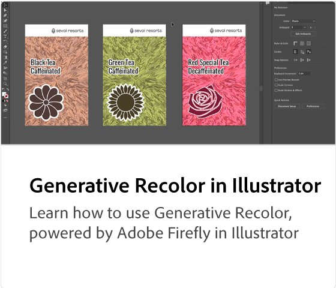

# Adobe [!DNL Firefly] resumen

Firefly es la nueva familia de modelos de IA creativos y generativos que llega a los productos de Adobe y se centra inicialmente en la generación de imágenes y efectos de texto. Firefly ofrece nuevas formas de idear, crear y comunicarse, al tiempo que mejora significativamente los flujos de trabajo creativos.

  

## Mira lo que puedes hacer con el Adobe Firefly

  

>[!VIDEO](https://video.tv.adobe.com/v/3416970t1?quality=12&learn=on&hidetitle=true)

## Más información sobre Adobe Firefly

<table style="table-layout:fixed">
<tr>
   <td>
      
  </td>
  <td>
      
  </td>
  <td>
      
  </td>
  <td>
    
    

     
  </td>
</tr>
</table>

## Tutoriales de Firefly

<table style="table-layout:fixed">
<tr>
   <td>
      
  </td>
   <td>
      
  </td>
  <td>
      
  </td>
  <td>
      
  </td>
</tr>
</table>
