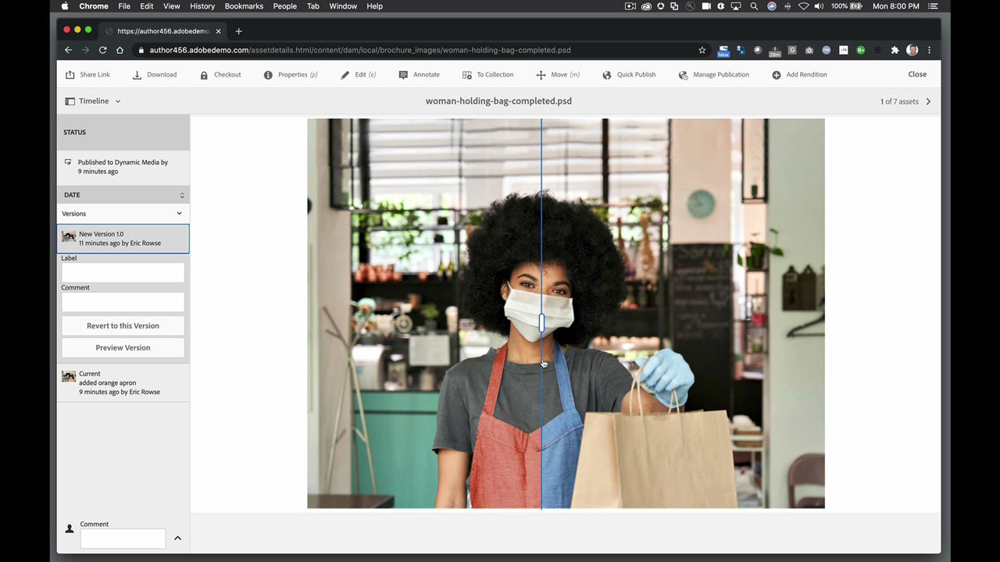
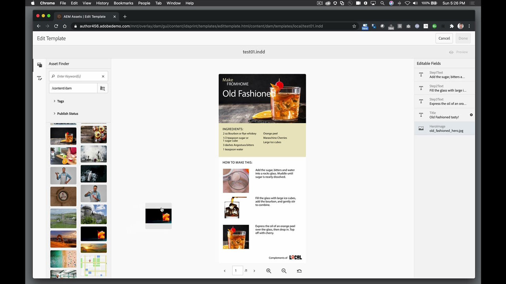
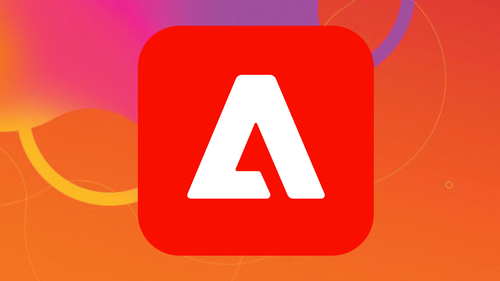

# AEM Assets y Asset Link

Adobe Experience Manager es la solución de administración de experiencias digitales líder del sector para empresas y organizaciones medianas. Proporciona una base moderna y ampliable para ofrecer experiencias atractivas que promueven la participación de la marca, impulsan la demanda y aumentan la lealtad del cliente. Experience Manager incluye un completo conjunto de herramientas para crear, gestionar y ofrecer experiencias digitales en todos los canales.

## Buscar Tutorials de productos

<table style="table-layout:fixed">
<tr>
 <td>
   
    

   <a href="aem.md#tutorial1"><strong>AEM y Asset Link</strong></a>
    

    <em>Haz actualizaciones en tiempo real de los activos almacenados en AEM con Asset Link</em>
     
  </td>
   <td>
   
    

   <a href="aem.md#tutorial2"><strong>Archivos de InDesign alojados en AEM</strong></a>
    

    <em>Aloja tu documento de InDesign en AEM para que varios usuarios puedan crear variaciones de contenido al mismo tiempo</em>
     
  </td>
  <td>
    
    

     
  </td>
</tr>
</table>

## AEM y Asset Link (5:45) {#tutorial1}

>[!VIDEO](https://video.tv.adobe.com/v/326828?hidetitle=true)

**Descripción**
Haz actualizaciones en tiempo real de los activos almacenados en AEM con Asset Link.

En este tutorial, aprenderás a:
* Encuentre lo que necesite, cuando lo necesite, con un panel dedicado para buscar y explorar activos dentro de sus programas de diseño
* Cargue activos fácilmente directamente desde sus programas de diseño
* Retirar y devolver activos del DAM a su programa de diseño para realizar actualizaciones en tiempo real

**Presentado por:**
Eric Rowse, consultor sénior de soluciones (Digital Media)

## Archivos de InDesign alojados en AEM (3:16) {#tutorial2}

>[!VIDEO](https://video.tv.adobe.com/v/326829?hidetitle=true)

**Descripción**
Aloje su documento de InDesign en AEM para que varios usuarios puedan crear variaciones de contenido al mismo tiempo.

En este tutorial, aprenderás a:
* Cargar archivo de InDesign en AEM para el acceso común al almacenamiento
* Crea variaciones de forma segura sin miedo a arruinar el archivo de origen
* Los campos de documento están preformateados, lo que permite realizar modificaciones o cambios rápidos en el contenido

**Presentado por:**
Eric Rowse, consultor sénior de soluciones (Digital Media)

<table style="table-layout:fixed">
<tr>
 <td>
   
    

   <a href="https://www.adobe.com/marketing/experience-manager.html"><strong>Adobe Experience Manager</strong></a>
    

    <em>Una potente combinación que cubrirá tus necesidades de administración de contenidos y activos digitales</em>
     
  </td>
  <td>
   
    

   <a href="https://www.adobe.com/marketing/experience-manager-assets.html"><strong>AEM Assets</strong></a>
    

    <em>Administración de activos digitales de próxima generación</em>
     
  </td>
  <td>
   
    

   <a href="https://www.adobe.com/marketing/experience-manager-assets/benefits.html"><strong>AEM Assets: Ventajas</strong></a>
    

    <em>Pon en marcha tus activos digitales</em>
     
  </td>
</tr>
</table>

**Recursos de Asset Link y AEM**

[Información y asistencia](https://helpx.adobe.com/support/experience-manager.html) es el centro de tutoriales adicionales, novedades y vínculos a foros de la comunidad.

**Versión de octubre de 2020**

Empiece a utilizar estas funciones (¡y mucho más!) descargando la actualización más reciente de la aplicación de escritorio de Creative Cloud.
