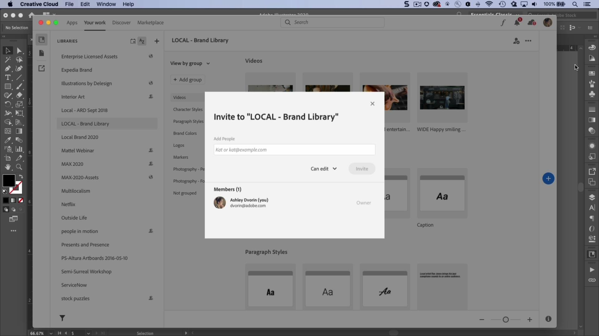

# Bibliotecas CC

Mantén tus activos a mano y tus proyectos fieles a la marca.

## Buscar Tutorials de productos

<table style="table-layout:fixed">
<tr>
 <td>
   
    

   <a href="cclibraries.md#tutorial1"><strong>Crear bibliotecas CC</strong></a>
    

    <em>Con las Bibliotecas Adobe Creative Cloud, puedes administrar, organizar y acceder a tus logotipos, colores y más, en tus aplicaciones de Creative Cloud favoritas</em>
     
  </td>
   <td>
   
    

   <a href="cclibraries.md#tutorial2"><strong>Compartir Bibliotecas CC</strong></a>
    

    <em>Trabaja de forma más eficaz, garantiza la coherencia creativa y sincronízate fácilmente con tu equipo</em>
     
  </td>
  <td>
    
    

     
  </td>
</tr>
</table>

## Crear bibliotecas CC (4:38) {#tutorial1}

>[!VIDEO](https://video.tv.adobe.com/v/326802?hidetitle=true)

**Descripción**
Con las Bibliotecas Adobe Creative Cloud, puedes administrar, organizar y acceder a tus logotipos, colores y mucho más en tus aplicaciones de Creative Cloud favoritas.

En este tutorial, aprenderás a:
* Mantén tus activos a mano y tus proyectos fieles a la marca
* ¡Novedad! Integración completa con Adobe XD

**Presentado por:**
Ashley Dvorin, consultora sénior de soluciones (Digital Media)

## Compartir Bibliotecas CC (4:14) {#tutorial2}

>[!VIDEO](https://video.tv.adobe.com/v/326803?hidetitle=true)

**Descripción**
Trabaja de forma más eficaz, garantiza la coherencia creativa y sincronízate fácilmente con tu equipo.

En este tutorial, aprenderás a:
* Mantén tus activos a mano y tus proyectos fieles a la marca
* Colabore fácilmente en proyectos directamente desde sus aplicaciones favoritas

**Presentado por:**
Ashley Dvorin, consultora sénior de soluciones (Digital Media)

**Recursos de Bibliotecas CC**

[Información y asistencia](https://helpx.adobe.com/creative-cloud/help/libraries.html) es el centro de tutoriales adicionales, Novedades y vínculos a foros de la comunidad.

**Versión de octubre de 2020**

Empiece a utilizar estas funciones (¡y mucho más!) descargando la actualización más reciente de la aplicación de escritorio de Creative Cloud.
