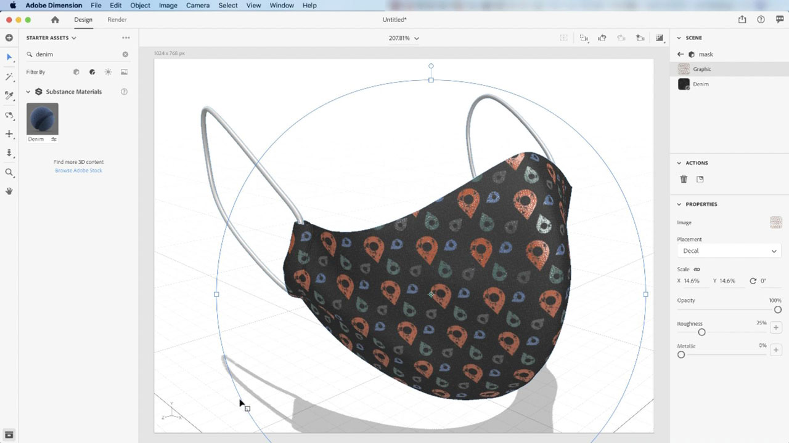

# [!DNL Dimension]

Crea contenido en 3D atractivo más rápido con iluminación, materiales y modelos de alta calidad. [!DNL Dimension] facilita la creación de visualizaciones de marca, ilustraciones, bocetos de productos, diseños de empaquetado y otros trabajos creativos.

## Buscar Tutorials de productos

<table style="table-layout:fixed">
<tr>
 <td>
   
    

   <a href="dimension.md#tutorial1"><strong>Aplicar materiales de Substance a modelos 3D</strong></a>
    

    <em>Los materiales de Substance admiten miles de variaciones de motivos y diseños en un solo material</em>
     
  </td>
  <td>
    
    

     
  </td>
  <td>
    
    

     
  </td>
</tr>
</table>

## Aplicar materiales de Substance a modelos 3D (11:42) {#tutorial1}

>[!VIDEO](https://video.tv.adobe.com/v/326944?hidetitle=true)

**Descripción**
Los materiales Substance admiten miles de variaciones de patrones y diseños en un solo material.

En este tutorial, aprenderás a:
* Crea contenido en 3D atractivo más rápido con iluminación, materiales y modelos de alta calidad

**Presentado por:**
Jim Babbage, Consultor Sénior de Soluciones (Medios Digitales)

**Recursos del Dimension**

[Información y asistencia](https://helpx.adobe.com/support/dimension.html) es el centro de tutoriales adicionales, [Novedades](https://helpx.adobe.com/dimension/user-guide.html/dimension/using/whats-new.ug.html) y vínculos a foros de la comunidad.

**Versión de octubre de 2020**

Empiece a utilizar estas funciones (¡y mucho más!) descargando la actualización más reciente de la aplicación de escritorio de Creative Cloud.
