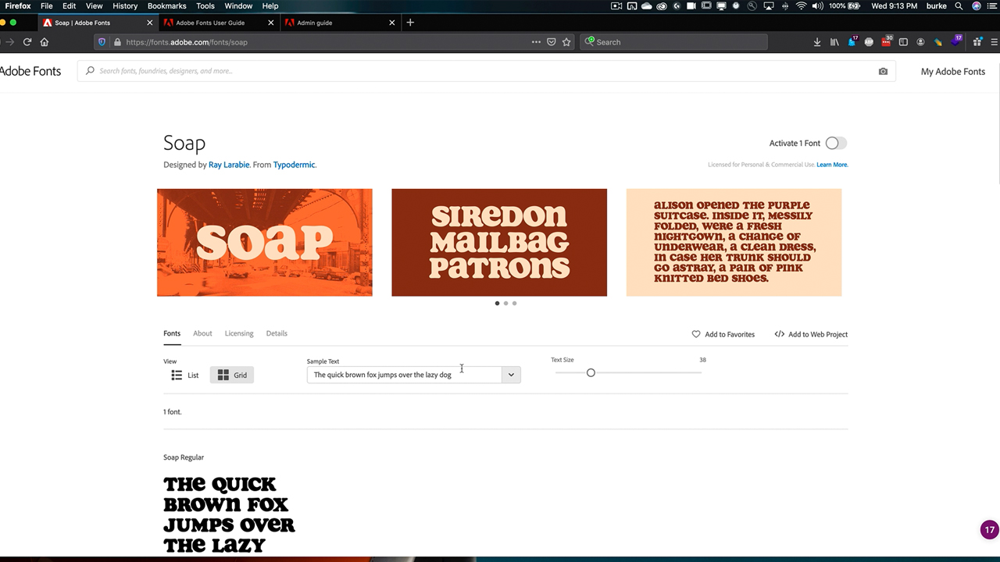

# Administración de empresas

Gestiona los derechos de Adobe y los activos en toda la organización.

## Examinar Tutorials de administración empresarial

<table style="table-layout:fixed">
<tr>
 <td>
   
    

   <a href="enterprise.md#tutorial1"><strong>Adobe Fonts</strong></a>
    

    <em>Descubre las casi 200 familias de Adobe Fonts y la facilidad de uso del servicio de Adobe Fonts</em>
     
  </td>
  <td>
    
    

     
  </td>
  <td>
    
    

     
  </td>
</tr>
</table>

## Adobe Fonts (5:20) {#tutorial1}

>[!VIDEO](https://video.tv.adobe.com/v/328226?hidetitle=true)

**Descripción:**

Descubre las casi 200 familias de Adobe Fonts y la facilidad de uso del servicio de Adobe Fonts.

En este tutorial, aprenderás a:
* Utiliza la potente interfaz de navegación para encontrar la fuente adecuada de forma rápida y sencilla
* Ahorra tiempo y dinero utilizando integraciones de Creative Cloud nativos
* Administrar todas las fuentes en un único lugar en Adobe Admin Console

**Presentado por:**

Todd Burke, consultor principal de soluciones (Digital Media)

**Recursos de administración empresarial:**

[Guía del usuario de Adobe Fonts](https://helpx.adobe.com/fonts/user-guide.html)

[Guía de administración para empresas](https://helpx.adobe.com/es/enterprise/admin-guide.html)
