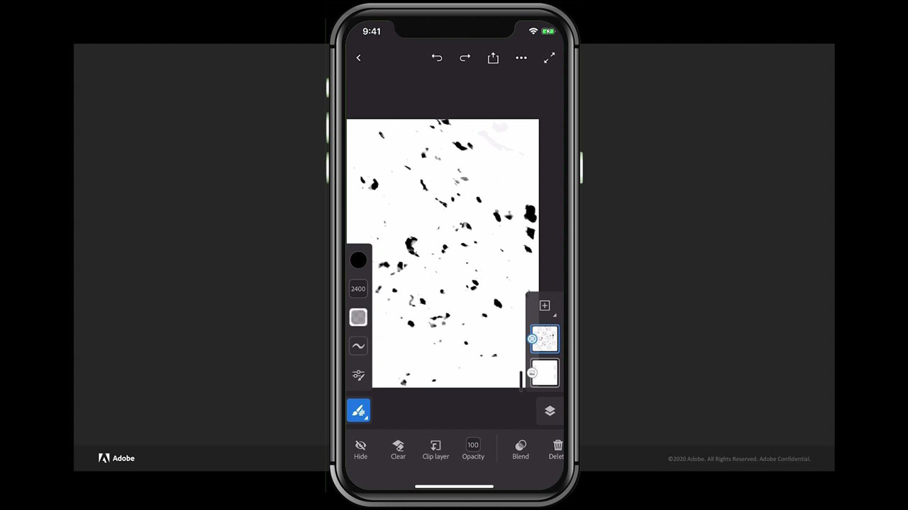

# Fresco

Adobe Fresca es una aplicación multiplataforma para crear dibujos y pinturas mediante métodos basados en pinceles que combinan flujos de trabajo vectoriales y rasterizados con documentos en la nube.

## Buscar Tutorials de productos

<table style="table-layout:fixed">
<tr>
 <td>
   
    

   <a href="fresco.md#tutorial1"><strong>Introducción al dibujo con Adobe Fresca</strong></a>
    

    <em>Usa las potentes herramientas de edición de color y selección de Adobe Fresco para cambiar drásticamente una imagen que se ajuste a tus necesidades de construcción de marca corporativas</em>
     
  </td>
  <td>
   
    

   <a href="fresco.md#tutorial2"><strong>Crear ilustración con textura: Fresco a Illustrator</strong></a>
    

    <em>Pinta y dibuja texturas en Adobe Fresca y aprende a usarlas en Illustrator</em>
     
  </td>
  <td>
    
    

     
  </td>
</tr>
</table>

## Introducción al dibujo con Adobe Fresca (19:07) {#tutorial1}

>[!VIDEO](https://video.tv.adobe.com/v/326946?hidetitle=true)

**Descripción**
Descubre Adobe Fresca para crear dibujos y pinturas con métodos basados en pinceles que combinan flujos de trabajo vectoriales y rasterizados con documentos en la nube.

En este tutorial, aprenderás a:
* Utilice pinceles vivos únicos que imitan las acuarelas y la pintura al óleo junto con sus pinceles vectoriales y de píxeles favoritos
* Cree efectos de textura colocando diferentes pinceles en capas y utilizando máscaras
* Crea en cualquier parte con la nueva aplicación de Fresco para iPhone
* Exporte su trabajo a varios formatos para utilizarlo en otras aplicaciones móviles y de escritorio

**Presentado por:**
Liz Tanonis, consultora de soluciones (Digital Media)

## Crear ilustración con textura: Fresco a Illustrator (4:10) {#tutorial2}

>[!VIDEO](https://video.tv.adobe.com/v/326947?hidetitle=true)

**Descripción**
Pinte y dibuje texturas en Adobe Fresca y aprenda a utilizarlas en Illustrator.

En este tutorial, aprenderás a:
* Crear ilustraciones en la aplicación Adobe Fresca para iPhone y exportarlas para utilizarlas en otras aplicaciones de Creative Cloud
* Usar la herramienta Calco de imagen en Illustrator para convertir ilustraciones en vectores
* Aplicación de texturas hechas a mano a ilustraciones vectoriales en Illustrator

**Presentado por:**
Liz Tanonis, consultora de soluciones (Digital Media)

**Recursos de Fresco**

[Información y asistencia](https://helpx.adobe.com/support/adobe-fresco.html) es el centro de tutoriales adicionales, [Novedades](https://helpx.adobe.com/fresco/using/whats-new.html) y vínculos a foros de la comunidad.

**Versión de octubre de 2020**

Empiece a utilizar estas funciones (¡y mucho más!) descargando la actualización más reciente de la aplicación de escritorio de Creative Cloud.
