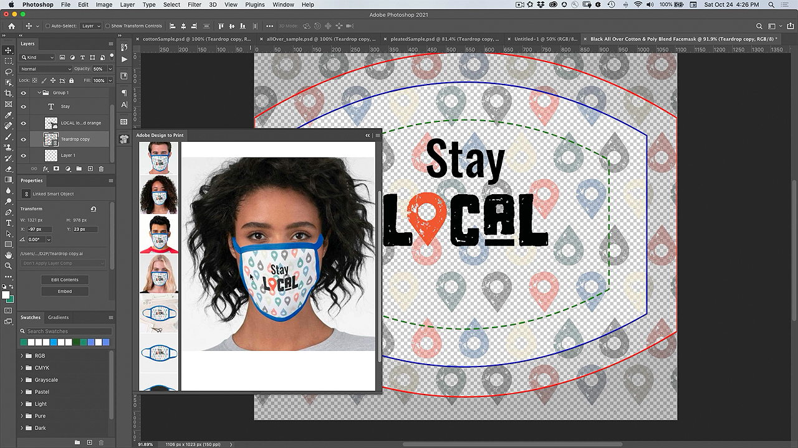
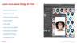

# Plugin de diseño para imprimir: personalizar una máscara facial

¿No sería genial si pudieras personalizar una máscara facial con tu propia ilustración? Con el plugin Adobe Design to Print, puedes visualizar tus diseños en cientos de productos Zazzle y publicarlos directamente en su tienda online.

## Examinar Tutorials de proyectos de máscara facial

<table style="table-layout:fixed">
<tr>
 <td>
   
    

   <a href="handsonproject.md#tutorial1"><strong>Instalar el complemento Diseño de Photoshop para imprimir</strong></a>
    

    <em>Usa las potentes herramientas de selección y edición de color de Adobe Photoshop para cambiar drásticamente una imagen que se ajuste a tus necesidades de construcción de marca corporativas</em>
     
  </td>
  <td>
    
    

    <a href="handsonproject.md#tutorial2"><strong>Personalizar una máscara facial con diseño para imprimir</strong></a>
    

    <em>Personaliza tu propia máscara facial Zazzle</em>
     
  </td>
  <td>
    
    

   <a href="handsonproject.md#tutorial3"><strong>Crea una visualización en 3D de tu máscara facial</strong></a>
    

    <em>Crea una visualización en 3D de tu máscara facial para la galería de eventos</em>
     
  </td>
</tr>
</table>

## Instalar el complemento Diseño de Photoshop para imprimir (1:50) {#tutorial1}

>[!VIDEO](https://video.tv.adobe.com/v/327096?hidetitle=true)

**Descripción**
Obtenga información sobre cómo instalar el plugin Design to Print para Photoshop.

En este tutorial, aprenderás a:
* Visualiza tus diseños en productos como ropa, accesorios, artículos de papelería y cuadros en tiempo real.
* Publish a la deslumbrante tienda online

**Presentado por:**
Patti Sokol, consultora principal de soluciones (Digital Media)

## Personalizar una máscara facial con diseño para imprimir (7:54) {#tutorial2}

>[!VIDEO](https://video.tv.adobe.com/v/327097?hidetitle=true)

**Descripción**
Personaliza tu propia máscara facial Zazzle

En este tutorial, aprenderás a:
* Visualiza tus diseños en productos como ropa, accesorios, artículos de papelería y cuadros en tiempo real.
* Publish a la deslumbrante tienda online

**Haga clic en la imagen para descargar el PDF de aprendizaje de diseño para imprimir**

**Presentado por:**
Patti Sokol, consultora principal de soluciones (Digital Media)

## Crear una visualización 3D de la máscara facial (7:54) {#tutorial3}

>[!VIDEO](https://video.tv.adobe.com/v/327098?hidetitle=true)

**Descripción**
Crea una visualización en 3D de tu máscara facial para la galería de eventos

En este tutorial, aprenderás a:
* Crea fácilmente visualizaciones fotorrealistas en 3D
* Añade materiales e iluminación de control para lograr un aspecto profesional
* Importar activos para aplicar su marca u otros diseños

**Hacer clic en la imagen para descargar el archivo [!DNL Dimension] con el modelo 3D de la máscara blanca**

**Presentado por:**
Patti Sokol, consultora principal de soluciones (Digital Media)
