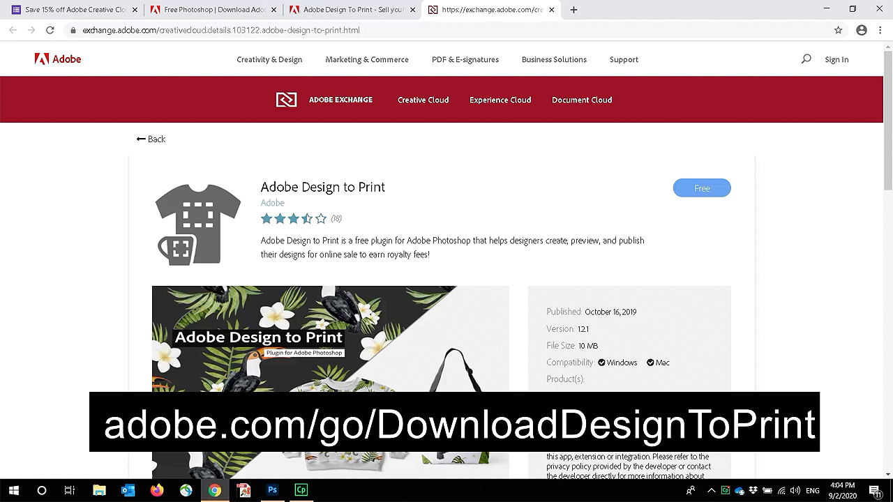

# Plugin de diseño para imprimir: personalizar una máscara facial

¿No sería genial poder personalizar una máscara facial con tu propia ilustración? Con el plugin Adobe Design to Print, puedes visualizar tus diseños en cientos de productos Zazzle y publicarlos directamente en su tienda online.

## Examinar Tutorials de proyectos de máscara

<table style="table-layout:fixed">
<tr>
 <td>
   
    

   <a href="handsonproject.md#tutorial1"><strong>Instalar el plugin Photoshop Design to Print</strong></a>
    

    <em>Utiliza las potentes herramientas de selección y edición de color de Adobe Photoshop para cambiar drásticamente una imagen que se ajuste a tus necesidades de marca corporativa</em>
     
  </td>
  <td>
    
    

    <a href="handsonproject.md#tutorial2"><strong>Personalizar una máscara facial con el diseño para imprimir</strong></a>
    

    <em>Personaliza tu propia máscara facial Zazzle</em>
     
  </td>
  <td>
    
    

   <a href="handsonproject.md#tutorial3"><strong>Crea una visualización en 3D de tu máscara facial</strong></a>
    

    <em>Crea una visualización en 3D de tu máscara facial para la galería de eventos</em>
     
  </td>
</tr>
</table>

## Instalar el plugin Photoshop Design to Print (1:50) {#tutorial1}

>[!VIDEO](https://video.tv.adobe.com/v/327096?hidetitle=true)

**Descripción**
Obtenga información sobre cómo instalar el plugin Design to Print para Photoshop.

En este tutorial, aprenderá a:
* Visualiza tus diseños en productos como ropa, accesorios, artículos de papelería y cuadros en tiempo real.
* Publica en el mercado online de Dazzle

**Presentado por:**
Patti Sokol, consultora principal de soluciones (Digital Media)

## Personalizar una máscara facial con diseño para imprimir (7:54) {#tutorial2}

>[!VIDEO](https://video.tv.adobe.com/v/327097?hidetitle=true)

**Descripción**
Personaliza tu propia máscara facial Zazzle

En este tutorial, aprenderá a:
* Visualiza tus diseños en productos como ropa, accesorios, artículos de papelería y cuadros en tiempo real.
* Publica en el mercado online de Dazzle

**Haga clic en Imagen para descargar el PDF Aprender diseño para imprimir**

**Presentado por:**
Patti Sokol, consultora principal de soluciones (Digital Media)

## Crea una visualización en 3D de tu máscara facial (7:54) {#tutorial3}

>[!VIDEO](https://video.tv.adobe.com/v/327098?hidetitle=true)

**Descripción**
Crea una visualización en 3D de tu máscara facial para la galería de eventos

En este tutorial, aprenderá a:
* Crea fácilmente visualizaciones fotorrealistas en 3D
* Añade materiales e iluminación de control para lograr un aspecto profesional
* Importar activos para aplicar su marca u otros diseños

**Haga clic en Imagen para descargar [!DNL Dimension] Archivo con modelo 3D de máscara blanca**

**Presentado por:**
Patti Sokol, consultora principal de soluciones (Digital Media)
