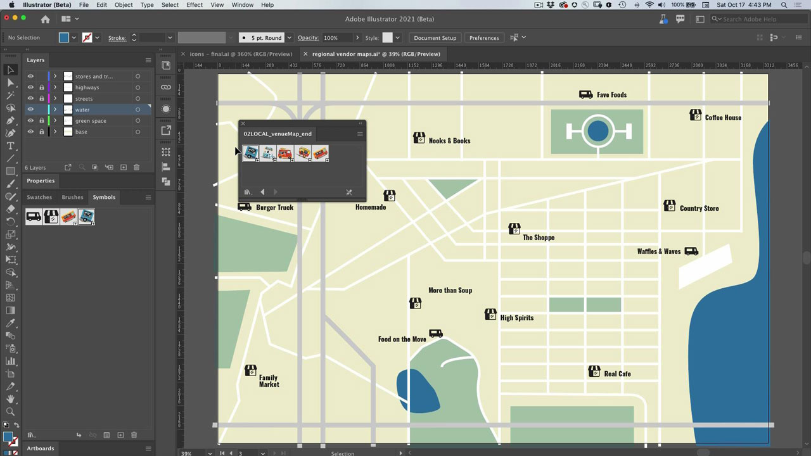

# Illustrator

La aplicación moderna para ilustraciones y gráficos. Crea logotipos, iconos, ilustraciones y cualquier otro diseño que puedas imaginar para la web, los dispositivos móviles o la impresión.

## Buscar Tutorials de productos

<table style="table-layout:fixed">
<tr>
 <td>
   
    

   <a href="illustrator.md#tutorial1"><strong>Usar símbolos para actualizar varias instancias de icono</strong></a>
    

    <em>Reducir el trabajo manual y mantener la coherencia con los símbolos</em>
     
  </td>
  <td>
    
    

    <a href="illustrator.md#tutorial2"><strong>Alinear texto e imágenes con ajuste de pictograma</strong></a>
    

    <em>Ajuste rápidamente los pictogramas a regiones importantes del documento</em>
     
  </td>
  <td>
    
    

     
  </td>
</tr>
</table>

## Usar símbolos para actualizar varias instancias de icono (5:08) {#tutorial1}

>[!VIDEO](https://video.tv.adobe.com/v/326816?hidetitle=true)

**Descripción**
Reduce el trabajo manual y mantén la coherencia con los símbolos.

En este tutorial, aprenderás a:
* Reducir el trabajo manual y mantener la coherencia con los símbolos

**Presentado por:**
Patti Sokol, consultora principal de soluciones (Digital Media)

## Alinear texto e imágenes con el ajuste de pictogramas (6:48) {#tutorial2}

>[!VIDEO](https://video.tv.adobe.com/v/326817?hidetitle=true)

**Descripción**
Ajuste rápidamente los pictogramas a regiones importantes del documento.

En este tutorial, aprenderás a:
* Ajuste rápidamente los pictogramas a regiones importantes del documento

**Presentado por:**
Patti Sokol, consultora principal de soluciones (Digital Media)

**Recursos de Illustrator**

[Información y asistencia](https://helpx.adobe.com/es/support/illustrator.html) es el centro de tutoriales adicionales y vínculos a foros de la comunidad.

**Versión de octubre de 2020**

Empiece a utilizar estas funciones (¡y mucho más!) descargando la actualización más reciente de la aplicación de escritorio de Creative Cloud.
