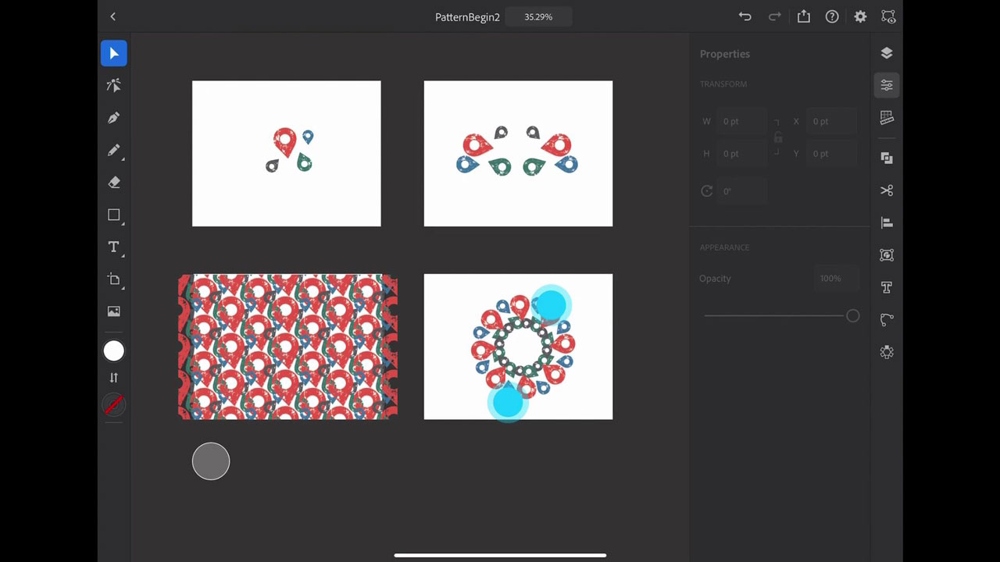

# Illustrator en iPad

Adobe Illustrator para el iPad es una experiencia de diseño vectorial rediseñada para el diseño táctil, el Apple Pencil y el iPad.

## Buscar Tutorials de productos

<table style="table-layout:fixed">
<tr>
 <td>
   
    

   <a href="illustratoripad.md#tutorial1"><strong>Introducción a Illustrator para el iPad</strong></a>
    

    <em>Crea un icono de ubicación con dificultades y conviértelo en un patrón que puedas aplicar a tu proyecto de [!DNL Dimension] y Zazzle.</em>
     
  </td>
  <td>
    
    

     
  </td>
  <td>
    
    

     
  </td>
</tr>
</table>

## Introducción a Illustrator para el iPad (9:21) {#tutorial1}

>[!VIDEO](https://video.tv.adobe.com/v/326823?hidetitle=true)

**Descripción**
Esta rápida introducción a Illustrator para iPad te ayudará a ponerte en marcha rápidamente para crear un icono de ubicación con problemas y convertirlo en un patrón que puedes aplicar a tu proyecto de [!DNL Dimension] y Zazzle.

En este tutorial, aprenderás a:
* Illustrator rediseñado para iPad transforma la productividad, acelera la colaboración, amplía las habilidades creativas y potencia la creatividad para todos
* La interfaz táctil permite una experiencia más táctil y precisa con Apple Pencil
* Acceder a gráficos y colores desde CC Libraries
* Flujo de trabajo de ida y vuelta en Illustrator móvil y de escritorio

**Presentado por:**
Dave Weinberg, consultor sénior de soluciones (Digital Media)

Logotipo de 

**Recursos de Illustrator en iPad**

[Información y asistencia](https://helpx.adobe.com/support/illustrator.html) es el centro de tutoriales adicionales, [Novedades](https://helpx.adobe.com/illustrator/using/whats-new/mobile-2021.html) y vínculos a foros de la comunidad.

**Versión de octubre de 2020**

Empiece a utilizar estas funciones (¡y mucho más!) descargando la actualización más reciente de la aplicación de escritorio de Creative Cloud.
