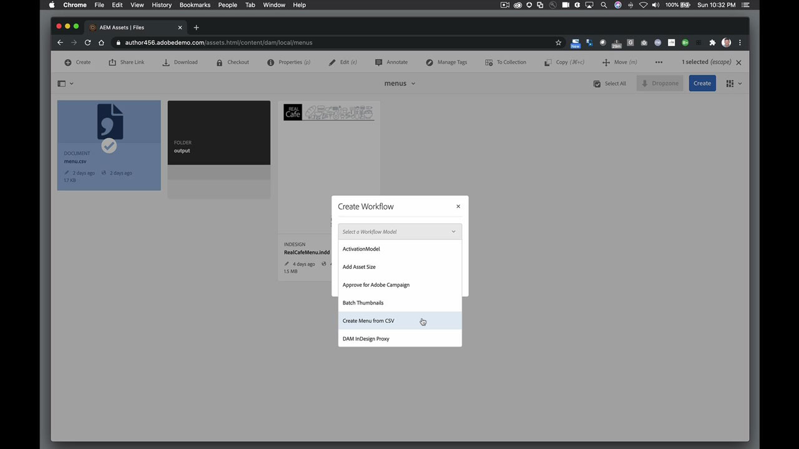

# InDesign Server

El software Adobe InDesign® Server proporciona un motor potente y escalable que aprovecha el diseño, la composición y las funciones tipográficas de InDesign para permitirle programar la creación de documentos automatizados atractivos.

## Buscar Tutorials de productos

<table style="table-layout:fixed">
<tr>
 <td>
   
    

   <a href="indesignserver.md#tutorial1"><strong>Contenido de InDesign Server basado en datos</strong></a>
    

    <em>El diseño basado en datos se puede lograr mediante programación con el InDesign Server</em>
     
  </td>
  <td>
    
    

     
  </td>
  <td>
    
    

     
  </td>
</tr>
</table>

## Contenido de InDesign Server basado en datos (4:14) {#tutorial1}

>[!VIDEO](https://video.tv.adobe.com/v/326901?hidetitle=true)

**Descripción**
El diseño basado en datos se puede lograr, mediante programación, con el InDesign Server.

En este tutorial, aprenderás a:
* Creación de plantillas de InDesign con estilos de texto u objeto previamente formateados
* Flujo en contenido basado en datos externos para una personalización más rápida del contenido
* Genere PDF de tinta plana del diseño o vincúlelos a otros formatos de salida AEM

**Presentado por:**
Eric Rowse, consultor sénior de soluciones (Digital Media)

## Recursos adicionales de InDesign Server

<table>
<tr>
 <td>
   
    

   <a href="https://www.adobe.com/products/indesignserver/buying-guide.html"><strong>InDesign Server: Guía de compra</strong></a>
    

    <em>Recursos disponibles para desarrolladores internos o socios</em>
     
  </td>
  <td>
   
    

   <a href="https://www.adobe.com/products/indesignserver/partner.html"><strong>InDesign Server: Buscar un partner</strong></a>
    

    <em>Aunque tengas la experiencia para desarrollar internamente, Adobe recomienda trabajar con socios para encontrar la solución que cumpla tus requisitos</em>
     
  </td>
  <td>
    
    

     
  </td>
</tr>
</table>

**Recursos de InDesign Server**

[Información y asistencia](https://www.adobe.com/products/indesignserver.html) es el centro de tutoriales adicionales, novedades y vínculos a foros de la comunidad.

**Versión de octubre de 2020**

Empiece a utilizar estas funciones (¡y mucho más!) descargando la actualización más reciente de la aplicación de escritorio de Creative Cloud.
