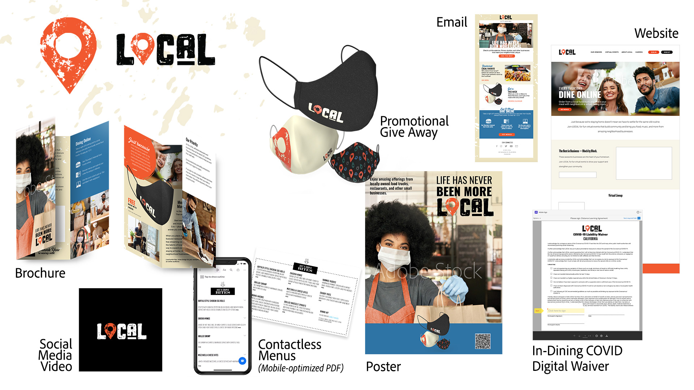

# MAX 2020: las sesiones empresariales

Como creativo empresarial, tienes que colaborar con equipos distribuidos, establecer procesos ampliables y cumplir con los sistemas y directrices corporativos. Estos tutoriales le ayudarán a conocer las nuevas funciones de la versión de 2021 de Creative Cloud desde una perspectiva empresarial.

## Operar a escala: aprovechar la potencia de AEM Assets y InDesign Server (26:54)

>[!VIDEO](https://video.tv.adobe.com/v/327112?hidetitle=true)

**Descripción**

¿Su personal creativo dedica demasiado tiempo al trabajo manual y repetitivo? Ayuda a tu organización a sacar el máximo partido a los profesionales creativos. Los sistemas empresariales, como la AEM y el InDesign Server, pueden proporcionar al personal creativo y de producción los medios necesarios para poner el contenido rápidamente en manos de la audiencia de destino.

En esta sesión grabada en directo, verá ejemplos de flujos de trabajo basados en plantillas en:
* Adobe Experience Manager (AEM) Assets es una solución de administración de activos digitales (DAM) que se puede integrar con Adobe Creative Cloud para ayudar a los usuarios de DAM a trabajar junto con equipos creativos, lo que simplifica la colaboración en el proceso de creación de contenidos
* Adobe InDesign Server es un motor de maquetación y maquetación que impulsa soluciones de publicación automatizada mediante su integración en otros sistemas

**Presentado por:**

Eric Rowse, consultor sénior de soluciones (Digital Media)
Derek Lu, Consultor principal de soluciones (Prueba de concepto)

## Nuevas herramientas para la nueva normal (29:57)

>[!VIDEO](https://video.tv.adobe.com/v/328232?hidetitle=true)

**Descripción**

WFH ha traído consigo desafíos, pero también ha obligado a los creativos y a sus empresas a experimentar con nuevas herramientas y nuevas formas de crear. Explora herramientas conocidas como Illustrator y Photoshop en sus nuevas versiones de iPad y dibuja con Fresco en tabletas (iPad, Microsoft Surface) y ahora en iPhone.

En esta sesión grabada en directo, aprenderá a:
* Utiliza diversos pinceles y técnicas de sombreado en Fresco para crear ilustraciones de campañas dibujadas a mano
* Crear y compartir iconos con dificultades en Illustrator en iPad para que coincidan con la construcción de marca
* Compón ilustraciones de Fresco y Illustrator en iPad para crear contenido para nuestros canales de redes sociales, mientras te desplazas con Photoshop en iPad

**Presentado por:**

Dave Weinberg, consultor sénior de soluciones (Digital Media)
Liz Tanonis, consultora de soluciones (Digital Media)
Emilie Enke, consultora de soluciones (Digital Media)

## Colaboración con CC Libraries (27:58)

>[!VIDEO](https://video.tv.adobe.com/v/328199?hidetitle=true)

**Descripción**

Con las Bibliotecas Adobe Creative Cloud, puedes administrar, organizar y acceder a tus logotipos, colores y más directamente desde tus aplicaciones de Creative Cloud favoritas. Trabaja de forma más eficaz, garantiza la coherencia creativa y sincronízate fácilmente con tu equipo.

En este tutorial, aprenderás a:
* Encuentre fácilmente los activos que necesita en todas sus aplicaciones creativas
* Capacita a los comunicadores de toda tu organización para crear experiencias fieles a la marca y, al mismo tiempo, mantener el control

**Presentado por:**

Ashley Dvorin, consultora sénior de soluciones (Digital Media)
Emily Palmer, consultora de soluciones (Digital Media)

## Acerca de Demo Assets: LOCAL

El equipo se puso en contacto para crear los activos de demostración como lo haría una empresa. Hemos ideado una campaña y creado activos para varios canales. También creamos una Biblioteca CC de elementos de marca para fomentar la colaboración y la coherencia.

En respuesta a la COVID-19, LOCAL, una empresa que organiza eventos en directo para celebrar unas vacaciones divertidas y extravagantes, ha pasado a las reuniones online y se ha asociado con pequeños camiones de comida y restaurantes locales para promocionar sus negocios y ayudarlos a mantenerse abiertos.

