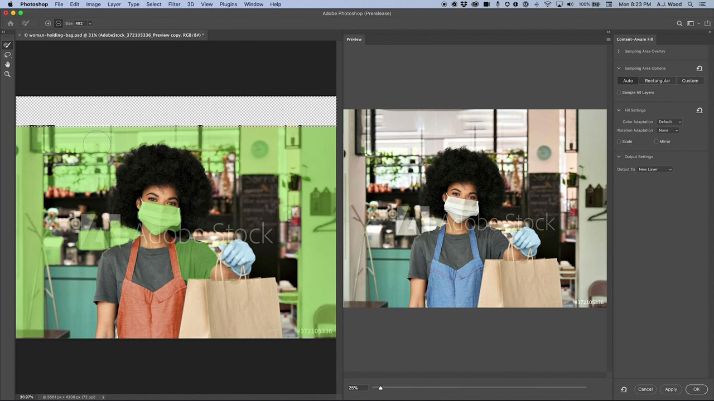

# Photoshop

Photoshop es el mejor software de diseño gráfico e imágenes del mundo, y permite una creatividad ilimitada para los profesionales de todos los dispositivos. Ahora cualquiera puede crear cualquier cosa que se imagine, en cualquier lugar en el que surja la inspiración. Si puedes pensarlo, puedes hacerlo con Photoshop.

## Buscar Tutorials de productos

<table style="table-layout:fixed">
<tr>
 <td>
   
    

   <a href="photoshop.md#tutorial1"><strong>Editar imágenes para que coincidan con tu campaña</strong></a>
    

    <em>Utiliza las potentes herramientas de selección y edición de color de Adobe Photoshop para cambiar drásticamente una imagen que se ajuste a tus necesidades de marca corporativa</em>
     
  </td>
  <td>
    
    

    <a href="photoshop.md#tutorial2"><strong>Seleccionar y reemplazar el cielo</strong></a>
    

    <em>Selecciona automáticamente el cielo de una imagen y sustitúyelo por el que más te guste, ajustando automáticamente los colores de la imagen para que coincidan con tu selección</em>
     
  </td>
  <td>
    
    

     
  </td>
</tr>
</table>

## Editar imágenes para que coincidan con tu campaña (5:45) {#tutorial1}

>[!VIDEO](https://video.tv.adobe.com/v/326950?hidetitle=true)

**Descripción**
Utiliza las potentes herramientas de selección y edición de color de Adobe Photoshop para cambiar drásticamente una imagen que se ajuste a tus necesidades de marca corporativa.

En este tutorial, aprenderá a:
* La herramienta Selección de objetos hace que la selección de elementos sea más rápida y sencilla
* El Relleno según el contenido permite un mayor control de las áreas de muestra de una imagen de origen para una mejor clonación y aplicación de parches en las áreas de destino
* Los pinceles pueden tener diferentes formas para obtener mejores resultados
* Adobe Sensei ayuda a aprovechar la inteligencia artificial para tareas rutinarias

**Presentado por:**
A.J Wood, consultor sénior de soluciones (Digital Media)

## Seleccionar y reemplazar el cielo (2:16) {#tutorial2}

>[!VIDEO](https://video.tv.adobe.com/v/326953?hidetitle=true)

**Descripción**
Selecciona automáticamente el cielo de una imagen y sustitúyelo por el que más te guste, ajustando automáticamente los colores de la imagen para que coincidan con tu selección.

En este tutorial, aprenderá a:
* Sustitución de cielo proporciona una solución con un solo clic para intercambiar al instante los cielos de las imágenes
* Sustitución de cielo guarda la salida como un grupo de capas con cada máscara, ajuste e imagen para perfeccionarla aún más

**Presentado por:**
A.J Wood, consultor sénior de soluciones (Digital Media)

**Recursos de Photoshop**

[Información y asistencia](https://helpx.adobe.com/support/photoshop.html) es el centro de tutoriales adicionales, [Novedades del sector](https://helpx.adobe.com/photoshop/using/whats-new.html)y vínculos a foros de la comunidad.

**Versión de octubre de 2020**

Empiece a utilizar estas funciones (¡y mucho más!) descargando la actualización más reciente de la aplicación de escritorio de Creative Cloud.
