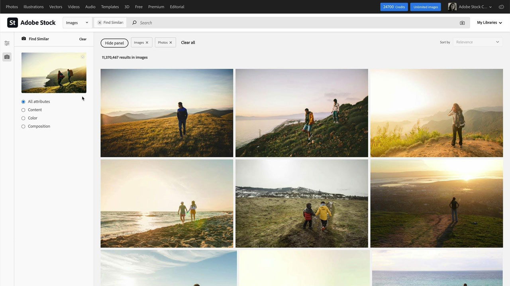
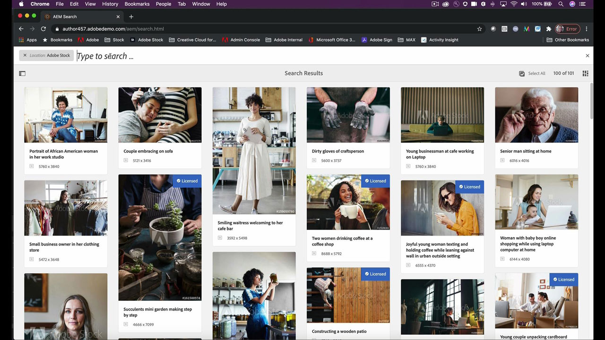

# [!DNL Stock]

Los creativos se encuentran bajo presión para ofrecer rápidamente contenido nuevo y visualmente atractivo que capte y mantenga la atención. Adobe [!DNL Stock] para empresas da acceso a los equipos creativos a más de 200 millones de imágenes, vídeos, plantillas, ilustraciones, archivos de audio y contenidos 3D, todo ello desde las aplicaciones creativas de Adobe que usan a diario.

## Buscar Tutorials de productos

<table style="table-layout:fixed">
<tr>
 <td>
   
    

   <a href="stock.md#tutorial1"><strong>Encuentra los mejores activos más rápido con el Adobe [!DNL Stock]</strong></a>
    

    <em>Encuentra la imagen de stock perfecta sin derechos de autor para mejorar tu proyecto creativo mediante resultados de búsqueda mejores y más rápidos con la tecnología de inteligencia artificial de Adobe</em>
     
  </td>
  <td>
   
    

   <a href="stock.md#tutorial2"><strong>Buscar y comprar licencia de activos [!DNL Stock] en 
Adobe Experience Manager</strong></a>
    

    <em>Simplifica el proceso de carga de tus activos de Adobe con licencia [!DNL Stock] en tu sistema de administración de activos digitales</em>
     
  </td>
  <td>
    
    

     
  </td>
</tr>
</table>

## Encuentra los mejores activos más rápido con el Adobe [!DNL Stock] (10:49) {#tutorial1}

>[!VIDEO](https://video.tv.adobe.com/v/326951?hidetitle=true)

**Descripción**
Encuentra la imagen de stock perfecta y sin derechos de autor para mejorar tu proyecto creativo mediante unos resultados de búsqueda mejores y más rápidos, con la tecnología de la IA de Adobe.

En este tutorial, aprenderás a:

* Dedica tiempo y esfuerzo a tu búsqueda de imágenes y vídeos de gran calidad
* Gestiona y supervisa fácilmente las licencias y el uso de activos en toda tu empresa
* Busca, previsualiza y obtén licencias directamente desde tus aplicaciones de Adobe Creative Cloud

**Presentado por:**

Victoria Torres, [!DNL Stock] Consultora de soluciones (Digital Media)

## Buscar y comprar licencias de [!DNL Stock] activos en AEM (6:46) {#tutorial2}

>[!VIDEO](https://video.tv.adobe.com/v/326952?hidetitle=true)

**Descripción**
Simplifica el proceso de carga de tus activos con licencia de Adobe [!DNL Stock] en tu sistema de administración de activos digitales.

En este tutorial, aprenderás a:
* Realizar una búsqueda de recursos de Adobe [!DNL Stock] sin salir AEM espacio de trabajo
* Guardar los contenidos con licencia directamente en una carpeta de AEM en el momento de comprar la licencia
* Ver los activos con licencia de AEM en el historial de licencias de [!DNL Stock] en el sitio web de [!DNL Stock].

**Presentado por:**
Emily Palmer, consultora de soluciones (Digital Media)

Logotipo de ![[!DNL Stock]](../assets/st_appicon_96.png)

**Recursos del Adobe [!DNL Stock]**

[Información y asistencia](https://helpx.adobe.com/support/stock.html) es el centro de tutoriales adicionales y vínculos a foros de la comunidad.

**Versión de octubre de 2020**

Empiece a utilizar estas funciones (¡y mucho más!) descargando la actualización más reciente de la aplicación de escritorio de Creative Cloud.
