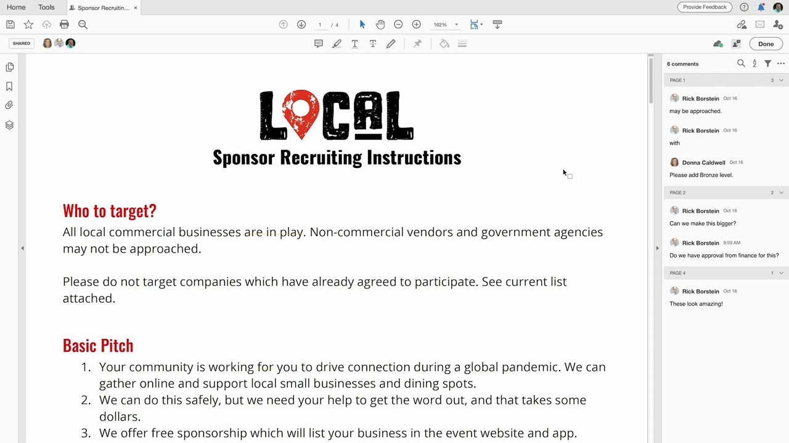

# Acrobat y Sign

Con Adobe Document Cloud — que incluye las principales soluciones de firma electrónica y PDF del mundo: puede convertir los procesos manuales de documentos en procesos digitales eficaces. Ahora su equipo puede realizar acciones rápidas en documentos, flujos de trabajo y tareas: en varias pantallas y dispositivos: en cualquier lugar, en cualquier momento y dentro de sus aplicaciones favoritas de Microsoft y empresas.

## Examinar Tutorials de productos

<table style="table-layout:fixed">
<tr>
 <td>
   
    

   <a href="acrobat-sign.md#tutorial1"><strong>Inicio de una revisión compartida de Acrobat</strong></a>
    

    <em>Invitar a los revisores a añadir sus comentarios a un documento PDF</em>
     
  </td>
  <td>
    
    

    <a href="acrobat-sign.md#tutorial2"><strong>Crear Forms de exención en línea con Adobe Sign</strong></a>
    

    <em>Convierta rápidamente documentos en formularios en línea y publíquelos en línea donde cualquiera que los necesite puede rellenarlos y firmarlos</em>
     
  </td>
  <td>
   
    

    <a href="acrobat-sign.md#tutorial3"><strong>Solicitar una firma con Adobe Sign</strong></a>
    

    <em>Ir de Word a PDF y enviar para firmar con Adobe Sign</em>
     
  </td>
</tr>
<tr>
 <td>
   
    

   <a href="acrobat-sign.md#tutorial4"><strong>Visualización de menús en dispositivos móviles con modo flotante</strong></a>
    

    <em>Utilice el modo flotante para mejorar la experiencia de lectura de PDF en dispositivos móviles</em>
     
  </td>
  <td>
    
    

    <a href="acrobat-sign.md#tutorial5"><strong>Digitalizar documentos a PDF desde su teléfono móvil</strong></a>
    

    <em>Con Adobe Scan, capture y convierta fácilmente documentos, formularios, tarjetas de visita y pizarras en archivos PDF de Adobe de alta calidad</em>
     
  </td>
  <td>
    
    

     
  </td>
</tr>
</table>

## Iniciar una Acrobat Shared Review (3:49) {#tutorial1}

>[!VIDEO](https://video.tv.adobe.com/v/326777?hidetitle=true)

****
DescripciónInvite a los revisores a añadir sus comentarios a un documento PDF.

En este tutorial, aprenderá a:
* Alojar comentarios de PDF en el Document Cloud
* Recopilar comentarios en un lugar
* Los comentarios simultáneos fomentan la colaboración

**Comparación de opciones de revisión y comentario de Adobe en PDF**

**Presentado por:**
Dan Armstrong, consultor de soluciones (medios digitales) Rick Borstein, asesor principal de soluciones (medios digitales)

## Crear Forms de exención en línea con Adobe Sign (5:19) {#tutorial2}

>[!VIDEO](https://video.tv.adobe.com/v/326776?hidetitle=true)

****
DescripciónConvierta rápidamente documentos en formularios en línea y publíquelos en línea donde cualquiera que los necesite puede rellenarlos y firmarlos.

En este tutorial, aprenderá a:
* Conversión de formularios en papel en documentos digitales
* Publicar formularios digitales en su sitio web, donde los clientes pueden acceder a ellos desde su propio dispositivo
* Los formularios completados se archivan automáticamente para sus registros

**Presentado por:**
Taylor Kobey, Consultora de Soluciones (Digital Media) Emily Palmer, Consultora de Soluciones (Digital Media)

## Solicitar una firma con Adobe Sign (3:21) {#tutorial3}

>[!VIDEO](https://video.tv.adobe.com/v/326801?hidetitle=true)

****
DescripciónVaya de Word a PDF y envíe para firmar con Adobe Sign.

En este tutorial, aprenderá a:
* Aproveche las herramientas que utiliza a diario para enviar documentos digitales para su firma

**Presentado por:**
Rick Borstein, Director de consultoría de soluciones (Digital Media)

## Ver menús en dispositivos móviles con modo flotante (2:57) {#tutorial4}

>[!VIDEO](https://video.tv.adobe.com/v/327093?hidetitle=true)

****
DescripciónUtilice el modo flotante para mejorar la experiencia de lectura de PDF en dispositivos móviles.

En este tutorial, aprenderá a:
* Hacer que los archivos PDF sean interactivos para dispositivos móviles
* Mejorar el diseño de PDF
* Añada funciones sobre la marcha para ayudarle a leer fácilmente documentos en su teléfono y tableta

**Presentado por:**
Emilie Enke, consultor asociado de soluciones (Digital Media)

## Digitalizar documentos a PDF desde su teléfono móvil (5:53) {#tutorial5}

>[!VIDEO](https://video.tv.adobe.com/v/327094?hidetitle=true)

****
DescripciónCon Adobe Scan, capture y convierta fácilmente documentos, formularios, tarjetas de visita y pizarras en archivos PDF de Adobe de alta calidad.

En este tutorial, aprenderá a:
* Utilice su teléfono móvil para capturar y convertir documentos, formularios, tarjetas de visita y pizarras en archivos PDF de Adobe de alta calidad
* Identifique y enfoque automáticamente el texto escrito a mano o impreso, al tiempo que elimina los elementos que no desea, como el resplandor y la sombra
* Abra el PDF digitalizado en Acrobat Reader para hacer notas y comentarios y revisarlo con su equipo

**Presentado por:**
Emilie Enke, consultor asociado de soluciones (Digital Media)

**Recursos de Acrobat y Adobe Sign**

[Formación y ](https://helpx.adobe.com/support/document-cloud.html) asistencia técnica es su centro para ver tutoriales adicionales,  [Novedades](https://helpx.adobe.com/acrobat/using/whats-new.html) y vínculos a foros de la comunidad.

**Versión de octubre de 2020**

Empiece a utilizar estas funciones (y mucho más) descargando la actualización más reciente desde la aplicación de escritorio de Creative Cloud.
