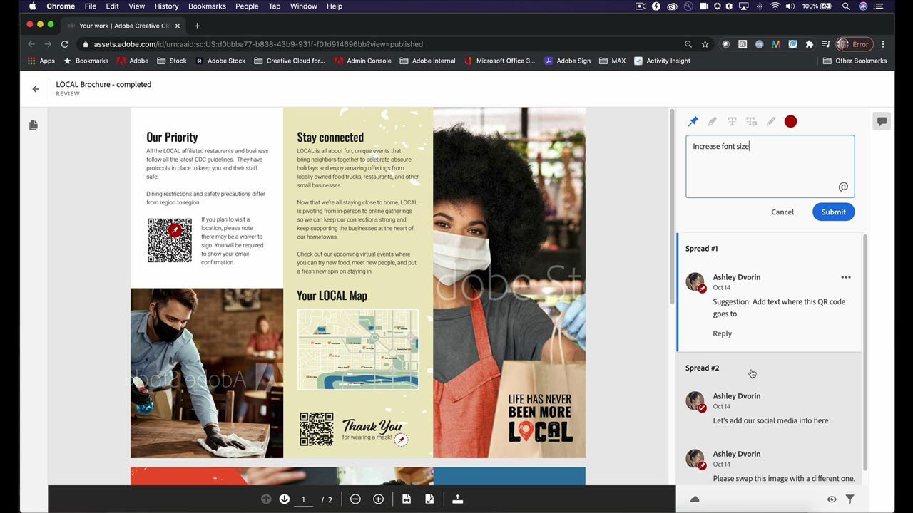

# InDesign

La aplicación estándar del sector para crear documentos atractivos para la publicación digital e impresa. Crea experiencias digitales e impresas sofisticadas, desde libros electrónicos y revistas electrónicas hasta libros, informes y artículos técnicos.

## Buscar Tutorials de productos

<table style="table-layout:fixed">
<tr>
 <td>
    
    

    <a href="indesign.md#tutorial1"><strong>Generar códigos QR</strong></a>
    

    <em>Generar código QR que vincule a un sitio web</em>
     
  </td>
  <td>
   
    

   <a href="indesign.md#tutorial2"><strong>Compartir para revisión desde InDesign</strong></a>
    

    <em>Experiencia de revisión creativa perfecta para diseñadores y miembros de su equipo</em>
     
  </td>
  <td>
    
    

    <a href="indesign.md#tutorial3"><strong>Importar comentarios del PDF desde una revisión del Document Cloud</strong></a>
    

    <em>Importar comentarios de un PDF directamente en InDesign y aplicar rápidamente los cambios solicitados</em>
     
  </td>
</tr>
<tr>
<td>
   
    

   <a href="indesign.md#tutorial4"><strong>Agregar archivo de vídeo al documento de InDesign</strong></a>
    

    <em>Añade vídeo al InDesign. Enviar al PDF y publicar en línea</em>
     
  </td>
 <td>
    
    

     
 </td>
 <td>
    
    

     
 </td>
</tr>
</table>

## Generar códigos QR (2:34) {#tutorial1}

>[!VIDEO](https://video.tv.adobe.com/v/326818?hidetitle=true)

**Descripción**
Generar código QR que vincule a un sitio web.

En este tutorial, aprenderás lo siguiente:
* Proporcionar acceso manos libres al contenido web a través de dispositivos móviles
* Haz que tus clientes se sientan seguros
* Digital significa que es fácil mantener el contenido actualizado

**Presentado por:**
Patti Sokol, consultora principal de soluciones (Digital Media)

## Compartir para revisión desde InDesign (4:04) {#tutorial2}

>[!VIDEO](https://video.tv.adobe.com/v/326824?hidetitle=true)

**Descripción**
InDesign Share for Review ofrece una experiencia de revisión creativa aún más fluida para los diseñadores y los miembros de su equipo.

En este tutorial, aprenderá a:
* Iniciar una revisión directamente desde InDesign sin tener que crear un PDF
* Revisar y comentar desde un navegador web
* Recopila los comentarios de varios responsables de departamento en un solo lugar
* Gestiona los comentarios en la aplicación para poder hacer cambios inmediatamente.

**PDF de comparación de opciones de comentarios y revisión de Adobes**

**Presentado por:**
Emily Palmer, consultora de soluciones (Digital Media)

## Importar comentarios del PDF de una revisión del Document Cloud (4:52) {#tutorial3}

>[!VIDEO](https://video.tv.adobe.com/v/326959?hidetitle=true)

**Descripción**
Importe comentarios de un PDF directamente en InDesign y aplique rápidamente los cambios solicitados.

En este tutorial, aprenderá a:
* Admite flujos de trabajo de comentarios de PDF existentes
* Funciona para PDF combinados de varias fuentes

**PDF de comparación de opciones de comentarios y revisión de Adobes**

**Presentado por:**
Michael Murphy, consultor sénior de soluciones (medios digitales)

## Agregar archivo de vídeo al documento de InDesign (5:58) {#tutorial4}

>[!VIDEO](https://video.tv.adobe.com/v/326757?hidetitle=true)

**Descripción**
Añade vídeo al InDesign. Enviar al PDF y publicar en línea.

En este tutorial, aprenderá a:
* Añadir vídeo al InDesign
* Enviar al PDF y publicar en línea

**Presentado por:**
Patti Sokol, consultora principal de soluciones (Digital Media)

**Recursos de InDesign**

[Información y asistencia](https://helpx.adobe.com/support/indesign.html) es el centro de tutoriales adicionales, [Novedades del sector](https://helpx.adobe.com/indesign/user-guide.html/indesign/using/whats-new.ug.html)y vínculos a foros de la comunidad.

**Versión de octubre de 2020**

Empiece a utilizar estas funciones (¡y mucho más!) descargando la actualización más reciente de la aplicación de escritorio de Creative Cloud.
