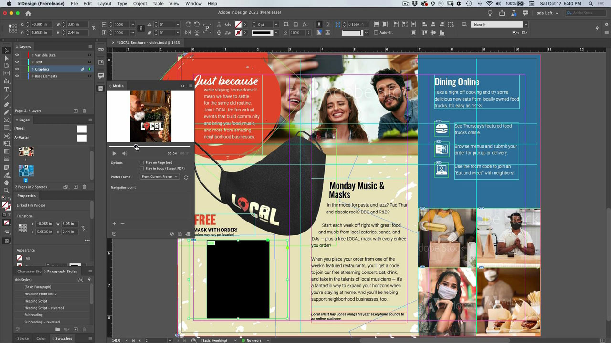

# InDesign

La aplicación estándar del sector para crear documentos atractivos para impresión y publicación digital. Cree experiencias digitales e impresas enriquecidas, desde libros electrónicos y revistas electrónicas hasta libros, informes y white papers.

## Examinar Tutorials de productos

<table style="table-layout:fixed">
<tr>
 <td>
    
    

    <a href="indesign.md#tutorial1"><strong>Generar códigos QR</strong></a>
    

    <em>Generar código QR que vincule a un sitio web</em>
     
  </td>
  <td>
   
    

   <a href="indesign.md#tutorial2"><strong>Compartir para revisar desde InDesign</strong></a>
    

    <em>Experiencia de revisión creativa perfecta para diseñadores y miembros de su equipo</em>
     
  </td>
  <td>
    
    

    <a href="indesign.md#tutorial3"><strong>Importar comentarios de PDF desde una revisión de Document Cloud</strong></a>
    

    <em>Importar comentarios de un PDF directamente en el InDesign y aplicar rápidamente los cambios solicitados</em>
     
  </td>
</tr>
<tr>
<td>
   
    

   <a href="indesign.md#tutorial4"><strong>Añadir archivo de vídeo al documento de InDesign</strong></a>
    

    <em>Añada vídeo al InDesign. Enviar a PDF y publicar en línea</em>
     
  </td>
 <td>
    
    

     
 </td>
 <td>
    
    

     
 </td>
</tr>
</table>

## Generar códigos QR (2:34) {#tutorial1}

>[!VIDEO](https://video.tv.adobe.com/v/326818?hidetitle=true)

****
DescripciónGenerar código QR que vincule a un sitio web.

En este tutorial, aprenderás a:
* Proporcionar acceso directo al contenido web a través de dispositivos móviles
* Haga que sus clientes se sientan seguros
* Digital significa que es fácil mantener el contenido actualizado

**Presentado por:**
Patti Sokol, Consultor Principal de Soluciones (Digital Media)

## Compartir para revisar desde InDesign (4:04) {#tutorial2}

>[!VIDEO](https://video.tv.adobe.com/v/326824?hidetitle=true)

****
DescripciónInDesign Share for Review proporciona una experiencia de revisión creativa aún más fluida para los diseñadores y los miembros de su equipo.

En este tutorial, aprenderá a:
* Iniciar una revisión directamente desde InDesign sin tener que crear un PDF
* Revisar y comentar desde un navegador web
* Recopile comentarios de varias partes interesadas en un solo lugar
* Administre comentarios en la aplicación, donde los cambios se pueden realizar inmediatamente.

**Comparación de opciones de revisión y comentario de Adobe en PDF**

**Presentado por:**
Emily Palmer, consultora de soluciones (Digital Media)

## Import PDF Comments from a Document Cloud Review (4:52) (Importar comentarios de PDF desde una revisión de , en inglés) {#tutorial3}

>[!VIDEO](https://video.tv.adobe.com/v/326959?hidetitle=true)

****
DescripciónImporte comentarios de un PDF directamente en el InDesign y aplique rápidamente los cambios solicitados.

En este tutorial, aprenderá a:
* Admite flujos de trabajo de comentarios de PDF existentes
* Funciona para archivos PDF combinados de varios orígenes

**Comparación de opciones de revisión y comentario de Adobe en PDF**

**Presentado por:**
Michael Murphy, consultor senior de soluciones (Digital Media)

## Add Video File to InDesign Document (5:58) (Añadir archivo de vídeo a documento de , en inglés) {#tutorial4}

>[!VIDEO](https://video.tv.adobe.com/v/326757?hidetitle=true)

****
DescripciónAñadir vídeo al InDesign. Enviar a PDF y publicar en línea.

En este tutorial, aprenderá a:
* Añadir vídeo al InDesign
* Enviar a PDF y publicar en línea

**Presentado por:**
Patti Sokol, Consultor Principal de Soluciones (Digital Media)

**Recursos de InDesign**

[Formación y ](https://helpx.adobe.com/support/indesign.html) asistencia técnica es su centro para ver tutoriales adicionales,  [Novedades](https://helpx.adobe.com/indesign/user-guide.html/indesign/using/whats-new.ug.html) y vínculos a foros de la comunidad.

**Versión de octubre de 2020**

Empiece a utilizar estas funciones (y mucho más) descargando la actualización más reciente desde la aplicación de escritorio de Creative Cloud.
