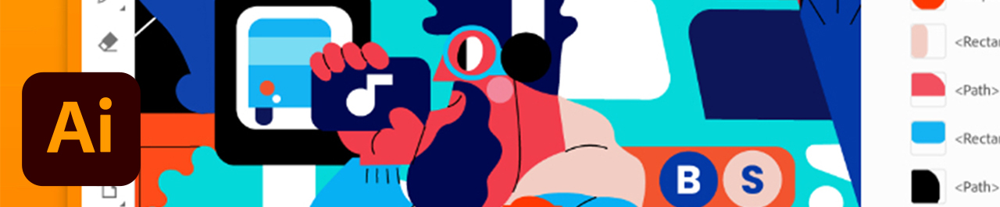

# Tutoriales

Como creativo empresarial, tienes que colaborar con equipos distribuidos, establecer procesos ampliables y cumplir con los sistemas y directrices corporativos. Estos tutoriales le ayudarán a conocer las nuevas funciones de la versión de 2021 de Creative Cloud desde una perspectiva empresarial.

## Tutorials por productos de escritorio

<table style="table-layout:fixed">
<tr>
 <td>
    
    

    <a href="acrobat-sign.md"><strong>Acrobat y Adobe Sign</strong></a>
    

    <em>Crear, editar y firmar documentos y formularios de PDF</em>
     
  </td>
  <td>
    
    

    <a href="dimension.md"><strong>Dimension</strong></a>
    

    <em>Crea imágenes en 3D fotorrealistas para construcción de marca, instantáneas de productos y diseños de paquetes</em>
     
  </td>
  <td>
    
    

    <a href="illustrator.md"><strong>Illustrator</strong></a>
    

    <em>Gráficos vectoriales e ilustraciones</em>
     
  </td>
</tr>
<tr>
 <td>
    
    

    <a href="indesign.md"><strong>InDesign</strong></a>
    

    <em>Diseño y maquetación de páginas para la publicación digital e impresa</em>
     
  </td>
  <td>
    
    

    <a href="photoshop.md"><strong>Photoshop</strong></a>
    

    <em>Edita, compón y crea bellas imágenes, gráficos y obras de arte en el escritorio</em>
     
  </td>
  <td>
    
    

    <a href="rush.md"><strong>Rush</strong></a>
    

    <em>Crea y comparte vídeos online en cualquier parte</em>
     
  </td>
</tr>
<tr>
 <td>
    
    

    <a href="xd.md"><strong>XD</strong></a>
    

    <em>Diseñar, crear prototipos y compartir experiencias de usuario</em>
     
  </td>
  <td>
    
    

     
  </td>
  <td>
    
    

     
  </td>
</tr>
</table>

### Tutorials por aplicación móvil

<table style="table-layout:fixed">
<tr>
 <td>
    
    

    <a href="capture.md"><strong>Capture</strong></a>
    

    <em>Convierte cualquier imagen en un tema de color, un gráfico vectorial, un pincel y mucho más</em>
     
  </td>
  <td>
    
    

    <a href="fresco.md"><strong>Fresco</strong></a>
    

    <em>Redescubre la diversión de dibujar y pintar en cualquier parte</em>
     
  </td>
  <td>
    
    

    <a href="illustratoripad.md"><strong>Illustrator en iPad</strong></a>
    

    <em>Gráficos vectoriales e ilustraciones</em>
     
  </td>
</tr>
<tr>
 <td>
    
    

    <a href="photoshopipad.md"><strong>Photoshop en el iPad</strong></a>
    

    <em>Edite, componga y cree bonitas imágenes, gráficos e ilustraciones en su equipo de escritorio y su iPad</em>
     
  </td>
  <td>
    
    

     
  </td>
  <td>
    
    

     
  </td>
</tr>
</table>

### Tutorials por integración

<table style="table-layout:fixed">
<tr>
 <td>
    
    

    <a href="aem.md"><strong>AEM Assets y Asset Link</strong></a>
    

    <em>Gestión de activos digitales de última generación</em>
     
  </td>
  <td>
    
    

    <a href="creativeclouddesktopapp.md"><strong>Aplicación de escritorio de Creative Cloud</strong></a>
    

    <em>La aplicación de escritorio de Creative Cloud es el centro para administrar las aplicaciones, los servicios y la colaboración de CC, ¡y mucho más!</em>
     
  </td>
  <td>
    
    

    <a href="cclibraries.md"><strong>Bibliotecas CC</strong></a>
    

    <em>Mantén tus activos a mano y tus proyectos fieles a la marca</em>
     
  </td>
</tr>
<tr>
<td>
    
    

    <a href="indesignserver.md"><strong>InDesign Server</strong></a>
    

    <em>Las sofisticadas herramientas de InDesign combinadas con la automatización personalizada</em>
     
  </td>
 <td>
    
    

    <a href="stock.md"><strong>Adobe [!DNL Stock]</strong></a>
    

    <em>Imágenes digitales de alta calidad, ilustraciones, vídeos, audio, plantillas y mucho más</em>
     
  </td>
  <td>
    
    

     
  </td>
</tr>
</table>

### Proyecto práctico: Crea tu propia máscara facial

<table style="table-layout:fixed">
<tr>
 <td>
    
    

    <a href="handsonproject.md"><strong>Crea tu propia máscara facial</strong></a>
    

    <em>Con el complemento Diseño de Adobe para imprimir, puede visualizar sus diseños en cientos de productos de Zazzle y publicarlos directamente en su tienda en línea</em>
     
  </td>
  <td>
    
    

     
  </td>
  <td>
    
    

     
  </td>
</tr>
</table>
