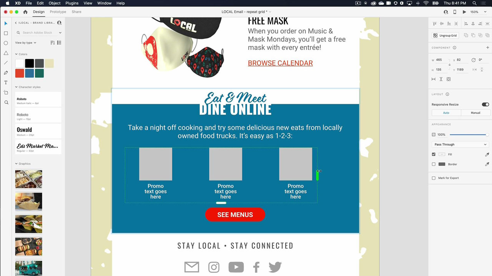

# XD

Adobe XD es una herramienta de diseño de experiencias de usuario y creación de prototipos para diseñar sitios web, aplicaciones, interfaces de voz, juegos y otros tipos de experiencias digitales.

## Buscar Tutorials de productos

<table style="table-layout:fixed">
<tr>
 <td>
   
    

   <a href="xd.md#tutorial1"><strong>Crear componentes con estados con cursor encima</strong></a>
    

    <em>Crea botones reutilizables y redimensionables dinámicamente para tus diseños interactivos</em>
     
  </td>
  <td>
    
    

    <a href="xd.md#tutorial2"><strong>Crear y rellenar una cuadrícula de repetición</strong></a>
    

    <em>Convierte un solo elemento en cuadrículas de repetición con solo hacer clic y arrastrar</em>
     
  </td>
  <td>
   
    

    <a href="xd.md#tutorial3"><strong>Trabajar con pilas</strong></a>
    

    <em>Utilice la propiedad stack para reorganizar fácilmente los elementos</em>
     
  </td>
</tr>
<tr>
 <td>
    
    

    <a href="xd.md#tutorial4"><strong>Crear un prototipo: vínculos de anclaje y grupos de desplazamiento</strong></a>
    

    <em>Añadir navegación y desplazamiento a un prototipo</em>
     
  </td>
  <td>
    
    

    <a href="xd.md#tutorial5"><strong>Crear un prototipo: estados de componentes interactivos</strong></a>
    

    <em>Añadir interactividad y un menú superpuesto a un prototipo</em>
     
  </td>
  <td>
   
    

   <a href="xd.md#tutorial7"><strong>Correo electrónico: Crear y rellenar una cuadrícula de repetición</strong></a>
    

    <em>Convierte un solo elemento en cuadrículas de repetición con solo hacer clic y arrastrar</em>
     
  </td>
</tr>
<tr>
 <td>
    
    

    <a href="xd.md#tutorial7"><strong>Correo electrónico: trabajar con pilas</strong></a>
    

    <em>Utilice la propiedad stack para reorganizar fácilmente los elementos</em>
     
  </td>
  <td>
    
    

     
  </td>
  <td>
    
    

     
  </td>
</tr>
</table>

## Crear [!UICONTROL Componentes] con los estados del ratón (7:35) {#tutorial1}

>[!VIDEO](https://video.tv.adobe.com/v/326874?hidetitle=true)

**Descripción**
Crea botones reutilizables y redimensionables dinámicamente para tus diseños interactivos.

En este tutorial, aprenderá a:
* Realice cambios en un componente principal de origen y dichos cambios se aplicarán automáticamente a todas las instancias de dicho componente
* Usa componentes para mantener la coherencia, ahorrar tiempo y reducir el número de clics

**Presentado por:**
Michael Murphy, consultor sénior de soluciones (medios digitales)

## Crear y rellenar una cuadrícula de repetición (2:57) {#tutorial2}

>[!VIDEO](https://video.tv.adobe.com/v/326955?hidetitle=true)

**Descripción**
Convierte un solo elemento en cuadrículas de repetición con solo hacer clic y arrastrar.

En este tutorial, aprenderá a:
* Aumenta tu flujo de trabajo y arrastra cualquier tamaño de cuadrícula que necesites, al instante
* Introduce contenido y datos reales, y la XD colocará por arte de magia todas las imágenes y el texto en tu cuadrícula
* Haz cambios una vez y aplícalos donde quieras, en cualquier dirección

**Presentado por:**
Ashley Dvorin, consultora sénior de soluciones (Digital Media)

## Trabajar con pilas (5:33) {#tutorial3}

>[!VIDEO](https://video.tv.adobe.com/v/326956?hidetitle=true)

**Descripción**
Utilice la propiedad stack para reorganizar fácilmente los elementos.

En este tutorial, aprenderá a:
* Mantén la alineación y el espaciado entre los objetos de tu lienzo aunque cambie el diseño
* Inserta nuevos objetos o reordénalos en una pila y todo se ajustará automáticamente

**Presentado por:**
Michael Murphy, consultor sénior de soluciones (medios digitales)

## Crear un prototipo: vínculos de anclaje y grupos de desplazamiento (9:55) {#tutorial4}

>[!VIDEO](https://video.tv.adobe.com/v/326957?hidetitle=true)

**Descripción**
Añadir navegación y desplazamiento a un prototipo.

En este tutorial, aprenderá a:
* Añada vínculos a sus prototipos con una acción que permita a los usuarios saltar a diferentes puntos de la misma mesa de trabajo
* Crea feeds de actividad, presentaciones de imágenes, listados de productos y más mediante la definición de áreas que se desplacen de forma independiente con respecto al resto de los diseños
* Crear grupos que se desplazan vertical, horizontalmente o ambos

**Presentado por:**
Michael Murphy, consultor sénior de soluciones (medios digitales)

## Crear un prototipo: estados de componentes interactivos (8:55) {#tutorial5}

>[!VIDEO](https://video.tv.adobe.com/v/326958?hidetitle=true)

**Descripción**
Añada interactividad y un menú superpuesto a un prototipo.

En este tutorial, aprenderá a:
* Crear una experiencia de usuario animada e interactiva no lineal sin necesidad de mesas de trabajo adicionales
* Crea varios flujos de prototipo o de interacción en un solo documento XD y publica vínculos únicos para cada flujo que se pueden compartir

**Presentado por:**
Emilie Enke, consultora asociada de soluciones (Digital Media)

## Correo electrónico: crear y rellenar una cuadrícula de repetición (4:45) {#tutorial6}

>[!VIDEO](https://video.tv.adobe.com/v/326775?hidetitle=true)

**Descripción**
Convierte un solo elemento en cuadrículas de repetición con solo hacer clic y arrastrar.

En este tutorial, aprenderá a:
* Aumenta tu flujo de trabajo y arrastra cualquier tamaño de cuadrícula que necesites, al instante
* Introduce contenido y datos reales, y la XD colocará por arte de magia todas las imágenes y el texto en tu cuadrícula
* Haz cambios una vez y aplícalos donde quieras, en cualquier dirección

**Presentado por:**
Victoria Torres, consultora de soluciones (Digital Media)

## Correo electrónico: trabajar con pilas (3:38) {#tutorial7}

>[!VIDEO](https://video.tv.adobe.com/v/326759?hidetitle=true)

**Descripción**
Utilice la propiedad stack para reorganizar fácilmente los elementos.

En este tutorial, aprenderá a:
* Mantén la alineación y el espaciado entre los objetos de tu lienzo aunque cambie el diseño
* Inserta nuevos objetos o reordénalos en una pila y todo se ajustará automáticamente

**Presentado por:**
Victoria Torres, consultora de soluciones (Digital Media)

**Recursos XD**

[Información y asistencia](https://helpx.adobe.com/support/xd.html) es el centro de tutoriales adicionales, [Novedades del sector](https://helpx.adobe.com/xd/user-guide.html/xd/help/whats-new.ug.html)y vínculos a foros de la comunidad.

**Versión de octubre de 2020**

Empiece a utilizar estas funciones (¡y mucho más!) descargando la actualización más reciente de la aplicación de escritorio de Creative Cloud.
