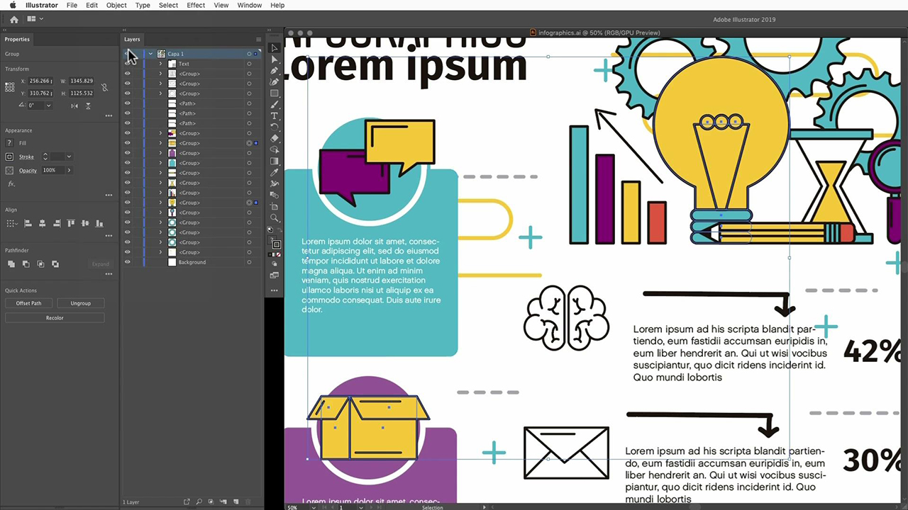
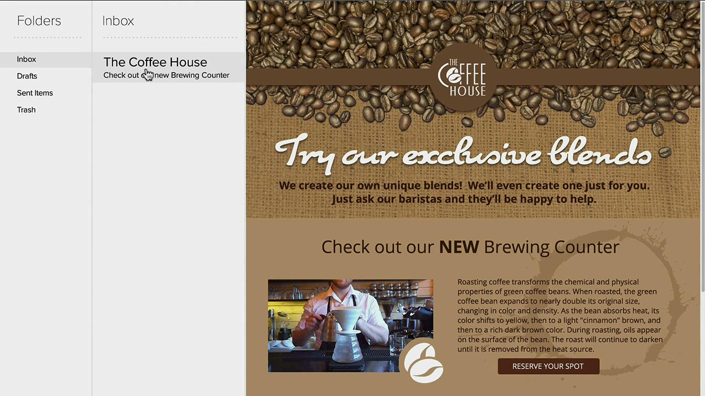

# Adobe [!DNL Stock] tutoriales

Los creativos se encuentran bajo presión para distribuir rápidamente contenido visual atractivo. Adobe Stock ofrece a los equipos creativos acceso a más de 300 millones de imágenes, vídeos, archivos de audio, plantillas, ilustraciones y contenidos 3D libres de derechos de autor, dentro de las aplicaciones de Creative Cloud que usan a diario. Obtén acceso ilimitado a los contenidos estándar de Adobe Stock con Creative Cloud Edición Pro. Descubra las colecciones más recientes en stock.adobe.com. Seleccione una imagen para ver un tutorial.

<table>
<tr>
   <td>
      
      

      <a href="stunning-digital-assets.md"><strong>Impresionantes recursos digitales (PDF)</strong></a>
      

      <em>Aprenda a integrar Adobe Stock con las Bibliotecas CC para crear resultados de diseño uniformes y profesionales para impresión y pantalla en este tutorial práctico</em>
       
  </td>
  <td>
      
      

      <a href="searchstock.md"><strong>Adobe de búsqueda [!DNL Stock] historial de licencias</strong></a>
      

      <em>Aprenda a buscar rápidamente en el Adobe de su organización [!DNL Stock] historial de licencias en Creative Cloud para empresas</em>
       
  </td>
  <td>
      
      

      <a href="handdrawn.md"><strong>Añade una estética dibujada a mano al Adobe [!DNL Stock] images</strong></a>
      

      <em>Amplía tu marketing creativo con técnicas únicas que añaden profundidad y dimensión a tus imágenes mediante Photoshop para iPad</em>
       
  </td>
  <td>
   
    

   <a href="flairtypography.md"><strong>Añade estilo a la tipografía con máscaras y animación</strong></a>
    

    <em>Da vida a tu texto con elementos de Adobe [!DNL Stock] y estilos de animación de After Effects</em>
     
  </td>
</tr>
<tr>
  <td>
      
      

      <a href="animatevector.md"><strong>Animación de un Adobe [!DNL Stock] ilustración vectorial en Photoshop</strong></a>
      

      <em>Añade animación a los gráficos de tu boletín con vectores editables para Adobe [!DNL Stock]</em>
       
  </td>
 <td>
      
      

      <a href="annualreport.md"><strong>Empieza tu informe anual con un vídeo creado con Adobe [!DNL Stock] y SPARK VIDEO</strong></a>
      

      <em>Haz de tu informe anual una historia con Adobe [!DNL Stock] y SPARK VIDEO</em>
       
  </td>
  <td>
      
      

      <a href="customanimations.md"><strong>Da vida a tu creatividad con animaciones personalizadas de Adobe [!DNL Stock]</strong></a>
      

      <em>Usar Adobe [!DNL Stock] imágenes, texturas y motivos para crear animaciones personalizadas en Photoshop</em>
       
  </td>
  <td>
      
      

      <a href="changecolors.md"><strong>Cambiar un Adobe [!DNL Stock] los colores de la imagen para que coincidan con tu historia</strong></a>
      

      <em>Encuentra una foto única en Adobe [!DNL Stock] y luego ajusta el color en Adobe Photoshop para que se ajuste a tus necesidades</em>
       
  </td>
</tr>
<tr>
 <td>
      
      

      <a href="collage.md"><strong>Creación de un collage en 3D para un póster con Adobe [!DNL Stock] images</strong></a>
      

      <em>Diseña un collage en Adobe Illustrator que ofrezca un efecto 3D llamativo a partir de imágenes en Adobe [!DNL Stock]</em>
       
  </td>
  <td>
      
      

      <a href="boldlabel.md"><strong>Crear una etiqueta en negrita con Adobe [!DNL Stock] plantillas y objetos inteligentes de Photoshop</strong></a>
      

      <em>Diseña y visualiza tus diseños personalizados con plantillas de empaquetado realistas de Adobe [!DNL Stock]</em>
       
  </td>
  <td>
      
      

      <a href="infographic.md"><strong>Crear una infografía de directrices empresariales con Adobe [!DNL Stock]</strong></a>
      

      <em>Combinar varios recursos de Adobe [!DNL Stock] para comunicar directrices en forma de infografías visualmente atractivas</em>
       
  </td>
 <td>
      
      

      <a href="featurecomparison.md"><strong>Creación de un gráfico comparativo de funciones de productos con Adobe [!DNL Stock]</strong></a>
      

      <em>Crea un gráfico que compare los planes de precios de los productos para ofrecer a los clientes potenciales la información que necesitan de un vistazo</em>
       
  </td>
</tr>
<tr>
   <td>
      
      

      <a href="surrealcomposite.md"><strong>Crear un compuesto semisurrealista con Adobe [!DNL Stock]</strong></a>
      

      <em>Crea una imagen editorial memorable combinando varias imágenes con color, movimiento y efectos de máscara</em>
       
  </td>
   <td>
      
      

      <a href="surrealpattern.md"><strong>Crea un patrón semisurrealista con Adobe [!DNL Stock]</strong></a>
      

      <em>Crea un hermoso patrón fluido basado en imágenes surrealistas de Adobe [!DNL Stock]</em>
       
  </td>
   <td>
      
      

      <a href="productconfigurator.md"><strong>Crear un configurador interactivo de productos con Adobe [!DNL Stock]</strong></a>
      

      <em>Aprovecha el poder de la interactividad, la animación y las ilustraciones editables de Adobe [!DNL Stock] presentar información financiera de forma visual</em>
       
  </td>
  <td>
      
      

      <a href="interactivetourismphoto.md"><strong>Crea una foto turística interactiva con Adobe [!DNL Stock] y XD</strong></a>
      

      <em>Cree rápidamente una foto interactiva dentro del prototipo de su sitio web con Adobe [!DNL Stock] &amp; XD</em>
       
  </td>
</tr>
<tr>
 <td>
      
      

      <a href="animationemail.md"><strong>Crear animaciones para correo electrónico con Adobe [!DNL Stock] y PHOTOSHOP</strong></a>
      

      <em>Potencia tus correos electrónicos con la animación de stop-action con Adobe [!DNL Stock] y PHOTOSHOP</em>
       
  </td>
  <td>
      
      

      <a href="brandgradients.md"><strong>Crea imágenes de marca coherentes con bonitos degradados y Adobe [!DNL Stock] assets</strong></a>
      

      <em>Crea la unidad de marca con imágenes variables combinando colores y degradados en tu campaña publicitaria</em>
       
   </td>
  <td>
      
      

      <a href="webgraphics.md"><strong>Creación de gráficos web atractivos combinando Adobe [!DNL Stock] imágenes con CSS</strong></a>
      

      <em>Crea la unidad de marca con imágenes variables combinando colores y degradados en tu campaña publicitaria</em>
       
  </td>
  <td>
      
      

      <a href="moodboard.md"><strong>Crea paneles de estilo inspirador en apenas tiempo con Adobe [!DNL Stock]</strong></a>
      

      <em>Crea un panel de estado de ánimo del proyecto para retransmitir información, ideas, elementos visuales y paletas de colores a los equipos o clientes</em>
       
  </td>
</tr>
<tr>
   <td>
      
      

      <a href="realisticcomposite.md"><strong>Crea composiciones fotográficas realistas con Adobe [!DNL Stock] images</strong></a>
      

      <em>Reúne a dos grandes Adobes [!DNL Stock] fotos para atraer a personas a tus publicaciones en redes sociales</em>
       
  </td>
   <td>
   
    

   <a href="loadingscreen.md"><strong>Personalización de una animación de pantalla de carga con Adobe [!DNL Stock] y XD</strong></a>
    

    <em>Personalizar ilustraciones vectoriales de Adobe [!DNL Stock] para crear una animación de pantalla de carga escalofriante para una aplicación móvil</em>
     
  </td>
  <td>
   
    

   <a href="presentationtemplate.md"><strong>Personalizar un Adobe [!DNL Stock] plantilla de presentación para que parezca profesional, pero llamativo</strong></a>
    

    <em>Crea una preciosa presentación estilizada en cuestión de minutos con imágenes y plantillas de Adobe [!DNL Stock] y algunos efectos especiales fáciles de hacer</em>
     
  </td>
   <td>
   
    

   <a href="customizecolors.md"><strong>Personalizar los colores de un Adobe [!DNL Stock] ilustración vectorial</strong></a>
    

    <em>Da calidad a cualquier proyecto con una ilustración atractiva. Encuentra el vector perfecto en Adobe [!DNL Stock]y, a continuación, haga coincidir los colores con la paleta de su proyecto mediante Adobe Illustrator</em>
     
  </td>
</tr>
<tr>
   <td>
      
      

      <a href="assets/AddMotiontoStillImageswithAdobeStockandPhotoshop.pdf"><strong>Añade movimiento a imágenes fijas con Adobe [!DNL Stock] y Photoshop (PDF)</strong></a>
      

      <em>Sorprende a tus audiencias en cualquier pantalla incorporando vídeos a una imagen fija</em>
       
   </td>
   <td>
   
    

   <a href="assets/CreateacompositewithPhotoshopontheiPadandAdobeStockimages.pdf" target="_blank"><strong>Crear una composición con Photoshop para el iPad y el Adobe [!DNL Stock] imágenes (PDF)</strong></a>
    

    <em>Aprende a usar una de tus aplicaciones favoritas de Adobe Creative Cloud de una forma completamente nueva con el poder de Photoshop en tu iPad</em>
     
  </td>
   <td>
   
    

   <a href="assets/CreateaUniqueEditorialGraphicwithAfterEffectsandAdobeStock.pdf" target="_blank"><strong>Animación de un Adobe [!DNL Stock] ilustración vectorial en Photoshop (PDF)</strong></a>
    

    <em>Combinando After Effects con Adobe [!DNL Stock]Además, puedes crear rápidamente efectos especiales sorprendentes que te ayuden a contar una historia visualmente</em>
     
  </td>
   <td>
      
      

      <a href="assets/CreateUniqueGraphicsbyCombiningAdobeStockImages.pdf" target="_blank"><strong>Crea gráficos únicos combinando el Adobe [!DNL Stock] imágenes (PDF)</strong></a>
      

      <em>Reúne dos imágenes diferentes para crear una escena completamente nueva para tus proyectos de diseño. Adobe [!DNL Stock] y Adobe Photoshop te lo ponen fácil</em>
       
   </td>
</tr>
<tr>
  <td>
      
      

      <a href="assets/CreatingaHalloweenCinemagraphwithPhotoshopCCandAdobeStock.pdf" target="_blank"><strong>Creación de un cinematográfico de Halloween con Photoshop CC y Adobe [!DNL Stock] (PDF)</strong></a>
      

      <em>Crea un cinemógrafo componiendo vídeo, ilustraciones y fotos con Adobe Photoshop</em>
       
  </td>
   <td>
      
      

      <a href="assets/PutyourDatainMotionwithAdobeStockandPremierePro.pdf" target="_blank"><strong>Pon tus datos en movimiento con Adobe [!DNL Stock] y Premiere Pro (PDF)</strong></a>
      

      <em>Haz que tus datos cobren vida para contar una historia más persuasiva utilizando Adobe [!DNL Stock] y ADOBE PREMIERE PRO</em>
       
  </td>
   <td>
      
      

      <a href="assets/RecolorAdobeStockVectorArtworkwithAdobeIllustratortoGetExactlytheLookYouWant.pdf" target="_blank"><strong>Volver a colorear Adobe [!DNL Stock] ilustraciones vectoriales con Adobe Illustrator para obtener exactamente el aspecto que deseas (PDF)</strong></a>
      

      <em>Adobe [!DNL Stock] facilita la búsqueda de gráficos vectoriales únicos y Adobe Illustrator le permite modificarlos rápidamente para que se ajusten a su visión creativa</em>
       
   </td>
   <td>
      
      

      <a href="assets/ShowOffyourDesignWorkintheRealWorldwithAdobeStockandPhotoshop.pdf" target="_blank"><strong>Presume de tu trabajo de diseño en el mundo real con Adobe [!DNL Stock] y Photoshop (PDF)</strong></a>
      

      <em>Siga estos pasos para mostrar su trabajo en un Adobe de aspecto realista [!DNL Stock] plantilla con Adobe Photoshop</em>
       
  </td>
 </tr> 
 <tr>
   <td>
      
      

      <a href="assets/UncoveramazingdetailsinAdobeStockimageswithLightroomformobile.pdf" target="_blank"><strong>Descubre detalles sorprendentes en Adobe [!DNL Stock] imágenes con Lightroom for mobile (PDF)</strong></a>
      

      <em>Descubre la potencia de Lightroom en tu dispositivo móvil para sacar lo mejor de tus imágenes</em>
       
  </td>
  <td>
      
      

      <a href="assets/VisualizePosterDesignsintheRealWorldwithAdobeStockandPhotoshop.pdf" target="_blank"><strong>Visualiza diseños de carteles en el mundo real con Adobe [!DNL Stock] y Photoshop (PDF)</strong></a>
      

      <em>Muestra tus diseños en entornos reales para tener una mejor idea de cómo se ven en el mundo</em>
       
  </td>
  <td>
    
    

     
  </td>
</tr>
</table>
